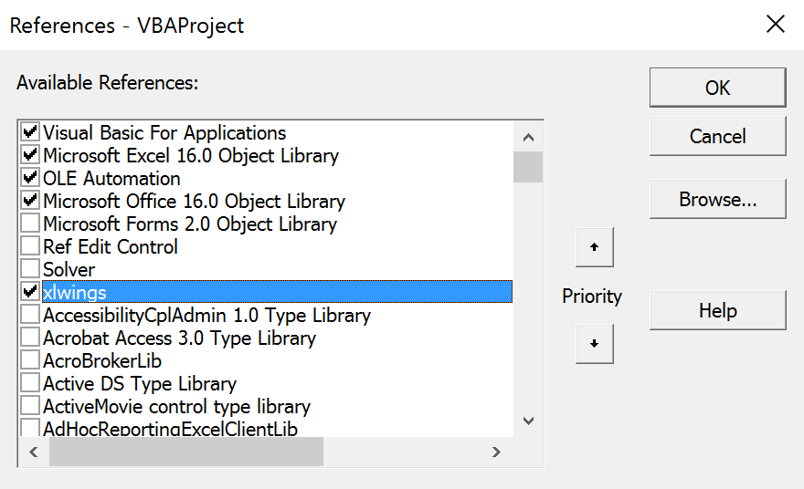
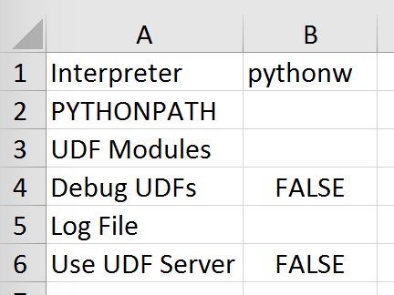

.. _xlwings_addin:

Add-in & Settings
=================

.. figure:: images/ribbon.png
    :scale: 40%

The xlwings add-in is the preferred way to be able to use the ``Run main`` button, ``RunPython`` or ``UDFs``.
Note that you don't need an add-in if you just want to manipulate Excel from Python via xlwings.

.. note:: The ribbon of the add-in is compatible with Excel >= 2007 on Windows and >= 2016 on Mac.
  On Mac, all UDF related functionality is not available.

.. note:: The add-in is password protected with the password ``xlwings``. For debugging or to add new extensions, you need
  to unprotect it.

Run main
--------

.. versionadded:: 0.16.0

The ``Run main`` button is the easiest way to run your Python code: It runs a function called ``main`` in a Python
module that has the same name as your workbook. This allows you to save your workbook as ``xlsx`` without enabling macros.
The ``xlwings quickstart`` command will create a workbook that will automatically work with the ``Run`` button.

.. _addin_installation:

Installation
------------

To install the add-in, it's easiest to use the command line client: ``xlwings addin install``. Technically, this copies the add-in
from Python's installation directory to Excel's ``XLSTART`` folder. If you encounter issues, then you can also download the 
add-in (``xlwings.xlam``) from the `GitHub Release page <https://github.com/xlwings/xlwings/releases>`_
(make sure you download the same version as the version of the Python package). Once downloaded, you can install the add-in
by going to ``Developer > Excel Add-in > Browse``. If you don't see ``Developer`` as tab in your ribbon, make sure to
activate the tab first under ``File > Options > Customize Ribbon`` (Mac: ``Cmd + , > Ribbon & Toolbar``).

Then, to use ``RunPython`` or ``UDFs`` in a workbook, you need to set a reference to ``xlwings`` in the VBA editor, see
screenshot (Windows: ``Tools > References...``, Mac: it's on the lower left corner of the VBA editor). Note that when
you create a workbook via ``xlwings quickstart``, the reference should already be set.

.. _settings:

User Settings
-------------

While the defaults will often work out-of-the box, you can change the global settings directly in the add-in:

* ``Interpreter``: This is the path to the Python interpreter. This works also with virtual or conda envs on Mac.
  If you use conda envs on Windows, then use ``Conda Path`` and ``Conda Env`` below instead. Examples:
  ``"C:\Python35\pythonw.exe"`` or ``"/usr/local/bin/python3.5"``. An empty field defaults to ``pythonw`` that
  expects the interpreter to be set in the ``PATH`` on Windows or ``.bash_profile`` on Mac. Note that in the settings,
  this is stored as ``Interpreter_Win`` or ``Interpreter_Mac``, respectively, see below!
* ``PYTHONPATH``: If the source file of your code is not found, add the path here.
* ``Conda Path``: If you are on Windows and use Anaconda or Miniconda, then type here the path to your
  installation, e.g. ``C:\Users\Username\Miniconda3`` or ``%USERPROFILE%\Anaconda``. NOTE that you need at least conda 4.6!
  You also need to set ``Conda Env``, see next point.
* ``Conda Env``: If you are on Windows and use Anaconda or Miniconda, type here the name of your conda env, e.g. ``base``
  for the base installation or ``myenv`` for a conda env with the name ``myenv``. Note
  that this requires you to either leave the ``Interpreter`` blank or set it to one of ``python`` or ``pythonw``.
* ``UDF Modules``: Names of Python modules (without .py extension) from which the UDFs are being imported.
  Separate multiple modules by ";".
  Example: ``UDF_MODULES = "common_udfs;myproject"``
  The default imports a file in the same directory as the Excel spreadsheet with the same name but ending in ``.py``.
* ``Debug UDFs``: Check this box if you want to run the xlwings COM server manually for debugging, see :ref:`debugging`.
* ``RunPython: Use UDF Server``:  Uses the same COM Server for RunPython as for UDFs. This will be faster, as the
  interpreter doesn't shut down after each call.
* ``Restart UDF Server``: This shuts down the UDF Server/Python interpreter. It'll be restarted upon the next function call.
* ``Show Console``: Check the box in the ribbon or set the config to TRUE if you want the command prompt to pop up. This only has an effect on Windows and the combination UDF + Conda currently forces the console to be shown.

Anaconda/Miniconda
******************

If you use Anaconda or Miniconda on Windows, you will need to set your ``Conda Path`` and ``Conda Env`` settings, as you will
otherwise get errors when using ``NumPy`` etc. In return, leave ``Interpreter`` empty or use either ``python`` (shows output in the terminal) or ``pythonw`` (doesn't show output in the terminal).

.. note:: If you use ``Conda Path`` and ``Conda Env`` with UDFs, you currently can't hide the command prompt that pops up.

.. _config_file:

Environment Variables
---------------------

With environment variables, you can set dynamic paths e.g. to your interpreter or ``PYTHONPATH``:

* On Windows, you can use all environment variables like so: ``%USERPROFILE%\Anaconda``.
* On macOS, the following special variables are supported: ``$HOME``, ``$APPLICATIONS``, ``$DOCUMENTS``, ``$DESKTOP``.

User Config: Ribbon/Config File
-------------------------------

The settings in the xlwings Ribbon are stored in a config file that can also be manipulated externally. The location is

* Windows: ``.xlwings\xlwings.conf`` in your user folder  
* macOS: ``~/Library/Containers/com.microsoft.Excel/Data/xlwings.conf``

The format is as follows - note the OS specific Interpreter settings!

.. code-block:: bash

    "Interpreter_Win","C:\path\to\python.exe"
    "Interpreter_Mac","/path/to/python"
    "PYTHONPATH",""
    "Conda Path",""
    "Conda Env",""
    "UDF Modules",""
    "Debug UDFs",""
    "Use UDF Server",""
    "Show Console",""

Workbook Directory Config: Config file
--------------------------------------

The global settings of the Ribbon/Config file can be overridden for one or more workbooks by creating a ``xlwings.conf`` file
in the workbook's directory.

.. _addin_wb_settings:

Workbook Config: xlwings.conf Sheet
-----------------------------------

Workbook specific settings will override global (Ribbon) and workbook directory config files: 
Workbook specific settings are set by listing the config key/value pairs in a sheet with the name ``xlwings.conf``.
When you create a new project with ``xlwings quickstart``, it'll already have such a sheet but you need to rename
it to ``xlwings.conf`` to make it active.

Alternative: Standalone VBA module
----------------------------------

Sometimes it might be useful to run xlwings code without having to install an add-in first. To do so, you
need to use the ``standalone`` option when creating a new project: ``xlwings quickstart myproject --standalone``.

This will add the content of the add-in as a single VBA module so you don't need to set a reference to the add-in anymore.
It will still read in the settings from your ``xlwings.conf`` if you don't override them by using a sheet with the name ``xlwings.conf``.
