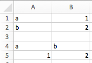
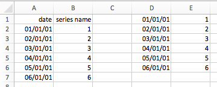
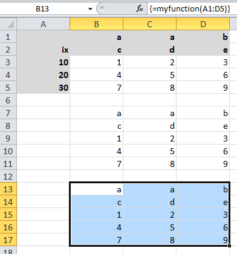

.. _converters:

Converters and Options
======================

Introduced with v0.7.0, converters define how Excel ranges and their values are converted both during
**reading** and **writing** operations. They also provide a consistent experience across **xlwings.Range** objects and
**User Defined Functions** (UDFs).

Converters are explicitely set in the ``options`` method when manipulating ``Range`` objects
or in the ``@xw.arg`` and ``@xw.ret`` decorators when using UDFs. If no converter is specified, the default converter
is applied when reading. When writing, xlwings will automatically apply the correct converter (if available) according to the
object's type that is being written to Excel. If no converter is found for that type, it falls back to the default converter.

All code samples below depend on the following import:

    >>> import xlwings as xw

**Syntax:**

==============================  ============================================================ ===========
****                            **xw.Range**                                                 **UDFs**
==============================  ============================================================ ===========
**reading**                     ``xw.Range.options(convert=None, **kwargs).value``           ``@arg('x', convert=None, **kwargs)``
**writing**                     ``xw.Range.options(convert=None, **kwargs).value = myvalue`` ``@ret(convert=None, **kwargs)``
==============================  ============================================================ ===========

.. note:: Keyword arguments (``kwargs``) may refer to the specific converter or the default converter.
  For example, to set the ``numbers`` option in the default converter and the ``index`` option in the DataFrame converter,
  you would write::

      xw.Range('A1:C3').options(pd.DataFrame, index=False, numbers=int).value

Default Converter
-----------------

If no options are set, the following conversions are performed:

* single cells are read in as ``floats`` in case the Excel cell holds a number, as ``unicode`` in case it holds text,
  as ``datetime`` if it contains a date and as ``None`` in case it is empty.
* columns/rows are read in as lists, e.g. ``[None, 1.0, 'a string']``
* 2d cell ranges are read in as list of lists, e.g. ``[[None, 1.0, 'a string'], [None, 2.0, 'another string']]``

The following options can be set:

* **ndim**

  Force the value to have either 1 or 2 dimensions regardless of the shape of the range:

  >>> import xlwings as xw
  >>> sht = xw.Book().sheets[0]
  >>> sht.range('A1').value = [[1, 2], [3, 4]]
  >>> sht.range('A1').value
  1.0
  >>> sht.range('A1').options(ndim=1).value
  [1.0]
  >>> sht.range('A1').options(ndim=2).value
  [[1.0]]
  >>> sht.range('A1:A2').value
  [1.0 3.0]
  >>> sht.range('A1:A2').options(ndim=2).value
  [[1.0], [3.0]]

* **numbers**

  By default cells with numbers are read as ``float``, but you can change it to ``int``::

    >>> sht.range('A1').value = 1
    >>> sht.range('A1').value
    1.0
    >>> sht.range('A1').options(numbers=int).value
    1

  Alternatively, you can specify any other function or type which takes a single float argument.

  Using this on UDFs looks like this::

    @xw.func
    @xw.arg('x', numbers=int)
    def myfunction(x):
        # all numbers in x arrive as int
        return x

  **Note:** Excel always stores numbers internally as floats, which is the reason why the `int` converter
  rounds numbers first before turning them into integers. Otherwise it could happen that e.g. 5 might be
  returned as 4 in case it is represented as a floating point number that is slightly smaller than 5.
  Should you require Python's original `int` in your converter, use `raw int` instead.

* **dates**

  By default cells with dates are read as ``datetime.datetime``, but you can change it to ``datetime.date``:

  - Range::

    >>> import datetime as dt
    >>> sht.range('A1').options(dates=dt.date).value

  - UDFs: ``@xw.arg('x', dates=dt.date)``

  Alternatively, you can specify any other function or type which takes the same keyword arguments
  as ``datetime.datetime``, for example:

    >>> my_date_handler = lambda year, month, day, **kwargs: "%04i-%02i-%02i" % (year, month, day)
    >>> sht.range('A1').options(dates=my_date_handler).value
    '2017-02-20'

* **empty**

  Empty cells are converted per default into ``None``, you can change this as follows:

  - Range: ``>>> sht.range('A1').options(empty='NA').value``

  - UDFs:  ``@xw.arg('x', empty='NA')``

* **transpose**

  This works for reading and writing and allows us to e.g. write a list in column orientation to Excel:

  - Range: ``sht.range('A1').options(transpose=True).value = [1, 2, 3]``

  - UDFs:

    .. code-block:: python

        @xw.arg('x', transpose=True)
        @xw.ret(transpose=True)
        def myfunction(x):
            # x will be returned unchanged as transposed both when reading and writing
            return x

* **expand**

  This works the same as the Range properties ``table``, ``vertical`` and ``horizontal`` but is
  only evaluated when getting the values of a Range::

    >>> import xlwings as xw
    >>> sht = xw.Book().sheets[0]
    >>> sht.range('A1').value = [[1,2], [3,4]]
    >>> rng1 = sht.range('A1').expand()
    >>> rng2 = sht.range('A1').options(expand='table')
    >>> rng1.value
    [[1.0, 2.0], [3.0, 4.0]]
    >>> rng2.value
    [[1.0, 2.0], [3.0, 4.0]]
    >>> sht.range('A3').value = [5, 6]
    >>> rng1.value
    [[1.0, 2.0], [3.0, 4.0]]
    >>> rng2.value
    [[1.0, 2.0], [3.0, 4.0], [5.0, 6.0]]

  .. note:: The ``expand`` method is only available on ``Range`` objects as UDFs only allow to manipulate the calling cells.

Built-in Converters
-------------------

xlwings offers several built-in converters that perform type conversion to **dictionaries**, **NumPy arrays**,
**Pandas Series** and **DataFrames**. These build on top of the default converter, so in most cases the options
described above can be used in this context, too (unless they are meaningless, for example the ``ndim`` in the case
of a dictionary).

It is also possible to write and register custom converter for additional types, see below.

The samples below can be used with both ``xlwings.Range`` objects and UDFs even though only one version may be shown.

Dictionary converter
********************

The dictionary converter turns two Excel columns into a dictionary. If the data is in row orientation, use ``transpose``:

::

    >>> sht = xw.sheets.active
    >>> sht.range('A1:B2').options(dict).value
    {'a': 1.0, 'b': 2.0}
    >>> sht.range('A4:B5').options(dict, transpose=True).value
    {'a': 1.0, 'b': 2.0}

Numpy array converter
*********************

**options:** ``dtype=None, copy=True, order=None, ndim=None``

The first 3 options behave the same as when using ``np.array()`` directly. Also, ``ndim`` works the same as shown above
for lists (under default converter) and hence returns either numpy scalars, 1d arrays or 2d arrays.

**Example**::

    >>> import numpy as np
    >>> sht = xw.Book().sheets[0]
    >>> sht.range('A1').options(transpose=True).value = np.array([1, 2, 3])
    >>> sht.range('A1:A3').options(np.array, ndim=2).value
    array([[ 1.],
           [ 2.],
           [ 3.]])

Pandas Series converter
***********************

**options:** ``dtype=None, copy=False, index=1, header=True``

The first 2 options behave the same as when using ``pd.Series()`` directly. ``ndim`` doesn't have an effect on
Pandas series as they are always expected and returned in column orientation.

``index``: int or Boolean
    | When reading, it expects the number of index columns shown in Excel.
    | When writing, include or exclude the index by setting it to ``True`` or ``False``.

``header``: Boolean
    | When reading, set it to ``False`` if Excel doesn't show either index or series names.
    | When writing, include or exclude the index and series names by setting it to ``True`` or ``False``.

For ``index`` and ``header``, ``1`` and ``True`` may be used interchangeably.

**Example:**

::

    >>> sht = xw.Book().sheets[0]
    >>> s = sht.range('A1').options(pd.Series, expand='table').value
    >>> s
    date
    2001-01-01    1
    2001-01-02    2
    2001-01-03    3
    2001-01-04    4
    2001-01-05    5
    2001-01-06    6
    Name: series name, dtype: float64
    >>> sht.range('D1', header=False).value = s

Pandas DataFrame converter
**************************

**options:** ``dtype=None, copy=False, index=1, header=1``

The first 2 options behave the same as when using ``pd.DataFrame()`` directly. ``ndim`` doesn't have an effect on
Pandas DataFrames as they are automatically read in with ``ndim=2``.

``index``: int or Boolean
    | When reading, it expects the number of index columns shown in Excel.
    | When writing, include or exclude the index by setting it to ``True`` or ``False``.

``header``: int or Boolean
    | When reading, it expects the number of column headers shown in Excel.
    | When writing, include or exclude the index and series names by setting it to ``True`` or ``False``.

For ``index`` and ``header``, ``1`` and ``True`` may be used interchangeably.

**Example:**

::

    >>> sht = xw.Book().sheets[0]
    >>> df = sht.range('A1:D5').options(pd.DataFrame, header=2).value
    >>> df
        a     b
        c  d  e
    ix
    10  1  2  3
    20  4  5  6
    30  7  8  9

    # Writing back using the defaults:
    >>> sht.range('A1').value = df

    # Writing back and changing some of the options, e.g. getting rid of the index:
    >>> sht.range('B7').options(index=False).value = df

The same sample for **UDF** (starting in ``Range('A13')`` on screenshot) looks like this::

    @xw.func
    @xw.arg('x', pd.DataFrame, header=2)
    @xw.ret(index=False)
    def myfunction(x):
       # x is a DataFrame, do something with it
       return x

xw.Range and 'raw' converters
*****************************

Technically speaking, these are "no-converters".

* If you need access to the ``xlwings.Range`` object directly, you can do::

    @xw.func
    @xw.arg('x', xw.Range)
    def myfunction(x):
       return x.formula

  This returns x as ``xlwings.Range`` object, i.e. without applying any converters or options.

* The ``raw`` converter delivers the values unchanged from the underlying libraries (``pywin32`` on Windows and
  ``appscript`` on Mac), i.e. no sanitizing/cross-platform harmonizing of values are being made. This might be useful
  in a few cases for efficiency reasons. E.g::

    >>> sht.range('A1:B2').value
    [[1.0, 'text'], [datetime.datetime(2016, 2, 1, 0, 0), None]]

    >>> sht.range('A1:B2').options('raw').value  # or sht.range('A1:B2').raw_value
    ((1.0, 'text'), (pywintypes.datetime(2016, 2, 1, 0, 0, tzinfo=TimeZoneInfo('GMT Standard Time', True)), None))

.. _custom_converter:

Custom Converter
----------------

Here are the steps to implement your own converter:

* Inherit from ``xlwings.conversion.Converter``
* Implement both a ``read_value`` and ``write_value`` method as static- or classmethod:

  *  In ``read_value``, ``value`` is what the base converter returns: hence, if no
     ``base`` has been specified it arrives in the format of the default converter.
  *  In ``write_value``, ``value`` is the original object being written to Excel. It must be returned
     in the format that the base converter expects. Again, if no ``base`` has been specified, this is the default
     converter.

  The ``options`` dictionary will contain all keyword arguments specified in
  the ``xw.Range.options`` method, e.g. when calling ``xw.Range('A1').options(myoption='some value')`` or as specified in
  the ``@arg`` and ``@ret`` decorator when using UDFs. Here is the basic structure::

    from xlwings.conversion import Converter

    class MyConverter(Converter):

        @staticmethod
        def read_value(value, options):
            myoption = options.get('myoption', default_value)
            return_value = value  # Implement your conversion here
            return return_value

        @staticmethod
        def write_value(value, options):
            myoption = options.get('myoption', default_value)
            return_value = value  # Implement your conversion here
            return return_value

* Optional: set a ``base`` converter (``base`` expects a class name) to build on top of an existing converter, e.g.
  for the built-in ones: ``DictCoverter``, ``NumpyArrayConverter``, ``PandasDataFrameConverter``, ``PandasSeriesConverter``
* Optional: register the converter: you can **(a)** register a type so that your converter becomes the default for
  this type during write operations and/or **(b)** you can register an alias that will allow you to explicitly call
  your converter by name instead of just by class name

The following examples should make it much easier to follow - it defines a DataFrame converter that extends the
built-in DataFrame converter to add support for dropping nan's::

    from xlwings.conversion import Converter, PandasDataFrameConverter

    class DataFrameDropna(Converter):

        base = PandasDataFrameConverter

        @staticmethod
        def read_value(builtin_df, options):
            dropna = options.get('dropna', False)  # set default to False
            if dropna:
                converted_df = builtin_df.dropna()
            else:
                converted_df = builtin_df
            # This will arrive in Python when using the DataFrameDropna converter for reading
            return converted_df

        @staticmethod
        def write_value(df, options):
            dropna = options.get('dropna', False)
            if dropna:
                converted_df = df.dropna()
            else:
                converted_df = df
            # This will be passed to the built-in PandasDataFrameConverter when writing
            return converted_df

Now let's see how the different converters can be applied::

    # Fire up a Workbook and create a sample DataFrame
    sht = xw.Book().sheets[0]
    df = pd.DataFrame([[1.,10.],[2.,np.nan], [3., 30.]])

* Default converter for DataFrames::

    # Write
    sht.range('A1').value = df

    # Read
    sht.range('A1:C4').options(pd.DataFrame).value

* DataFrameDropna converter::

    # Write
    sht.range('A7').options(DataFrameDropna, dropna=True).value = df

    # Read
    sht.range('A1:C4').options(DataFrameDropna, dropna=True).value

* Register an alias (optional)::

    DataFrameDropna.register('df_dropna')

    # Write
    sht.range('A12').options('df_dropna', dropna=True).value = df

    # Read
    sht.range('A1:C4').options('df_dropna', dropna=True).value

* Register DataFrameDropna as default converter for DataFrames (optional)::

    DataFrameDropna.register(pd.DataFrame)

    # Write
    sht.range('A13').options(dropna=True).value = df

    # Read
    sht.range('A1:C4').options(pd.DataFrame, dropna=True).value

These samples all work the same with UDFs, e.g.::

    @xw.func
    @arg('x', DataFrameDropna, dropna=True)
    @ret(DataFrameDropna, dropna=True)
    def myfunction(x):
        # ...
        return x

.. note::
    Python objects run through multiple stages of a transformation pipeline when they are being written to Excel. The
    same holds true in the other direction, when Excel/COM objects are being read into Python.

    Pipelines are internally defined by ``Accessor`` classes. A Converter is just a special Accessor which
    converts to/from a particular type by adding an extra stage to the pipeline of the default Accessor. For example, the
    ``PandasDataFrameConverter`` defines how a list of list (as delivered by the default Accessor) should be turned
    into a Pandas DataFrame.

    The ``Converter`` class provides basic scaffolding to make the task of writing a new Converter easier. If
    you need more control you can subclass ``Accessor`` directly, but this part requires more work and is currently
    undocumented.