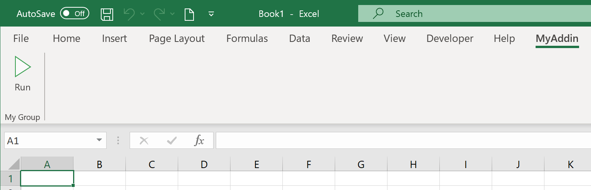
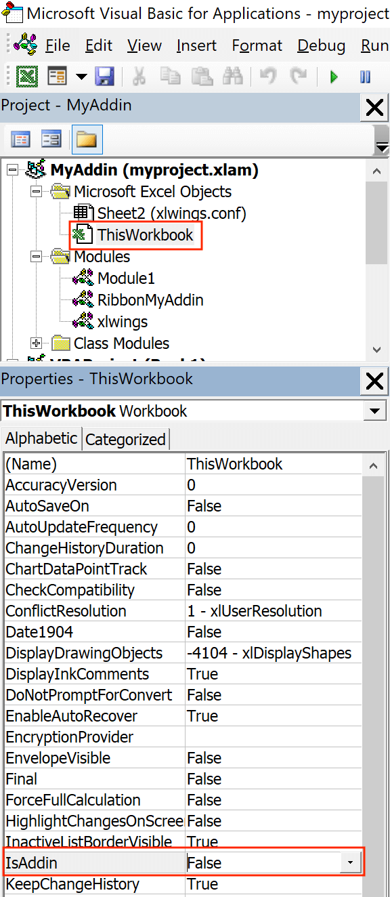

.. _customaddin:

Custom Add-ins
==============

.. versionadded:: 0.22.0

Custom add-ins work on Windows and macOS and are essentially white-labeled xlwings add-ins that include all your ``RunPython`` functions and UDFs (as usual, UDFs work on Windows only). You can build add-ins with and without an Excel ribbon.

The useful thing about add-in is that UDFs and RunPython calls will be available in all workbooks right out of the box without having to add any references via the VBA editor's ``Tools`` > ``References...``. This tutorial assumes you're familiar with how xlwings and its configuration works.

Quickstart
----------

Start by running the following command on a command line (to create an add-in without a ribbon, you would leave away the ``--ribbon`` flag:

.. code-block:: bash

   $ xlwings quickstart myproject --addin --ribbon

This will create the familiar quickstart folder with a Python file and an Excel file, but this time, the Excel file is in the ``xlam`` format.

* Double-click the Excel add-in to open it in Excel
* Add a new empty workbook (``Ctrl+N`` on Windows or ``Command+N`` on macOS)

You should see a new ribbon tab called ``MyAddin`` like this:

The add-in and VBA project is currently always called ``myaddin``, no matter what name you chose in the quickstart command. We'll see towards the end of this tutorial how we can change that, but for now we'll stick with it.

Compared to the xlwings add-in, the custom add-in offers an additional level of configuration: the configuration sheet of the add-in itself which is the easiest way to configure simple add-ins with a static configuration.

Let's open the VBA editor by clicking on ``Alt+F11`` (Windows) or ``Option+F11`` (macOS). In our project, select ``ThisWorkbook``, then change the Property ``IsAddin`` from ``True`` to ``False``, see the following screenshot:

This will make the sheet ``_myaddin.conf`` visible (again, we'll see how to change the name of ``myaddin`` at the end of this tutorial):

* Activate the sheet config by renaming it from ``_myaddin.conf`` to ``myaddin.conf``
* Set your ``Interpreter_Win/_Mac`` or ``Conda`` settings (you may want to take them over from the xlwings settings for now)

Once done, switch back to the VBA editor, select ``ThisWorkbook`` again, and change ``IsAddin`` back to ``True`` before you save your add-in from the VBA editor. Now click the ``Run`` button under the ``My Addin`` ribbon tab and if you've configured the Python interpreter correctly, it will print ``Hello xlwings!`` into cell ``A1`` of the active workbook.

Changing the Ribbon menu
------------------------

To change the buttons and items in the ribbon menu or the Backstage View, download and install the `Office RibbonX Editor <https://github.com/fernandreu/office-ribbonx-editor/releases>`_. While it is only available for Windows, the created ribbons will also work on macOS. Open your add-in with it so you can change the XML code that defines your buttons etc. You will find a good tutorial `here <https://www.rondebruin.nl/win/s2/win001.htm>`_. The callback function for the demo ``Run`` button is in the ``RibbonMyAddin`` VBA module that you'll find in the VBA editor.

Importing UDFs
--------------

To import your UDFs into the custom add-in, run the ``ImportPythonUDFsToAddin`` Sub towards the end of the ``xlwings`` module (click into the Sub and hit ``F5``). Remember, you only have to do this whenever you change the function name, argument or decorator, so you're end users won't have to deal with this.

If you are only deploying UDFs via your add-in, you probably don't need a Ribbon menu and can leave away the ``--ribbon`` flag in the ``quickstart`` command.

Configuration
-------------

As mentioned before, configuration works the same as with xlwings, so you could have your users override the default configuration we did above by adding a ``myaddin.conf`` sheet on their workbook or you could use the ``myaddin.conf`` file in the user's home directory. For details see :ref:`xlwings_addin`.

Installation
------------

If you want to permanently install your add-in, you can do so by using the xlwings CLI:

.. code-block:: bash

    $ xlwings addin install --file C:\path\to\your\myproject.xlam

This, however, means that you will need to adjust the ``PYTHONPATH`` for it to find your Python code (or move your Python code to somewhere where Python looks for it---more about that below under deployment). The command will copy your add-in to the ``XLSTART`` folder, a special folder from where Excel will open all files everytime you start it.

Renaming your add-in
--------------------

Admittedly, this part is a bit cumbersome for now. Let's assume, we would like to rename the addin from ``MyAddin`` to ``Demo``:

* In the ``xlwings`` VBA module, change ``Public Const PROJECT_NAME As String = "myaddin"`` to ``Public Const PROJECT_NAME As String = "demo"``. You'll find this line at the top, right after the ``Declare`` statements.
* If you rely on the ``myaddin.conf`` sheet for your configuration, rename it to ``demo.conf``
* Right-click the VBA project, select  ``MyAddin Properties...`` and rename the ``Project Name`` from ``MyAddin`` to ``Demo``.
* If you use the ribbon, you want to rename the ``RibbonMyAddin`` VBA module to ``RibbonDemo``. To do this, select the module in the VBA editor, then rename it in the ``Properties`` window. If you don't see the Properties window, hit ``F4``.
* Open the add-in in the Office RibbonX Editor (see above) and replace all occurrences of ``MyAddin`` with ``Demo`` in the XML code.

And finally, you may want to rename your ``myproject.xlam`` file in the Windows explorer, but I assume you have already run the quickstart command with the correct name, so this won't be necessary.

Deployment
----------

By far the easiest way to deploy your add-in to your end-users is to build an installer via the xlwings PRO offering. This will take care of everything and your end users literally just need to double-click the installer and they are all set (no existing Python installation required and no manual installation of the add-in or adjusting of settings required).

If you want it the free (but hard) way, you either need to build an installer yourself or you need your users to install Python and the add-in and take care of placing the Python code in the correct directory. This normally involves tweaking the following settings, for example in the ``myaddin.conf`` sheet:

* ``Interpreter_Win/_Mac``: if your end-users have a working version of Python, you can use environment variables to dynamically resolve to the correct path. For example, if they have Anaconda installed in the default location, you could use the following configuration::

        Conda Path: %USERPROFILE%\anaconda3
        Interpreter_Mac: $HOME/opt/anaconda3/bin/python

* ``PYTHONPATH``: since you can't have your Python source code in the ``XLSTART`` folder next to the add-in, you'll need to adjust the ``PYTHONPATH`` setting and add the folder to where the Python code will be. You could point this to a shared drive or again make use of environment variables so the users can place the file into a folder called ``MyAddin`` in their home directory, for example. However, you can also place your Python code where Python looks for it, for example by placing them in the ``site-packages`` directory of the Python distribution---an easy way to achieve this is to build a Python package that you can install via ``pip``.