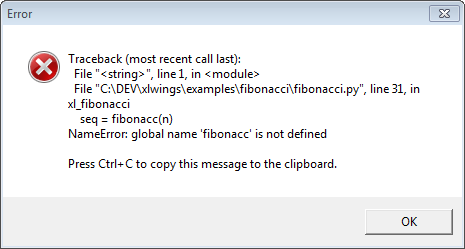
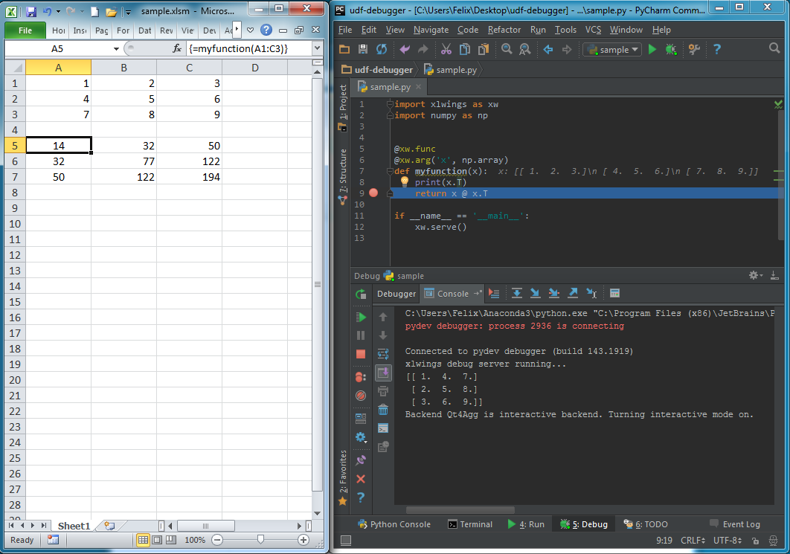

.. _debugging:

Debugging
=========

Since xlwings runs in every Python environment, you can use your preferred way of debugging.

* **RunPython**: When calling Python through ``RunPython``, you can set a ``mock_caller`` to make it easy to switch
  back and forth between calling the function from Excel and Python.
* **UDFs**: For debugging User Defined Functions, xlwings offers a convenient debugging server

To begin with, Excel will show Python errors in a Message Box:

.. note:: On Mac, if the ``import`` of a module/package fails before xlwings is imported, the popup will not be shown and the StatusBar
    will not be reset. However, the error will still be logged in the log file. For the location of the logfile, see :ref:`log`.

RunPython
---------

Consider the following sample code of your Python source code ``my_module.py``:

.. code-block:: python

    # my_module.py
    import os
    import xlwings as xw

    def my_macro():
        wb = xw.Book.caller()
        wb.sheets[0].range('A1').value = 1

    if __name__ == '__main__':
        # Expects the Excel file next to this source file, adjust accordingly.
        xw.Book('myfile.xlsxm').set_mock_caller()
        my_macro()

``my_macro()`` can now easily be run from Python for debugging and from Excel via ``RunPython`` without having to change the
source code:

.. code-block:: vb.net

    Sub my_macro()
        RunPython ("import my_module; my_module.my_macro()")
    End Sub

UDF debug server
----------------

Windows only: To debug UDFs, just set ``UDF_DEBUG_SERVER = True`` in the :ref:`VBA Settings <vba_settings>`, at the top of the xlwings VBA module.
Then add the following lines at the end of your Python source file and run it. Depending on which IDE you use, you
might need to run the code in "debug" mode (e.g. in case you're using PyCharm or PyDev)::

    if __name__ == '__main__':
        xw.serve()

When you recalculate the Sheet (``Ctrl-Alt-F9``), the code will stop at breakpoints or output any print calls that you
may have.

The following screenshot shows the code stopped at a breakpoint in the community version of PyCharm:

.. note::
  When running the debug server from a command prompt, there is currently no gracious way to terminate it, but closing
  the command prompt will kill it.