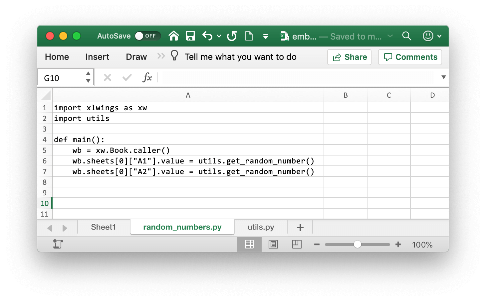
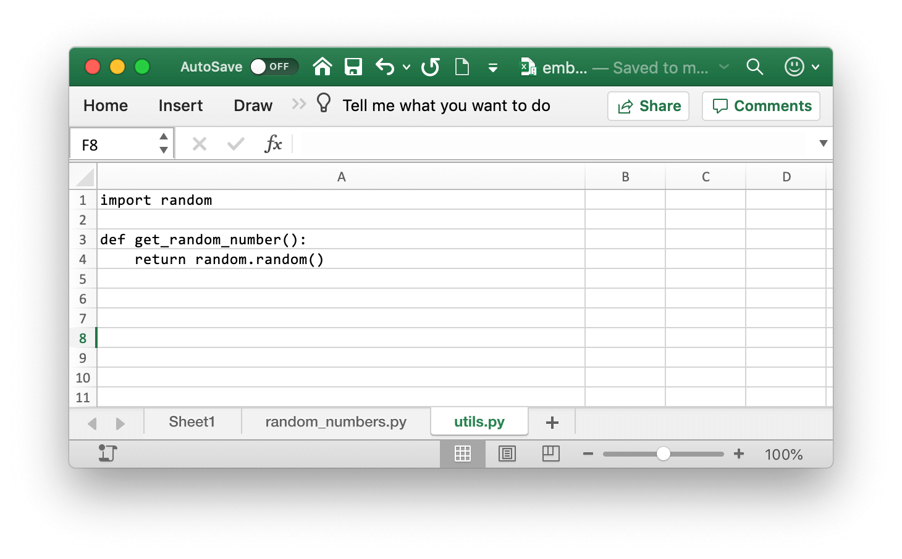

.. _deployment:

Deployment
==========

Zip files
---------

.. versionadded:: 0.15.2

To make it easier to distribute, you can zip up your Python code into a zip file. If you use UDFs, this will disable the
automatic code reload, so this is a feature meant for distribution, not development. In practice, this means that when
your code is inside a zip file, you'll have to click on re-import to get any changes.

If you name your zip file like your Excel file (but with ``.zip`` extension) and place it in the same folder as your
Excel workbook, xlwings will automatically find it (similar to how it works with a single python file).

If you want to use a different directory, make sure to add it to the ``PYTHONPATH`` in your config (Ribbon or config file):

.. code-block:: bash

    PYTHONPATH, "C:\path\to\myproject.zip"

RunFrozenPython
---------------

.. versionchanged:: 0.15.2

You can use a freezer like PyInstaller, cx_Freeze, py2exe etc. to freeze your Python module into an executable so that
the recipient doesn't have to install a full Python distribution.

.. note::
    * This does not work with UDFs.
    * Currently only available on Windows, but support for Mac should be easy to add.
    * You need at least 0.15.2 to support arguments whereas the syntax changed in 0.15.6

Use it as follows:

.. code-block:: basic

    Sub MySample()
        RunFrozenPython "C:\path\to\dist\myproject\myproject.exe", "arg1 arg2"
    End Sub

.. _embedded_code:

Embedded Code
-------------

This feature requires xlwings :guilabel:`PRO`.

xlwings PRO allows you to store your Python code directly in Excel so you don't have to distribute separate
Python files.

All you have to do is:

* Name a sheet with a ``.py`` ending (can also be a hidden or very hidden sheet)
* Copy/paste your Python source code

.. note::
  Make sure to select ``Paste Special > Text`` as you might otherwise get errors with
  indentation or unrecognized characters.

Then, use the VBA function ``RunPython ("import mymodule;mymodule.myfunction()")`` as usual.

Note that you can have multiple Excel sheets and import them like normal Python files. Consider this example:

You can call this function from VBA like so::

    Sub RandomNumbers()
        RunPython ("import random_numbers;random_numbers.main()")
    End Sub

.. note::
    UDFs modules don't have to be added to the ``UDF Modules`` explicitly when using embedded code. However,
    in contrast to how it works with external files, you currently need to re-import the functions when you change them.

.. note::
    While you can hide your sheets with your code, they will be written to a temporary directory in clear text.

.. _zero_config_installer:

One-Click Zero-Config Installer
-------------------------------

This feature requires xlwings :guilabel:`PRO`.

With xlwings PRO you get access to a private GitHub repository that will build your custom installer in the cloud --- no local installation required. Using a custom installer to deploy the Python runtime has the following advantages:

* Zero Python knowledge required from end users
* Zero configuration required by end users
* No admin rights required
* Works for both UDFs and RunPython
* Works for external distribution
* Easy to deploy updates

End User Instructions
*********************

* **Installing**

  Give the end user your Excel workbook and the installer. The user only has to double-click the installer and confirm a few prompts --- no configuation is required.

* **Updating**

  If you use the embedded code feature (see: :ref:`embedded_code`), you can deploy updates by simply giving the user a new Excel file. Only when you change a dependency, you will need to create a new installer.

* **Uninstalling**

  The application can be uninstalled again via Window Settings > Apps & Features.

Build the Installer
*******************

Before you can build the installer, the project needs to be configured correctly, see below.

In the GitHub repo, go to ``x releases`` > ``Draft/Create a new release``. Add a version like ``1.0.0`` to ``Tag version``, then hit ``Publish release``.

Wait a few minutes and refresh the page: the installer will appear under the release from where you can download it. You can follow the progress under the ``Actions`` tab.

Configuration
*************

**Excel file**

You can add your Excel file to the repository if you like but it's not a requirement. Configure the Excel file as follows:

* Add the standalone xlwings VBA module, e.g. via ``xlwings quickstart project --standalone``
* Make sure that in the VBA editor (``Alt-F11``) under ``Tools`` > ``References`` xlwings is unchecked
* Rename the ``_xlwings.conf`` sheet into ``xlwings.conf``
* In the ``xlwings.conf`` sheet, as ``Interpreter``, set the following value: ``%LOCALAPPDATA%\project`` while replacing ``project`` with the name of your project
* If you like, you can hide the ``xlwings.conf`` sheet

**Source code**

Source code can either be embedded in the Excel file (see :ref:`embedded_code`) or added to the ``src`` directory. The first option requires ``xlwings-pro`` in ``requirements.txt``, the second option will also work with ``xlwings``.

**Dependencies**

Add your dependencies to ``requirements.txt``. For example::

    xlwings==0.18.0
    numpy==1.18.2

**Code signing (optional)**

Using a code sign certificate will show a verified publisher in the installation prompt. Without it, it will show an unverified publisher.

* Store your code sign certificate as ``sign_cert_file`` in the root of this repository (make sure your repo is private).
* Go to ``Settings`` > ``Secrets`` and add the password as ``code_sign_password``.

**Project details**

Update the following under ``.github/main.yml``::

    PROJECT:
    APP_PUBLISHER:

**Python version**

Set your Python version under ``.github/main.yml``::

    python-version: '3.7'
    architecture: 'x64'

.. _deployment_key:

Deployment Key
--------------

This feature requires xlwings :guilabel:`PRO`.

If you have an xlwings PRO developer license, you can generate a deployment key. A deployment key allows you to send an xlwings PRO tool to an end user without them requiring a paid license. A deployment key is also perpetual, i.e. doesn't expire like a developer license.

In return, a deployment key only works with the version of xlwings that was used to generate the deployment key. A developer can generate new deployment keys for new versions of xlwings as long as they have an active xlwings PRO subscription.

.. note::
    You need a paid developer license to generate a deployment key. A trial license won't work.

To create a deployment key, run the following command::

    xlwings license deploy

Then paste the generated key into the xlwings config as ``LICENSE_KEY``. For deployment purposes, usuaully the best place to do that is on a sheet called ``xlwings.conf``, but you can also use an ``xlwings.conf`` file in either the same folder or in the ``.xlwings`` folder within the user's home folder. To use an environment variable, use ``XLWINGS_LICENSE_KEY``. See also :ref:`settings`.