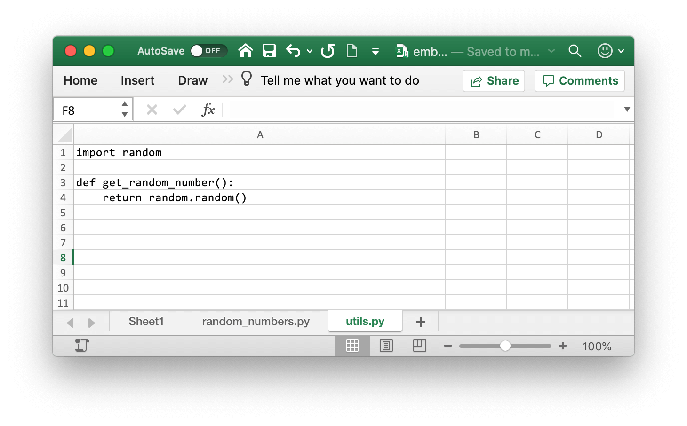

.. _embedded_code:

Embedded Code
=============

This feature requires xlwings :guilabel:`PRO`.

xlwings PRO allows you to store your Python code directly in Excel so you don't have to distribute separate
Python files.

On a command line, run the following command which will import all Python files from the current directory and paste them into sheets with the same name of the currently active workbook::

    $ xlwings code embed

Then, use the VBA function ``RunPython ("import mymodule;mymodule.myfunction()")`` as usual.

Note that you can have multiple Excel sheets and import them like normal Python files. Consider this example:

.. figure:: images/embedded_code1.png

You can call this function from VBA like so::

    Sub RandomNumbers()
        RunPython ("import random_numbers;random_numbers.main()")
    End Sub

.. note::
    UDFs modules don't have to be added to the ``UDF Modules`` explicitly when using embedded code. However,
    in contrast to how it works with external files, you currently need to re-import the functions when you change them.

.. note::
    While you can hide your sheets with your code, they will be written to a temporary directory in clear text.