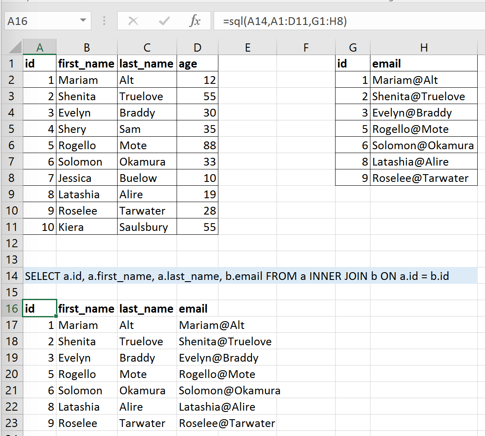

Extensions
==========

It's easy to extend the xlwings add-in with own code like UDFs or RunPython macros, so that they can be deployed
without end users having to import or write the functions themselves. Just add another VBA module to the xlwings addin
with the respective code.

UDF extensions can be used from every workbook without having to set a reference. 

In-Excel SQL
------------

The xlwings addin comes with a built-in extension that adds in-Excel SQL syntax (sqlite dialect):

.. code::

    =sql(SQL Statement, [alias a], table a, [alias b], table b, ...)

If there are no aliases provided, tables are aliased automatically as ``a``, ``b``, ``c``, etc. as the screenshot shows. Since v0.33.5 you can, however, provide your own alias/table name like so:

.. code::

    =sql(
        "SELECT customers.name, o.product, o.amount
        FROM customers
        INNER JOIN b ON customers.customer_id = o.customer_id",
        "customers", A1:D4,
        "o", Orders[#All]
    )

This is, you need to provide the table name/alias first before providing the range reference as the next argument, similar to how the ``=LET`` formula works in Excel.

As this extension uses UDFs, it's only available on Windows right now. This formula can be used on macOS and Excel on the web though via xlwings Server.
