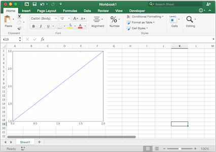

.. _matplotlib:

Matplotlib & Plotly Charts
==========================

Matplotlib
----------

Using :meth:`pictures.add() <xlwings.main.Pictures.add>`, it is easy to paste a Matplotlib plot as picture in Excel.

Getting started
***************

The easiest sample boils down to::

    import matplotlib.pyplot as plt
    import xlwings as xw

    fig = plt.figure()
    plt.plot([1, 2, 3])

    sheet = xw.Book().sheets[0]
    sheet.pictures.add(fig, name='MyPlot', update=True)

.. note::
    If you set ``update=True``, you can resize and position the plot on Excel: subsequent calls to ``pictures.add()``
    with the same name (``'MyPlot'``) will update the picture without changing its position or size.

Full integration with Excel
***************************

Calling the above code with :ref:`RunPython <run_python>` and binding it e.g. to a button is
straightforward and works cross-platform.

However, on Windows you can make things feel even more integrated by setting up a
:ref:`UDF <udfs>` along the following lines::

    @xw.func
    def myplot(n, caller):
        fig = plt.figure()
        plt.plot(range(int(n)))
        caller.sheet.pictures.add(fig, name='MyPlot', update=True)
        return 'Plotted with n={}'.format(n)

If you import this function and call it from cell B2, then the plot gets automatically
updated when cell B1 changes:

.. figure:: ../images/mpl_udf.png

Properties
**********

Size, position and other properties can either be set as arguments within :meth:`pictures.add() <xlwings.main.Pictures.add>`, or
by manipulating the picture object that is returned, see :meth:`xlwings.Picture`.

For example::

    >>> sht = xw.Book().sheets[0]
    >>> sht.pictures.add(fig, name='MyPlot', update=True,
                         left=sht.range('B5').left, top=sht.range('B5').top)

or::

    >>> plot = sht.pictures.add(fig, name='MyPlot', update=True)
    >>> plot.height /= 2
    >>> plot.width /= 2

Getting a Matplotlib figure
***************************

Here are a few examples of how you get a matplotlib ``figure`` object:

* via PyPlot interface::

    import matplotlib.pyplot as plt
    fig = plt.figure()
    plt.plot([1, 2, 3, 4, 5])

  or::

    import matplotlib.pyplot as plt
    plt.plot([1, 2, 3, 4, 5])
    fig = plt.gcf()

* via object oriented interface::

    from matplotlib.figure import Figure
    fig = Figure(figsize=(8, 6))
    ax = fig.add_subplot(111)
    ax.plot([1, 2, 3, 4, 5])

* via Pandas::

    import pandas as pd
    import numpy as np

    df = pd.DataFrame(np.random.rand(10, 4), columns=['a', 'b', 'c', 'd'])
    ax = df.plot(kind='bar')
    fig = ax.get_figure()

.. note::
    When working with Google Sheets, you can use a maximum of 1 million pixels per picture. Total pixels is a function of figure size and dpi: (width in inches * dpi) * (height in inches * dpi). For example, ``fig = plt.figure(figsize=(6, 4))`` with 200 dpi (default dpi when using ``pictures.add()``) will result in (6 * 200) * (4 * 200) = 960,000 px. To change the dpi, provide ``export_options``: ``pictures.add(fig, export_options={"bbox_inches": "tight", "dpi": 300})``. Existing figure size can be checked via ``fig.get_size_inches()``. pandas also accepts ``figsize`` like so:  ``ax = df.plot(figsize=(3, 3))``. Note that ``"bbox_inches": "tight"`` crops the image and therefore will reduce the number of pixels in a non-deterministic way. ``export_options`` will be passed to ``figure.figsave()`` when using Matplotlib and to ``figure.write_image()`` when using Plotly.

.. _plotly:

Plotly static charts
--------------------

Prerequisites
*************

In addition to ``plotly``, you will need ``kaleido``, ``psutil``, and ``requests``. The easiest way to get it is via pip::

    $ pip install kaleido psutil requests

or conda::

    $ conda install -c conda-forge python-kaleido psutil requests

See also: https://plotly.com/python/static-image-export/

How to use
**********

It works the same as with Matplotlib, however, rendering a Plotly chart takes slightly longer. Here is a sample:

.. code-block:: python

    import xlwings as xw
    import plotly.express as px

    # Plotly chart
    df = px.data.iris()
    fig = px.scatter(df, x="sepal_width", y="sepal_length", color="species")

    # Add it to Excel
    wb = xw.Book()
    wb.sheets[0].pictures.add(fig, name='IrisScatterPlot', update=True)

.. figure:: ../images/plotly.png
