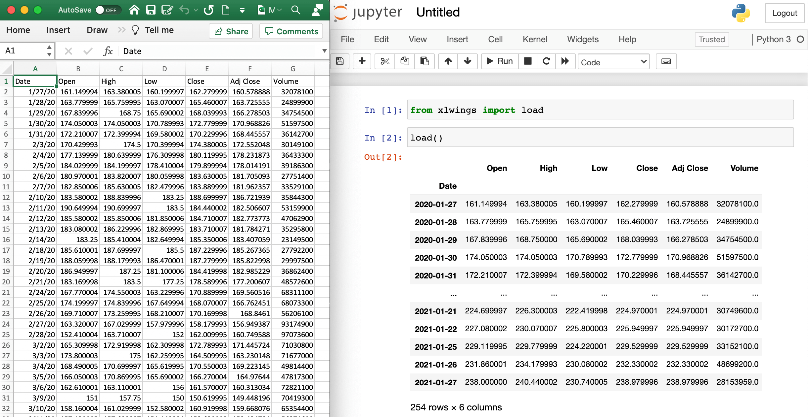

.. _jupyternotebooks:

Jupyter Notebooks: Interact with Excel
======================================

When you work with Jupyter notebooks, you may use Excel as an interactive data viewer or scratchpad from where you can load DataFrames. The two convenience functions :meth:`view <xlwings.view>` and :meth:`load <xlwings.load>` make this really easy.

.. note::
    The :meth:`view <xlwings.view>` and :meth:`load <xlwings.load>` functions should exclusively be used for interactive work. If you write scripts, use the xlwings API as introduced under :ref:`quickstart` and :ref:`syntax_overview`.

The view function
-----------------

The view function accepts pretty much any object of interest, whether that's a number, a string, a nested list or a NumPy array or a pandas DataFrame. By default, it writes the data into an Excel table in a new workbook. If you wanted to reuse the same workbook, provide a ``sheet`` object, e.g. ``view(df, sheet=xw.sheets.active)``, for further options see :meth:`view <xlwings.view>`.

.. figure:: images/xw_view.png

.. versionchanged:: 0.22.0 Earlier versions were not formatting the output as Excel table

The load function
-----------------

To load in a range in an Excel sheet as pandas DataFrame, use the ``load`` function. If you only select one cell, it will auto-expand to cover the whole range. If, however, you select a specific range that is bigger than one cell, it will load in only the selected cells. If the data in Excel does not have an index or header, set them to ``False`` like this: ``xw.load(index=False)``, see also :meth:`load <xlwings.load>`.

.. versionadded:: 0.22.0
