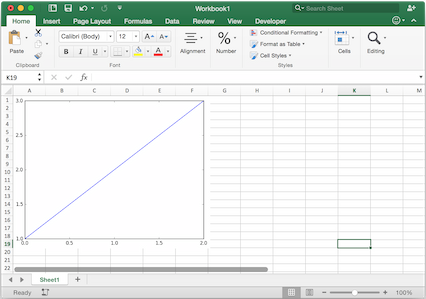
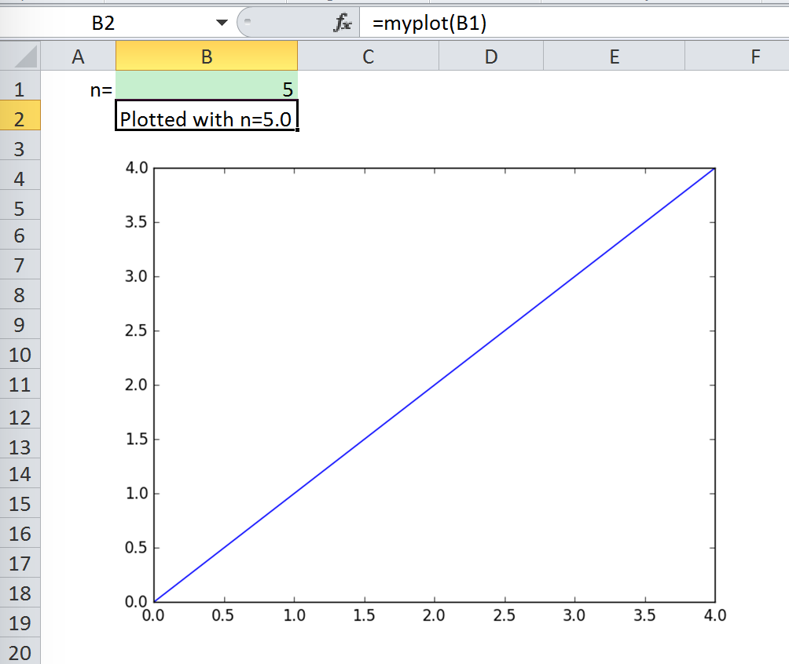

.. _matplotlib:

Matplotlib
==========

Using :meth:`pictures.add() <xlwings.main.Pictures.add>`, it is easy to paste a Matplotlib plot as picture in Excel.

Getting started
---------------

The easiest sample boils down to::

    >>> import matplotlib.pyplot as plt
    >>> import xlwings as xw

    >>> fig = plt.figure()
    >>> plt.plot([1, 2, 3])

    >>> sht = xw.Book().sheets[0]
    >>> sht.pictures.add(fig, name='MyPlot', update=True)

.. note::
    If you set ``update=True``, you can resize and position the plot on Excel: subsequent calls to ``pictures.add()``
    with the same name (``'MyPlot'``) will update the picture without changing its position or size.

Full integration with Excel
---------------------------

Calling the above code with :ref:`RunPython <run_python>` and binding it e.g. to a button is
straightforward and works cross-platform.

However, on Windows you can make things feel even more integrated by setting up a
:ref:`UDF <udfs>` along the following lines::

    @xw.func
    def myplot(n):
        sht = xw.Book.caller().sheets.active
        fig = plt.figure()
        plt.plot(range(int(n)))
        sht.pictures.add(fig, name='MyPlot', update=True)
        return 'Plotted with n={}'.format(n)

If you import this function and call it from cell B2, then the plot gets automatically
updated when cell B1 changes:

Properties
----------

Size, position and other properties can either be set as arguments within :meth:`pictures.add() <xlwings.main.Pictures.add>`, or
by manipulating the picture object that is returned, see :meth:`xlwings.Picture`.

For example::

    >>> sht = xw.Book().sheets[0]
    >>> sht.pictures.add(fig, name='MyPlot', update=True,
                         left=sht.range('B5').left, top=sht.range('B5').top)

or::

    >>> plot = sht.pictures.add(fig, name='MyPlot', update=True)
    >>> plot.height /= 2
    >>> plot.width /= 2

Getting a Matplotlib figure
---------------------------
Here are a few examples of how you get a matplotlib ``figure`` object:

* via PyPlot interface::

    import matplotlib.pyplot as plt
    fig = plt.figure()
    plt.plot([1, 2, 3, 4, 5])

  or::

    import matplotlib.pyplot as plt
    plt.plot([1, 2, 3, 4, 5])
    fig = plt.gcf()

* via object oriented interface::

    from matplotlib.figure import Figure
    fig = Figure(figsize=(8, 6))
    ax = fig.add_subplot(111)
    ax.plot([1, 2, 3, 4, 5])

* via Pandas::

    import pandas as pd
    import numpy as np

    df = pd.DataFrame(np.random.rand(10, 4), columns=['a', 'b', 'c', 'd'])
    ax = df.plot(kind='bar')
    fig = ax.get_figure()
