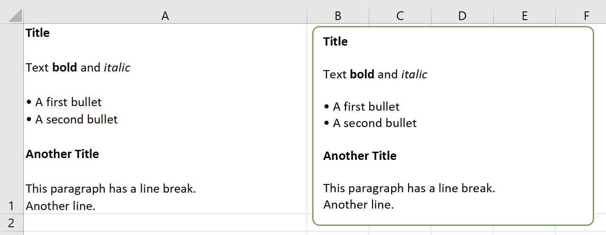

.. _markdown:

Markdown Formatting
===================

This feature requires xlwings PRO and at least v0.23.0.

Markdown offers an easy and intuitive way of styling text components in your cells and shapes. For an introduction to Markdown, see e.g., `Mastering Markdown <https://guides.github.com/features/mastering-markdown/>`_.

Markdown support is in an early stage and currently only supports:

* First-level headings
* Bold (i.e., strong)
* Italic (i.e., emphasis)
* Unordered lists

It doesn't support nested objects yet such as 2nd-level headings, bold/italic within bullet points or nested bullet points.

Let's go through an example to see how everything works!

.. code-block:: python

    from xlwings.reports import Markdown, MarkdownStyle

    mytext = """\
    # Title

    Text **bold** and *italic*

    * A first bullet
    * A second bullet

    # Another Title

    This paragraph has a line break.
    Another line.
    """

    sheet = xw.Book("Book1.xlsx").sheets[0]

    # Range
    sheet['A1'].clear()
    sheet['A1'].value = Markdown(mytext)

    # Shape: The following expects a shape like a Rectangle on the sheet
    sheet.shapes[0].text = ""
    sheet.shapes[0].text = Markdown(mytext)

Running this code will give you this nicely formatted text:

But why not make things a tad more stylish? By providing a ``MarkdownStyle`` object, you can define your style. Let's change the previous example like this:

.. code-block:: python

    from xlwings.reports import Markdown, MarkdownStyle

    mytext = """\
    # Title

    Text **bold** and *italic*

    * A first bullet
    * A second bullet

    # Another Title

    This paragraph has a line break.
    Another line.
    """

    sheet = xw.Book("Book1.xlsx").sheets[0]

    # Styling
    style = MarkdownStyle()
    style.h1.font.color = (255, 0, 0)
    style.h1.font.size = 14
    style.h1.font.name = 'Comic Sans MS'  # No, that's not a font recommendation...
    style.h1.blank_lines_after = 0
    style.unordered_list.bullet_character = '\N{heavy black heart}'  # Emojis are fun!

    # Range
    sheet['A1'].clear()
    sheet['A1'].value = Markdown(mytext, style)  # <= provide your style object here

    # Shape: The following expects a shape like a Rectangle on the sheet
    sheet.shapes[0].text = ""
    sheet.shapes[0].text = Markdown(mytext, style)

Here is the output of this:

You can override all properties, i.e., you can change the emphasis from italic to a red font or anything else you want::

    >>> style.strong.bold = False
    >>> style.strong.color = (255, 0, 0)
    >>> style.strong
    strong.color: (255, 0, 0)

Markdown objects can also be used with template-based reporting, see :ref:`reports_quickstart`.

.. note::
    macOS currently doesn't support the formatting (bold, italic, color etc.) of Markdown text due to a bug with AppleScript/Excel. The text will be rendered correctly though, including bullet points.

See also the API reference:

* :meth:`Markdown class <xlwings.pro.Markdown>`
* :meth:`MarkdownStyle class <xlwings.pro.MarkdownStyle>`
