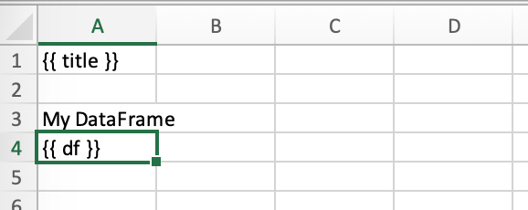

.. _reports_quickstart:

Quickstart
==========

You can work on the ``sheet``, ``book`` or ``app`` level:

* ``mysheet.render_template(**data)``: replaces the placeholders in ``mysheet``
* ``mybook.render_template(**data)``: replaces the placeholders in all sheets of ``mybook``
* ``myapp.render_template(template, output, **data)``: convenience wrapper that copies a template book before replacing the placeholder with the values. Since this approach allows you to work with hidden Excel instances, it is the most commonly used method for production.

Let's go through a typical example: start by creating the following Python script ``report.py``::

    # report.py
    from pathlib import Path

    import pandas as pd
    import xlwings as xw

    # We'll place this file in the same directory as the Excel template
    this_dir = Path(__file__).resolve().parent

    data = dict(
        title='MyTitle',
        df=pd.DataFrame(data={'one': [1, 2], 'two': [3, 4]})
    )

    # Change visible=False to run this in a hidden Excel instance
    with xw.App(visible=True) as app:
        book = app.render_template(this_dir / 'mytemplate.xlsx',
                                   this_dir / 'myreport.xlsx',
                                   **data)
        book.to_pdf(this_dir / 'myreport.pdf')

Then create the following Excel file called ``mytemplate.xlsx``:

Run the Python script (or run the code from a Jupyter notebook)::

    python report.py

This will copy the template and create the following output by replacing the variables in double curly braces with
the value from the Python variable:

.. figure:: ../../images/myreport.png

If you like, you could also create a classic xlwings tool to call this script or you could design a GUI app by using a framework like PySimpleGUI and turn it into an executable by using a freezer (e.g., PyInstaller). This, however, is beyond the scope of this tutorial.

.. note::
    By default, xlwings Reports overwrites existing values in templates if there is not enough free space for your variable. If you want your rows to dynamically shift according to the height of your array, use :ref:`Frames <Frames>`.

.. note::
    Unlike xlwings, xlwings Reports never writes out the index of pandas DataFrames. If you need the index to appear in Excel, use ``df.reset_index()``, see :ref:`dataframes_reports`.

See also :meth:`render_templates (API reference) <xlwings.pro.reports.render_template>`.

Render Books and Sheets
-----------------------

Sometimes, it's useful to render a single book or sheet instead of using the ``myapp.render_template`` method. This is a workbook stored as ``Book1.xlsx``:

.. figure:: ../../images/sheet_rendering1.png
    :scale: 60%

Running the following code::

    import xlwings as xw

    book = xw.Book('Book1.xlsx')
    sheet = book.sheets['template'].copy(name='report')
    sheet.render_template(title='A Demo!', table=[[1, 2], [3, 4]])
    book.to_pdf()

Copies the template sheet first and then fills it in:

.. figure:: ../../images/sheet_rendering2.png
    :scale: 60%

See also the :meth:`mysheet.render_template (API reference) <xlwings.Sheet.render_template>` and :meth:`mybook.render_template (API reference) <xlwings.Book.render_template>`.

.. versionadded:: 0.22.0
