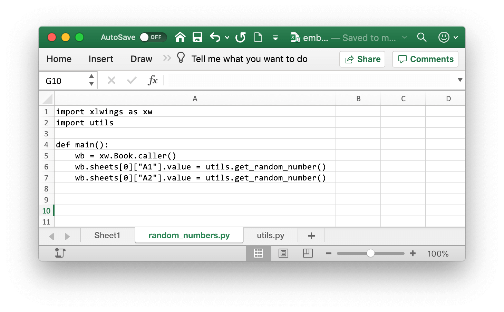

.. _release:

Releasing xlwings Tools
=======================

This feature requires xlwings :guilabel:`PRO`.

xlwings PRO offers a simple way to deploy your xlwings tools to your end users without the usual hassle that's involved when installing and configuring Python and xlwings. End users don't need to know anything about Python as they only need to:

* Run an installer (one installer can power many different Excel workbooks)
* Use the Excel workbook as if it was a normal macro-enabled workbook

Advantages:

* **Zero-config**: The end user doesn't have to configure anything throughout the whole process.
* **No add-in required**: No installation of the xlwings add-in required.
* **Easy to update**: If you want to deploy an update of your Python code, it's often good enough to distribute a new version of your workbook.
* **No conflicts**: The installer doesn't touch any environment variables or registry keys and will therefore not conflict with any existing Python installations.
* **Deploy key**: The release command will add a deploy key as your LICENSE_KEY. A deploy key won't expire and end users won't need a paid subscription.

You as a developer need to create the one-click installer and run the ``xlwings release`` command on the workbook. Let's go through these two steps in detail!

There is a video walkthrough at: https://www.youtube.com/watch?v=yw36VT_n1qg

.. _zero_config_installer:

Step 1: One-Click Installer
---------------------------

As a subscriber of one of our `paid plans <https://www.xlwings.org/pricing>`_, you will get access to a private GitHub repository, where you can build your one-click installer:

1) Update your ``requirements.txt`` file with your dependencies: in your repository, start by clicking on the ``requirements.txt`` file. This will open the following screen where you can click on the pencil icon to edit the file (if you know your way around Git, you can also clone the repository and use your local commit/push workflow instead):

  .. figure:: images/gh_edit_requirements.png

  After you're done with your edits, click on the green ``Commit changes`` button.

  .. note::
    If you are unsure about your dependencies, it's best to work locally with a virtual or Conda environment. In the virtual/Conda environment, only install packages that you need, then run: ``pip list --format=freeze``.

2) On the right-hand side of the landing page, click on ``Releases``:

  .. figure:: images/gh_releases.png

  On the next screen, click on ``Draft a new release`` (note, the very first time, you will see a green button called ``Create a new release`` instead):

  .. figure:: images/gh_create_release.png

  This will bring up the following screen, where you'll only have to fill in a ``Tag version`` (e.g., ``1.0.0``), then click on the green button ``Publish release``:

  .. figure:: images/gh_publish_release.png

  After 3-5 minutes (you can follow the progress under the ``Actions`` tab), you'll find the installer ready for download under Releases (ignore the ``zip`` and ``tar.gz`` files):

  .. figure:: images/gh_installer_download.png

.. note::
  The one-click installer is a normal Python installation that you can use with multiple Excel workbooks. Hence, you don't need to create a separate installer for each workbook as long as they all work with the same set of dependencies as defined by the ``requirements.txt`` file.

Step 2: Release Command (CLI)
-----------------------------

The release command is part of the xlwings CLI (command-line client) and will prepare your Excel file to work with the one-click installer generated in the previous step. Before anything else:

* Make sure that you have enabled ``Trust access to the VBA project object model`` under ``File > Options > Trust Center > Trust Center Settings > Macro Settings``. You only need to do this once and since this is a developer setting, your end users won't need to bother about this. This setting is needed so that xlwings can update the Excel file with the correct version of the VBA code.
* Run the installer from the previous step. This will not interfere with your existing Python installation as it won't touch your environment variables or registry. Instead, it will only write to the following folder: ``%LOCALAPPDATA%\<installer-name>``.
* Make sure that your local version of xlwings corresponds to the version of xlwings in the ``requirements.txt`` from the installer. The easiest way to double-check this is to run ``pip freeze`` on a Command Prompt or Anaconda Prompt. If your local version of xlwings differs, install the same version as the installer uses via: ``pip install xlwings==<version from installer>``.

To work with the release command, you should have your workbook in the ``xlsm`` format and all the Python modules in the same folder::

    myworkbook.xlsm
    mymodule_one.py
    mymodule_two.py
    ...

You currently can't organize your code in directories, but you can easily import ``mymodule_two`` from ``mymodule_one``.

Make sure that your Excel workbook is the active workbook, then run the following command on a Command/Anaconda Prompt::

    xlwings release

If this is the first time you are running this command, you will be asked a few questions. If you are shown a ``[Y/n]``, you can hit Enter to accept the default as expressed by the capitalized letter:

* ``Name of your one-click installer?`` `Type in the name of your one-click installer. If you want to use a different Python distribution (e.g., Anaconda), you can leave this empty (but you will need to update the xlwings.conf sheet with the Conda settings once the release command has been run).`
* ``Embed your Python code? [Y/n]`` `This will copy the Python code into the sheets of the Excel file. It will respect all Python files that are in the same folder as the Excel workbook.`
* ``Hide the config sheet? [Y/n]`` `This will hide the xlwings.conf sheet.`
* ``Hide the sheets with the embedded Python code? [Y/n]`` `If you embed your Python code, this will hide all sheets with a .py ending.`
* ``Allow your tool to run without the xlwings add-in? [Y/n]`` `This will remove the VBA reference to xlwings and copy in the xlwings VBA modules so that the end users don't need to have the xlwings add-in installed. Note that in this case, you will need to have your RunPython calls bound to a button as you can't use the Ribbon's Run main button anymore.`

Whatever answers you pick, you can always change them later by editing the ``xlwings.conf`` sheet or by deleting the ``xlwings.conf`` sheet and re-running the ``xlwings release`` command. If you go with the defaults, you only need to provide your end users with the one-click installer and the Excel workbook, no external Python files are required.

Updating a Release
------------------

To edit your Python code, it's easiest to work with external Python files and not with embedded code. To stop xlwings from using the embedded code, simply delete all sheets with a ``.py`` ending and the workbook will again use the external Python modules. Once you are done editing the files, simply run the ``xlwings release`` command again, which will embed the updated code. If you haven't done any changes to your dependencies (i.e., you haven't upgraded a package or introduced a new one), you only need to redeploy your Excel workbook to have the end users get the update.

If you did make changes to the ``requirements.txt`` and release a new one-click installer, you will need to have the users install the new version of the installer first.

.. note::

  Every time you change the xlwings version in ``requirements.txt`` of your one-click installer, make sure to upgrade your local xlwings installatino to the same version and run ``xlwings release`` again!

.. _embedded_code:

Embedded Code Explained
-----------------------

When you run the ``xlwings release`` command, your code will be embedded automatically (except if you switch this behavior off). You can, however, also embed code directly: on a command line, run the following command::

    xlwings code embed

This will import all Python files from the current directory and paste them into Excel sheets of the currently active workbook. Now, you can use ``RunPython`` as usual: ``RunPython "import mymodule;mymodule.myfunction()"``.

Note that you can have multiple Excel sheets and import them like normal Python files. Consider this example:

.. figure:: images/embedded_code2.png

You can call the ``main`` function from VBA like so::

    Sub RandomNumbers()
        RunPython "import random_numbers;random_numbers.main()"
    End Sub

.. note::
    * UDFs modules don't have to be added to the ``UDF Modules`` explicitly when using embedded code. However, in contrast to how it works with external files, you currently need to re-import the functions when you change them.
    * While you can hide your sheets with your code, they will be written to a temporary directory in clear text.