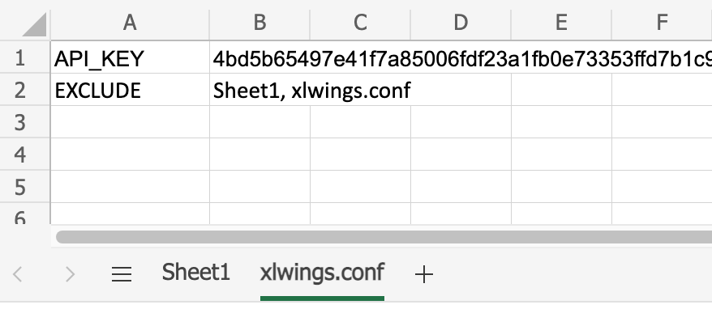

.. _remote_interpreter:

Remote Python Interpreter: Google Sheets & Excel on the web
===========================================================

This feature requires xlwings :guilabel:`PRO` and at least v0.26.0.

In connection with **Google Sheets** or **Excel on the web**, xlwings can be run on a **server** (cloud service or self-hosted) for a full cloud experience without local installations of neither Excel nor Python.

.. important:: This feature is currently experimental and only covers parts of the xlwings API, see also :ref:`Limitations` and :ref:`Roadmap`.

Why is this useful?
-------------------

To automate Office on the web, you have to use Office Scripts (i.e., TypeScript, a typed superset of JavaScript) and for Google Sheets, you have to use Apps Script (i.e., JavaScript). If you don't feel like learning JavaScript, xlwings allows you to write Python code instead. But even if you are comfortable with JavaScript, you are very limited in what you can do, as both Office Scripts and Apps Script are primarily designed to automate simple spreadsheet tasks such as inserting a new sheet or formatting cells rather than working with data. They also make it very hard/impossible to use external libraries and run in environments with minimal resources.

.. note:: From here on, when I refer to the **xlwings JavaScript module**, I mean either the xlwings Apps Script module if you use Google Sheets or the xlwings Office Scripts module if you use Excel on the web.

On the other hand, xlwings with a remote Python interpreter brings you these advantages:

* **Work with the whole Python ecosystem**: including pandas, machine learning libraries, database packages, web scraping, boto (for AWS S3), etc. This makes xlwings a great alternative for Power Query, which isn't currently available for Excel on the web or Google Sheets.
* **Leverage your existing development workflow**: use your favorite IDE/editor (local or cloud-based) and stick to your Git workflow, allowing you to easily track changes, collaborate and perform code reviews. You can also write unit tests easily using pytest.
* **Remain in control of your data and code**: except for the data you expose in Excel or Google Sheets, everything stays on your server. This can include database passwords and other sensitive info such as customer data. There's also no need to give the Python code to end-users: the whole business logic with your secret sauce is protected on your own infrastructure.
* **Choose the right machine for the job**: whether that means using a GPU, a ton of CPU cores, lots of memory, or a gigantic hard disc. As long as Python runs on it, you can go from serverless functions as offered by the big cloud vendors all the way to a self-managed Kubernetes cluster under your desk (see :ref:`Production Deployment`).
* **Headache-free deployment and maintenance**: there's only one location where your Python code lives and you can automate the whole deployment process with continuous integration pipelines like GitHub actions etc.

Prerequisites
-------------

.. tab-set::
    .. tab-item:: Google Sheets
      :sync: google

      No special requirements.

    .. tab-item:: Excel on the web
      :sync: excel

      * You need access to Excel on the web with the ``Automate`` tab enabled, i.e., access to Office Scripts. Note that Office Scripts currently requires OneDrive for Business or SharePoint (it's not available on the free office.com), see also `Office Scripts Requirements <https://docs.microsoft.com/en-gb/office/dev/scripts/overview/excel#requirements>`_.
      * The ``fetch`` command in Office Scripts must **not** be disabled by your Microsoft 365 administrator.

Introduction
------------

Working with a remote Python interpreter consists of two parts:

* the Python part (the "backend" or "server")
* the xlwings JavaScript module (the "frontend" or "client")

This is no different from the classic desktop use of xlwings except that (a) the xlwings JavaScript module is used in place of the VBA add-in/module and (b) the Python backend runs on a server instead of on your local machine.

Working with a remote Python interpreter means that you have to expose your Python functions by using a Python web framework. In more detail, you need to handle a POST request along these lines (the sample shows an excerpt that uses `FastAPI <https://fastapi.tiangolo.com/>`_ as the web framework, but it works accordingly with any other web framework like Django or Flask):

.. code-block:: python

    @app.post("/hello")
    def hello(data: dict = Body(...)):
        # Instantiate a Book object with the deserialized request body
        book = xw.Book(json=data)

        # Use xlwings as usual
        book.sheets[0].value = 'Hello xlwings!'

        # Pass the following back as the response
        return book.json()

Once this runs on a public-facing web server, you simply have to paste the xlwings JavaScript module into the editor in Excel on the web or Google Sheets, respectively, adjust the configuration, and you're all set! The next section shows you how you can play around with this in no time.

Cloud-based development with Gitpod
-----------------------------------

If you want to have a development environment up and running in less than 5 minutes (even if you're new to web development), simply click the ``Open in Gitpod`` button to open a `sample project <https://github.com/xlwings/xlwings-web-fastapi>`_ in `Gitpod <https://www.gitpod.io>`_ (Gitpod is a cloud-based development environment with a generous free tier):

.. image:: https://gitpod.io/button/open-in-gitpod.svg
   :target: https://gitpod.io/#https://github.com/xlwings/xlwings-web-fastapi
   :alt: Open in Gitpod

Opening the project in Gitpod will require you to sign in with your GitHub account. A few moments later, you should see an online version of VS Code. In the Terminal, it will ask you to paste the xlwings license key (get one `here <https://www.xlwings.org/trial>`_). Note that your browser will ask you for permission to paste. Once you confirm your license key by hitting ``Enter``, the server will automatically start with everything properly configured. You can then open the ``app`` directory and look at the ``main.py`` file, where you'll see the ``hello`` function. This is the function we're going to call from Google Sheets/Excel on the web in just a moment. The other file in this directory, ``app.py`` contains all the FastAPI boilerplate code. Let's leave this alone for a moment and look at the ``js`` folder instead. Open the file according to your platform:

.. tab-set::
    .. tab-item:: Google Sheets
      :sync: google

      .. code-block:: text

          xlwings_google.js

    .. tab-item:: Excel on the web
      :sync: excel

      .. code-block:: text

          xlwings_excel.ts

Copy the code, then switch to Google Sheets or Excel on the web, respectively, and continue as follows:

.. tab-set::
    .. tab-item:: Google Sheets
      :sync: google

      Click on ``Extensions`` > ``Apps Script``. This will open a separate browser tab and open a file called ``Code.gs`` with a function stub. Replace this function stub with the copied code from ``xlwings_google.js`` and click on the ``Save`` icon. Then hit the ``Run`` button (the ``hello`` function should be automatically selected in the dropdown to the right of it). If you run this the very first time, Google Sheets will ask you for the permissions it needs. Once approved, the script will run the ``hello`` function and write ``Hello xlwings!`` into cell ``A1``.

      To add a button to a sheet to run this function, switch from the Apps Script editor back to Google Sheets, click on ``Insert`` > ``Drawing`` and draw a rounded rectangle. After hitting ``Save and Close``, the rectangle will appear on the sheet. Select it so that you can click on the 3 dots on the top right of the shape. Select ``Assign Script`` and write ``hello`` in the text box, then hit ``OK``.

    .. tab-item:: Excel on the web
      :sync: excel

      In the ``Automate`` tab, click on ``New Script``. This opens a code editor pane on the right-hand side with a function stub. Replace this function stub with the copied code from ``xlwings_excel.ts``. Make sure to click on ``Save script`` before clicking on ``Run``: the script will run the ``hello`` function and write ``Hello xlwings!`` into cell ``A1``.

      To run this script from a button, click on the 3 dots in the Office Scripts pane (above the script), then select ``+ Add button``.

Any changes you make to the ``hello`` function in ``app/main.py`` in Gitpod are automatically saved and reloaded by the web server and will be reflected the next time you run the script from Google Sheets or Excel on the web.

To test out ``yahoo``, the other function of the `sample project <https://github.com/xlwings/xlwings-web-fastapi>`_, replace ``hello`` with ``yahoo`` in the ``runPython`` function in the xlwings JavaScript module.

.. note:: While Excel on the web requires you to create a separate script with a function called ``main`` for each Python function, Google Sheets allows you to add multiple functions with any name.

Please note that clicking the Gitpod button gets you up and running quickly, but if you want to save your changes (i.e., commit them to Git), you should first fork the project on Github and open it from Gitpod instead of clicking the button. Or continue with the next section, which shows you how you can start a project from scratch on your local machine.

An alternative for Gitpod is `GitHub Codespaces <https://github.com/features/codespaces>`_, but unlike Gitpod, GitHub Codespaces only works with GitHub, has no free tier, and may not be available yet on your account.

Local Development
-----------------

This tutorial walks you through a local development workflow as an alternative to using Gitpod/GitHub Codespaces. What's making this a little harder than using an online service like Gitpod is the fact that we need to expose our local web server to the internet for easy development.

As before, we're going to use `FastAPI <https://fastapi.tiangolo.com/>`_ as our web framework. While you can use any web framework you like, no quickstart command exists for these yet, so you'd have to set up the boilerplate yourself. Let's start with the server before turning our attention to the client side (i.e, Google Sheets or Excel on the web).

Part I: xlwings Server
**********************

Start a new quickstart project by running the following command on a Terminal/Command Prompt. Feel free to replace ``demo`` with another project name and make sure to run this command in the desired directory::

    $ xlwings quickstart demo --fastapi

This creates a folder called ``demo`` in the current directory with the following files::

    main.py
    app.py
    requirements.txt

I would recommend you to create a virtual or Conda environment where you install the dependencies via ``pip install -r requirements.txt``. In ``app.py``, you'll find the FastAPI boilerplate code and in ``main.py``, you'll find the ``hello`` function that is exposed under the ``/hello`` endpoint.

The application expects you to set a unique ``XLWINGS_API_KEY`` as environment variable in order to protect your application from unauthorized access. You should choose a strong random key, for example by running the following on a Terminal/Command Prompt: ``python -c "import secrets; print(secrets.token_hex(32))"``. If you don't set an environment variable, it will use ``DEVELOPMENT`` as the API key (only use this for quick tests and never for production!).

To run this server locally, run ``python main.py`` in your Terminal/Command Prompt or by using your code editor/IDE. You should see something along these lines:

.. code-block:: text

    $ python main.py
    INFO:     Will watch for changes in these directories: ['/Users/fz/Dev/demo']
    INFO:     Uvicorn running on http://127.0.0.1:8000 (Press CTRL+C to quit)
    INFO:     Started reloader process [36073] using watchgod
    INFO:     Started server process [36075]
    INFO:     Waiting for application startup.
    INFO:     Application startup complete.

Your web server is now listing, however, to enable it to communicate with Google Sheets or Excel on the web, you need to expose your local server securely to the internet. There are many free and paid services available to help you do this. One of the more popular ones is `ngrok <https://ngrok.com/>`_ whose free version will do the trick (for a list of ngrok alternatives, see `Awesome Tunneling <https://github.com/anderspitman/awesome-tunneling>`_):

* `ngrok Installation <https://ngrok.com/download>`_
* `ngrok Tutorial <https://ngrok.com/docs>`_

For the sake of this tutorial, let's assume you've installed ngrok, in which case you would run the following on your Terminal/Command Prompt to expose your local server to the public internet::

    $ ngrok http 8000

Note that the number of the port (8000) has to correspond to the port that is configured on your local development server as specified at the bottom of ``main.py``. ngrok will print something along these lines::

    ngrok by @inconshreveable                                                                                (Ctrl+C to quit)

    Session Status                online
    Account                       name@domain.com (Plan: Free)
    Version                       2.3.40
    Region                        United States (us)
    Web Interface                 http://127.0.0.1:4040
    Forwarding                    http://xxxx-xxxx-xx-xx-xxx-xxxx-xxxx-xxxx-xxx.ngrok.io -> http://localhost:8000
    Forwarding                    https://xxxx-xxxx-xx-xx-xxx-xxxx-xxxx-xxxx-xxx.ngrok.io -> http://localhost:8000

To configure the xlwings client in the next step, we'll need the ``https`` version of the Forwarding address that ngrok prints, i.e., ``https://xxxx-xxxx-xx-xx-xxx-xxxx-xxxx-xxxx-xxx.ngrok.io``.

.. note:: When you're not actively developing, you should stop your ngrok session by hitting ``Ctrl-C`` in the Terminal/Command Prompt.

Part II: xlwings Client
***********************

Now it's time to switch to Google Sheets or Excel on the web! To paste the xlwings JavaScript module, follow these 3 steps:

1. **Copy the xlwings JavaScript module**: On a Terminal/Command Prompt/Anaconda Prompt on your local machine, run the following command:

   .. tab-set::
       .. tab-item:: Google Sheets
         :sync: google

         .. code-block:: text

             $ xlwings copy gs

       .. tab-item:: Excel on the web
         :sync: excel

         .. code-block:: text

             $ xlwings copy os

   This will copy the correct xlwings JavaScript module to the clipboard so we can paste it in the next step.

2. **Paste the xlwings JavaScript module**

.. tab-set::
    .. tab-item:: Google Sheets
      :sync: google

      Click on ``Extensions`` > ``Apps Script``. This will open a separate browser tab and open a file called ``Code.gs`` with a function stub. Replace this function stub with the copied code from the previous step and click on the ``Save`` icon. Then hit the ``Run`` button (the ``hello`` function should be automatically selected in the dropdown to the right of it). If you run this the very first time, Google Sheets will ask you for the permissions it needs. Once approved, the script will run the ``hello`` function and write ``Hello xlwings!`` into cell ``A1``.

      To add a button to a sheet to run this function, switch from the Apps Script editor back to Google Sheets, click on ``Insert`` > ``Drawing`` and draw a rounded rectangle. After hitting ``Save and Close``, the rectangle will appear on the sheet. Click on it so that you can click on the 3 dots on the top right of the shape. Select ``Assign Script`` and write ``hello`` in the text box, then hit ``OK``.

    .. tab-item:: Excel on the web
      :sync: excel

      In the ``Automate`` tab, click on ``New Script``. This opens a code editor pane on the right-hand side with a function stub. Replace this function stub with the copied code from the previous step. Make sure to click on ``Save script`` before clicking on ``Run``: the script will run the ``hello`` function and write ``Hello xlwings!`` into cell ``A1``.

      To run this script from a button, click on the 3 dots in the Office Scripts pane (above the script), then select ``+ Add button``.

3. **Configuration**: The final step is to configure the xlwings JavaScript module properly, see the next section :ref:`Configuration`.

Configuration
-------------

The xlwings JavaScript module can be configured in two ways:

* Via arguments in the ``runPython`` function
* Via ``xlwings.conf`` sheet

If both ways are configured, the function arguments win. Using the ``xlwings.conf`` sheet has the advantages that you can potentially (a) upgrade your xlwings module without having to adjust the code and (b) you can share your configuration with multiple ``runPython`` calls. Let's first see what the available settings are:

* ``URL`` (required): This is the full URL of your function. In the above example under :ref:`Local Development`, this would be ``https://xxxx-xxxx-xx-xx-xxx-xxxx-xxxx-xxxx-xxx.ngrok.io/hello``, i.e., the ngrok URL **with the /hello endpoint appended**.
* ``API_KEY`` (required): The ``API_KEY`` has to correspond to whatever you set the ``XLWINGS_API_KEY`` environment variable on your server and will protect your functions from unauthorized access. It's good practice to keep your sensitive keys such as the ``API_KEY`` out of your source code (the JavaScript module), but putting it in the ``xlwings.conf`` sheet may only be marginally better. Excel on the web, however, doesn't currently provide you with a better way of handling this. Google Sheets, on the other hand, allows you to work with `Properties Service <https://developers.google.com/apps-script/guides/properties>`_ to keep the ``API_KEY`` out of both the JavaScript code and the ``xlwings.conf`` sheet.

  .. note:: The API_KEY is chosen by you to protect your application and has nothing to do with the xlwings license key!

* ``EXCLUDE`` (optional): By default, xlwings sends over the complete content of the whole workbook to the server. If you have sheets with big amounts of data, this can make the calls slow or even prevent you from making the call. If your backend doesn't need the content of certain sheets, you can exclude them from being sent over via the ``EXCLUDE`` setting. Currently, you can only exclude entire sheets as comma-delimited string like so: ``Sheet1, Sheet2``.

Configuration Examples: Function Arguments
******************************************

.. tab-set::

    .. tab-item:: Google Sheets
      :sync: google

      Using only required arguments:

      .. code-block:: JavaScript

        function hello() {
          runPython(
            "https://xxxx-xxxx-xx-xx-xxx-xxxx-xxxx-xxxx-xxx.ngrok.io/hello",
            "YOUR_UNIUQE_API_KEY"
          );
        }

      Additionally providing the ``exclude`` parameter to exclude the content of the ``xlwings.conf`` and ``Sheet1`` sheets:

      .. code-block:: JavaScript

        function hello() {
          runPython(
            "https://xxxx-xxxx-xx-xx-xxx-xxxx-xxxx-xxxx-xxx.ngrok.io/hello",
            "YOUR_UNIUQE_API_KEY",
            "xlwings.conf, Sheet1"
          );
        }

    .. tab-item:: Excel on the web
      :sync: excel

      Using only required arguments:

      .. code-block:: JavaScript

        async function main(workbook: ExcelScript.Workbook) {
          await runPython(
            workbook,
            "https://xxxx-xxxx-xx-xx-xxx-xxxx-xxxx-xxxx-xxx.ngrok.io/hello",
            "YOUR_UNIUQE_API_KEY"
          );
        }

      Additionally providing the ``exclude`` parameter to exclude the content of the ``xlwings.conf`` and ``Sheet1`` sheets:

      .. code-block:: JavaScript

        async function main(workbook: ExcelScript.Workbook) {
          await runPython(
            workbook,
            "https://xxxx-xxxx-xx-xx-xxx-xxxx-xxxx-xxxx-xxx.ngrok.io/hello",
            "YOUR_UNIUQE_API_KEY",
            "xlwings.conf, Sheet1"
          );
        }

Configuration Examples: xlwings.conf sheet
******************************************

Create a sheet called ``xlwings.conf`` and fill in key/value pairs like so:

You can now refer to this configuration as follows:

.. tab-set::
    .. tab-item:: Google Sheets
      :sync: google

      Both functions can be on a single xlwings module:

      .. code-block:: JavaScript

        function hello() {
          runPython(
            "URL",
            "API_KEY"
          );
        }

        function yahoo() {
          runPython(
            "URL_YAHOO",
            "API_KEY"
          );
        }

    .. tab-item:: Excel on the web
      :sync: excel

      Office Scripts requires the calls to be on separate xlwings modules:

      .. code-block:: JavaScript

        // Script 1
        async function main(workbook: ExcelScript.Workbook) {
          await runPython(
            workbook,
            "URL",
            "API_KEY"
          );
        }

      .. code-block:: JavaScript

        // Script 2
        async function main(workbook: ExcelScript.Workbook) {
          await runPython(
            workbook,
            "URL_YAHOO",
            "API_KEY"
          );
        }

Production Deployment
---------------------

The xlwings web server can be built with any web framework and can therefore be deployed using any solution capable of running a Python backend or function. Here is a list for inspiration (non-exhaustive):

* **Fully-managed services**: `Heroku <https://www.heroku.com>`_, `render <https://www.render.com>`_, `Fly.io <https://www.fly.io>`_, etc.
* **Interactive environments**: `PythonAnywhere <https://www.pythonanywhere.com>`_, `Anvil <https://www.anvil.works>`_, etc.
* **Serverless functions**: `AWS Lambda <https://aws.amazon.com/lambda/>`_, `Azure Functions <https://azure.microsoft.com/en-us/services/functions/>`_, `Google Cloud Functions <https://cloud.google.com/functions>`_, `Vercel <https://vercel.com>`_, etc.
* **Virtual Machines**: `DigitalOcean <https://m.do.co/c/ed671b0a5a9b>`_ (referral link), `vultr <https://www.vultr.com/?ref=7155223>`_ (referral link), `Linode <https://www.linode.com/>`_, `AWS EC2 <https://aws.amazon.com/ec2/>`_, `Microsoft Azure VM <https://azure.microsoft.com/en-us/services/virtual-machines/>`_, `Google Cloud Compute Engine <https://cloud.google.com/compute>`_, etc.
* **Corporate servers**: Anything will work (including Kubernetes) as long as the respective endpoints can be accessed from Excel on the web or Google Sheets.

.. important::
    For production deployment, always make sure to set a unique and random ``API_KEY``, see :ref:`Configuration`.

If you'd like to deploy the `sample project <https://github.com/xlwings/xlwings-web-fastapi>`_ to production in less than 5 minutes, you can do so by clicking the button below, which will deploy it to Heroku's free tier. Note, however, that on the free plan, the backend will "sleep" after 30 minutes of inactivity, which means that it will take a few moments the next time you call it until it is up and running again. The ``XLWINGS_API_KEY`` is auto-generated and you can look it up under your app's ``Settings`` > ``Config Vars`` > ``Reveal Config Vars`` once the app is deployed. To get the URL, you'll need to append ``/hello`` to the app's URL that you'll find in your dashboard.

.. image:: https://www.herokucdn.com/deploy/button.svg
   :target: https://heroku.com/deploy?template=https://github.com/xlwings/xlwings-web-fastapi/tree/main
   :alt: Deploy

Triggers
--------

.. tab-set::
    .. tab-item:: Google Sheets
      :sync: google

      For Google Sheets, you can take advantage of the integrated Triggers (accessible from the menu on the left-hand side of the Apps Script editor). You can trigger your xlwings functions on a schedule or by an event, such as opening or editing a sheet.

    .. tab-item:: Excel on the web
      :sync: excel

      Normally, you would use Power Automate to achieve similar things as with Google Sheets Triggers, but unfortunately, Power Automate can't run Office Scripts that contain a ``fetch`` command like xlwings does, so for the time being, you can only trigger xlwings calls manually on Excel on the web. Alternatively, you can open your Excel file with Google Sheets and leverage the Triggers that Google Sheets offers. This, however, requires you to store your Excel file on Google Drive.

Limitations
-----------

* Currently, only a subset of the xlwings API is covered, mainly the Range and Sheet classes with a focus on reading and writing values. This, however, includes full support for type conversion including pandas DataFrames, NumPy arrays, datetime objects, etc.
* You have to follow the web's classic request/response cycle, meaning that values that you write to a range will only be written back to Google Sheets/Excel once the function call returns. Put differently, you'll get the state of the sheets at the moment the call was initiated, but you can't read from a cell you've just written to until the next call.
* You will need to use the same xlwings version for the Python package and the JavaScript module, otherwise, the server will raise an error.
* Currently, custom functions (a.k.a. user-defined functions or UDFs) are not supported.
* For users with no experience in web development, this documentation may not be quite good enough just yet.

Platform-specific limitations:

.. tab-set::
    .. tab-item:: Google Sheets
      :sync: google

      * `Quotas for Google Services <https://developers.google.com/apps-script/guides/services/quotas>`_ apply.

    .. tab-item:: Excel on the web
      :sync: excel

      * xlwings relies on the ``fetch`` command in Office Scripts that cannot be used via Power Automate and that can be disabled by your Microsoft 365 administrator.
      * `Platform limits with Office Scripts <https://docs.microsoft.com/en-us/office/dev/scripts/testing/platform-limits>`_ apply.

Roadmap
-------

* Add features that aren't supported yet, e.g., charts, shapes, named ranges, tables, etc.
* Improve efficiency.
* Add support for Excel Desktop (Windows & macOS). Note that Office Scripts on Windows is out for Office Insiders (Microsoft 365 only), so if you have access to this, it should work out of the box.
