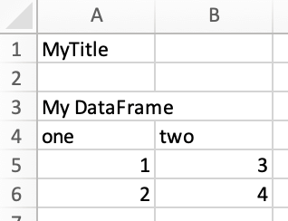
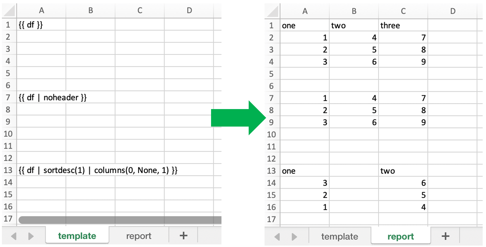

.. _reports_quickstart:

xlwings Reports
===============

This feature requires xlwings :guilabel:`PRO`.

xlwings Reports is a solution for template-based Excel and PDF reporting. It allows business users without Python knowledge to create and maintain Excel templates without having to rely on a Python developer for every change: xlwings Reports separates the Python code (data acquisition) from the Excel template (layout/formatting).

xlwings Reports supports all commonly required components:

* **Text**: Format text via Markdown syntax.
* **Tables**: Write pandas DataFrames to Excel cells and tables and format them dynamically based on the number of rows.
* **Charts**: Use your favorite charting engine: Excel charts, Matplotlib, or Plotly.
* **Images**: You can include both raster (e.g., png) or vector (e.g., svg) graphics, including dynamically generated ones, e.g., QR codes.
* **Multi-column Layout**: Split your content up into a classic two column layout.
* **PDF**: Generate PDF reports automatically.
* **Languages**: Generate factsheets in various languages based on a single template.

Quickstart
----------

You can render one sheet via :meth:`mysheet.render_template <xlwings.Sheet.render_template>` or use the higher-level convenience function :meth:`xw.create_report <xlwings.pro.reports.create_report>` which first copies the template workbook and then loops through all sheets:

Render Sheets
*************

Let's first look at how to render a single sheet. This is a workbook stored as ``Book1.xlsx``:

Running the following code::

    import xlwings as xw
    book = xw.Book('Book1.xlsx')
    sheet = book.sheets['template'].copy(name='report')
    sheet.render_template(title='A Demo!', table=[[1, 2], [3, 4]])
    book.to_pdf()

Leaves you with this:

.. figure:: images/sheet_rendering2.png
    :scale: 60%

See also the :meth:`mysheet.render_template (API reference) <xlwings.Sheet.render_template>`.

.. versionadded:: 0.22.0

Render Workbooks
****************

If your template is a full workbook, you can use the ``create_report`` function. Start by creating the following Python script ``mytemplate.py``::

    from xlwings.pro.reports import create_report
    import pandas as pd

    df = pd.DataFrame(data=[[1,2],[3,4]])
    book = create_report('mytemplate.xlsx', 'myreport.xlsx', title='MyTitle', df=df)
    book.to_pdf()

Then create the following Excel file called ``mytemplate.xlsx``:

.. figure:: images/mytemplate.png

Now run the Python script::

    python mytemplate.py

This will copy the template and create the following output by replacing the variables in double curly braces with
the value from the Python variable:

By default, xlwings Reports overwrites existing values in templates if there is not enough free space for your variable.
If you want your rows to dynamically shift according to the height of your array, use :ref:`Frames <Frames>`.

See also :meth:`create_reports (API reference) <xlwings.pro.reports.create_report>`.

pandas DataFrames
-----------------

When you work with DataFrames, you'll often need to tweak the data. The following filters allow you to do the most common operations. A filter is added to the placeholder, separated by the pipe character. You can combine multiple filters by using multiple pipe characters as we'll see in the examples.

* **noindex**: Hide the index

  Example::

  {{ df | noindex }}

* **noheader**: Hide the column header

  Example::

  {{ df | noheader }}

* **sortasc**: Sort in ascending order

  Example: Sort by second, then by first column::

  {{ df | sortasc(1, 0) }}

* **sortdesc**: Sort in descending order

  Example: Sort by first, then by second column in descending order::

  {{ df | sortdesc(0, 1) }}

* **maxrows**: Maximum number of rows: if your DataFrame has 12 rows and you set maxrows to 10, then you'll get a table that shows the first 9 rows as-is and sums up the remaining 3 rows as the last row. By default, this row will be called "Other", but you can change the wording by submitting a second argument:

  Examples::

  {{ df | maxrows(10) }}
  {{ df | sortasc(1)| noindex | maxrows(10) }}
  {{ df | maxrows(10, "Other Items") }}

 Since it it labels the first column (not the index) with "Other", you'll probably use this filter most of the time with ``noindex``. If your data is unsorted, use ``sortasc``/``sortdesc`` to make sure the correct rows are aggregated.

* **columns**: Select and reorder columns and introduce empty columns (column indices are zero-based)

  Example: ``{{ df | columns(0, None, 2, 1) }}``. This will introduce an empty column (``None``) as the second column and switch the order of the second and third column.

  .. note::
    Merged cells: you'll also have to introduce empty columns if you are using merged cells in your Excel template.

Here are a couple of examples with a screenshot::

    import xlwings as xw
    import pandas as pd

    book = xw.Book('Book1.xlsx')
    sheet = book.sheets['template'].copy(name='report')
    df = pd.DataFrame({'one': [1, 2, 3], 'two': [4, 5, 6], 'three': [7, 8, 9]})
    sheet.render_template(df=df)

.. _excel_tables_reports:

Excel Tables
------------

Using Excel tables is the recommended way to format tables as the styling can be applied dynamically across columns and rows. You can also use themes and apply alternating colors to rows/columns. On top of that, they are the easiest way to make the source of a chart dynamic. Go to ``Insert`` > ``Table`` and make sure that you activate ``My table has headers`` before clicking on ``OK``. Add the placeholder as usual on the top-left of your Excel table:

.. figure:: images/excel_table_template.png

Running the following script::

    from xlwings.pro.reports import create_report
    import pandas as pd

    nrows, ncols = 3, 3
    df = pd.DataFrame(data=nrows * [ncols * ['test']],
                      columns=[f'col {i}' for i in range(ncols)])

    create_report('template.xlsx', 'output.xlsx', df=df)

Will produce the following report:

.. figure:: images/excel_table_report.png

.. note::
    * To exclude the index, use the ``noindex`` filter. for more about filters, see below.
    * At the moment, you can only assign pandas DataFrames to tables.
    * For Excel table support, you need at least version 0.21.0 and the index behavior was changed in 0.21.3

Excel Charts
------------

**Note**: To use charts with a dynamic source, you'll need at least xlwings version 0.22.1

To use Excel charts in your reports, follow this process:

1. Add some sample/dummy data to your Excel template:

    .. figure:: images/reports_chart1.png

2. If your data source is dynamic, turn it into an Excel Table (``Insert`` > ``Table``). Make sure you do this *before* adding the chart in the next step.

    .. figure:: images/reports_chart2.png

3. Add your chart and style it:

    .. figure:: images/reports_chart3.png

4. Reduce the Excel table to a 2 x 2 range and add the placeholder in the top-left corner (in our example ``chart_data``) . You can leave in some dummy data or clear the values of the Excel table:

    .. figure:: images/reports_chart4.png

5. Assuming your file is called ``mytemplate.xlsx`` and your sheet ``template`` like on the previous screenshot, you can run the following code::

    import xlwings as xw
    import pandas as pd

    df = pd.DataFrame(data={'Q1': [1000, 2000, 3000],
                            'Q2': [4000, 5000, 6000],
                            'Q3': [7000, 8000, 9000]},
                      index=['North', 'South', 'West'])

    book = xw.Book("mytemplate.xlsx")
    sheet = book.sheets['template'].copy(name='report')
    sheet.render_template(chart_data=df)

This will produce the following report, with the chart source correctly adjusted:

    .. figure:: images/reports_chart5.png

**Note**: If you don't want the source data on your report, you might want to place it on a separate sheet. It's easiest if you add and design the chart on the separate sheet, before cutting the chart and pasting it on your report template.

Images
------

Images are inserted so that the cell with the placeholder will become the top-left corner of the image. For example, write the following placeholder into you desired cell: ``{{ logo }}``.

Then run the following code::

    import xlwings as xw
    from xlwings.pro.reports import Image

    book = xw.Book('Book1.xlsx')
    sheet = book.sheets['template'].copy(name='report')
    sheet.render_template(logo=Image(r'C:\path\to\logo.png'))

**Note**: ``Image`` also accepts a ``pathlib.Path`` object instead of a string.

If you want to use vector-based graphics, you can use ``svg`` on Windows and ``eps`` on macOS. You can control the appearance of your image by applying filters on your placeholder:

* **Width**: Set the width in pixels (height will be scaled proportionally).

  Example::

  {{ logo | width(200) }}

* **Height**: Set the height in pixels (width will be scaled proportionally).

  Example::

  {{ logo | height(200) }}

* **Width and Height**: Setting both width and height will distort the proportions of the image.

  Example::

  {{ logo | height(200) | width(200) }}

* **Scale**: Scale your image using a factor (height and width will be scaled proportionally).

  Example::

  {{ logo | scale(1.2) }}

Matlotlib and Plotly Plots
--------------------------

For a general introduction on how to handle Matplotlib and Plotly, see also: See also: :ref:`matplotlib`. There, you'll also find the prerequisites to be able to export Plotly charts as pictures.

Matplotlib
**********

Write the following placeholder in the cell where you want to paste the Matplotlib plot: ``{{ lineplot }}``. Then run the following code::

    import matplotlib.pyplot as plt
    import xlwings as xw

    fig = plt.figure()
    plt.plot([1, 2, 3])

    book = xw.Book('Book1.xlsx')
    sheet = book.sheets['template'].copy(name='report')
    sheet.render_template(lineplot=fig)

Plotly
******

Plotly works the same::

    import plotly.express as px
    import xlwings as xw

    fig = px.line(x=["a","b","c"], y=[1,3,2], title="A line plot")
    book = xw.Book('Book1.xlsx')
    sheet = book.sheets['template'].copy(name='report')
    sheet.render_template(lineplot=fig)

To change the appearance of the Matplotlib or Plotly plot, you can use the same filters as with Images, namely:

* width
* height
* size

Additionally, you can use:

* **format**: allows to change the default Image format from ``png`` to e.g., ``svg`` on Windows or ``eps`` on macOS, which will export the plot as vector graphics. As an example, to make the chart smaller and use the ``svg`` format, you would write the following placeholder::

    {{ lineplot | scale(0.8) | format(svg) }}

Text
----

You can work with placeholders in text that lives in cells or shapes like text boxes. If you have more than just a few words, text boxes usually make more sense as they won't impact the row height no matter how you style them. This is key to getting a consistent multi-page report.

Simple Text without Formatting
******************************

.. versionadded:: 0.21.4

You can use any shapes like rectangles or circles, not just text boxes::

    from xlwings.pro.reports import create_report

    create_report('template.xlsx', 'output.xlsx', temperature=12.3)

This code turns this template:

.. figure:: images/shape_text_template.png

into this report:

While this works for simple text, you will lose the formatting if you have any. To prevent that, use a ``Markdown`` object:

Markdown Formatting
*******************

.. versionadded:: 0.23.0

You can format text in cells or shapes via Markdown syntax::

    from xlwings.pro import Markdown, MarkdownStyle

    mytext = """\
    # Title

    Text **bold** and *italic*

    * A first bullet
    * A second bullet

    # Another Title

    This paragraph has a line break.
    Another line.
    """

    # The first sheet requires a shape as shown on the screenshot
    sheet = xw.Book("Book1.xlsx").sheets[0]
    sheet.render_template(myplaceholder=Markdown(mytext, style))

This will render this template with the placeholder in a cell and a shape:

.. figure:: images/markdown_template.png

Like this (this uses the default formatting):

.. figure:: images/markdown1.png

For more on Markdown, especially how to change the styling, see :ref:`markdown`.

.. _frames:

Frames: Multi-column Layout
---------------------------

Frames are vertical containers in which content is being aligned according to their height. That is,
within Frames:

* Variables do not overwrite existing cell values as they do without Frames.
* Formatting is applied dynamically, depending on the number of rows your object uses in Excel

To use Frames, insert ``<frame>`` into **row 1** of your Excel template wherever you want a new dynamic column
to start. Row 1 will be removed automatically when creating the report. Frames go from one
``<frame>`` to the next ``<frame>`` or the right border of the used range.

How Frames behave is best demonstrated with an example:
The following screenshot defines two frames. The first one goes from column A to column E and the second one
goes from column F to column I, since this is the last column that is used.

You can define and format table-like objects by formatting exactly

* one header and
* one data row

as shown in the screenshot:

.. figure:: images/frame_template.png

You could also use Excel Tables, as they can make formatting easier.

Running the following code::

    from xlwings.pro.reports import create_report
    import pandas as pd

    df1 = pd.DataFrame([[1, 2, 3], [4, 5, 6], [7, 8, 9]])
    df2 = pd.DataFrame([[1, 2, 3], [4, 5, 6], [7, 8, 9], [10, 11, 12], [13, 14, 15]])

    data = dict(df1=df1, df2=df2)

    create_report('my_template.xlsx',
                  'my_report.xlsx',
                  **data)

will generate this report:

.. figure:: images/frame_report.png