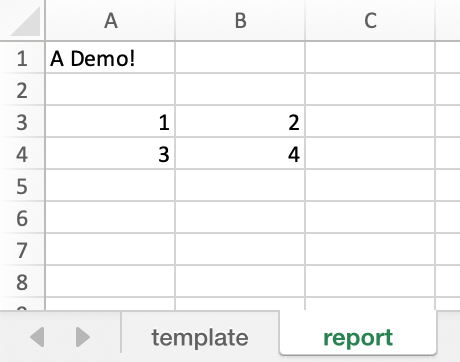
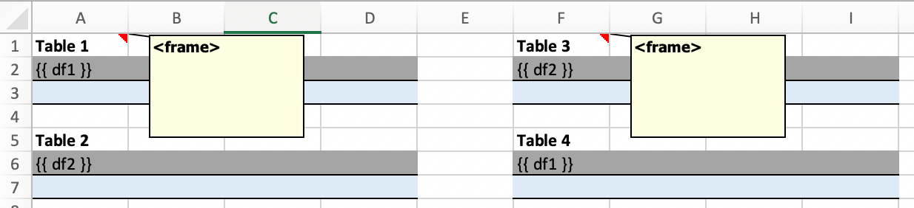

.. _reports_quickstart:

xlwings Reports
===============

This feature requires xlwings :guilabel:`PRO`.

xlwings Reports is a solution for template-based Excel and PDF reporting, making the generation of pixel-perfect factsheets really simple. xlwings Reports allows business users without Python knowledge to create and maintain Excel templates without having to rely on a Python developer after the intial setup has been done: xlwings Reports separates the Python code (pre- and post-processing) from the Excel template (layout/formatting).

xlwings Reports supports all commonly required components:

* **Text**: Easily format your text via Markdown syntax.
* **Tables (dynamic)**: Write pandas DataFrames to Excel cells and Excel tables and format them dynamically based on the number of rows.
* **Charts**: Use your favorite charting engine: Excel charts, Matplotlib, or Plotly.
* **Images**: You can include both raster (e.g., png) or vector (e.g., svg) graphics, including dynamically generated ones, e.g., QR codes or plots.
* **Multi-column Layout**: Split your content up into e.g. a classic two column layout by using Frames.
* **Single Template**: Generate reports in various languages, for various funds etc. based on a single template.
* **PDF Report**: Generate PDF reports automatically and "print" the reports on PDFs in your corporate layout for pixel-perfect results including headers, footers, backgrounds and borderless graphics.
* **Easy Pre-processing**: Since everything is based on Python, you can connect with literally any data source and clean it with pandas or some other library.
* **Easy Post-processing**: Again, with Python you're just a few lines of code away from sending an email with the reports as attachment or uploading the reports to your web server, S3 bucket etc.

Quickstart
----------

You can work on the ``sheet``, ``book`` or ``app`` level:

* ``mysheet.render_template()``: replaces the placeholders in mysheet
* ``mybook.render_template()``: replaces the placeholders in all sheets of a mybook
* ``myapp.render_template()``: convenience wrapper that copies a template book before replacing the placeholder with the values. Since this approach allows you to work with hidden Excel instances, it is the most commonly used method for production.

Render Workbooks
****************

If your template is a workbook, you can use the ``render_template`` function. Start by creating the following Python script ``mytemplate.py``::

    from xlwings.pro.reports import render_template
    import pandas as pd

    df = pd.DataFrame(data={'one': [1, 2], 'two': [3, 4]})
    book = render_template('mytemplate.xlsx', 'myreport.xlsx', title='MyTitle', df=df)
    book.to_pdf()

Then create the following Excel file called ``mytemplate.xlsx``:

.. figure:: images/mytemplate.png

Run the Python script (or run the code from a Jupyter notebook)::

    python mytemplate.py

This will copy the template and create the following output by replacing the variables in double curly braces with
the value from the Python variable:

.. figure:: images/myreport.png

In production, you'll often want to run this in a separate and hidden Excel instance as well as use fully qualified ``Path`` objects. It's also often easier to collect the data into a data dictionary::

    from pathlib import Path

    import pandas as pd
    import xlwings as xw

    base_dir = Path(r'C:\Users\myuser\myreport')

    data = dict(
        title='MyTitle',
        df=pd.DataFrame(data={'one': [1, 2], 'two': [3, 4]})
    )

    with xw.App(visible=False) as app:
        book = app.render_template(base_dir / 'mytemplate.xlsx',
                                   base_dir / 'myreport.xlsx',
                                   **data)
        book.to_pdf(base_dir / 'myreport.pdf')

.. note::
    By default, xlwings Reports overwrites existing values in templates if there is not enough free space for your variable. If you want your rows to dynamically shift according to the height of your array, use :ref:`Frames <Frames>`.

.. note::
    By default, DataFrames don't write out the index. If you need the index to appear in Excel, use ``df.reset_index()``, see :ref:`dataframes_reports`.

See also :meth:`render_templates (API reference) <xlwings.pro.reports.render_template>`.

Render Sheets
*************

Sometimes, it's useful to render a single sheet instead of using the ``render_template`` function. This is a workbook stored as ``Book1.xlsx``:

.. figure:: images/sheet_rendering1.png
    :scale: 60%

Running the following code::

    import xlwings as xw

    book = xw.Book('Book1.xlsx')
    sheet = book.sheets['template'].copy(name='report')
    sheet.render_template(title='A Demo!', table=[[1, 2], [3, 4]])
    book.to_pdf()

Copies the template sheet first and then fills it in:

See also the :meth:`mysheet.render_template (API reference) <xlwings.Sheet.render_template>`.

.. versionadded:: 0.22.0

.. _dataframes_reports:

DataFrames
----------

To write DataFrames in a consistent manner to Excel, xlwings Reports ignores the DataFrame indices. If you need to pass the index over to Excel, reset the index before passing in the DataFrame to ``render_template`` or ``render_template``: ``df.reset_index()``.

When working with pandas DataFrames, the report designer often needs to tweak the data. Thanks to filters, they can do the most common operations directly in the template without the need to write Python code. A filter is added to the placeholder in Excel by using the pipe character: ``{{ myplaceholder | myfilter }}``. You can combine multiple filters by using multiple pipe characters: they are applied from left to right, i.e. the result from the first filter will be the input for the next filter. Let's start with an example before listing each filter with its details::

    import xlwings as xw
    import pandas as pd

    book = xw.Book('Book1.xlsx')
    sheet = book.sheets['template'].copy(name='report')
    df = pd.DataFrame({'one': [1, 2, 3], 'two': [4, 5, 6], 'three': [7, 8, 9]})
    sheet.render_template(df=df)

.. figure:: images/reports_df_filters.png

Available filters for DataFrames:

* **noheader**: Hide the column headers

  Example::

  {{ df | noheader }}

* **header**: Only return the header

  Example::

  {{ df | header }}

* **sortasc**: Sort in ascending order (indices are zero-based)

  Example: sort by second, then by first column::

  {{ df | sortasc(1, 0) }}

* **sortdesc**: Sort in descending order (indices are zero-based)

  Example: sort by first, then by second column in descending order::

  {{ df | sortdesc(0, 1) }}

* **columns**: Select/reorder columns and insert empty columns (indices are zero-based)

  See also: ``colslice``

  Example: introduce an empty column (``None``) as the second column and switch the order of the second and third column::

    {{ df | columns(0, None, 2, 1) }}

  .. note::
    Merged cells: you'll also have to introduce empty columns if you are using merged cells in your Excel template.

* **mul**, **div**, **sum**, **sub**: Apply an arithmetic operation (multiply, divide, sum, subtract) on a column (indices are zero-based)

  Syntax::

  {{ df | operation(value, col_ix, fill_value) }}

  ``fill_value`` is optional and determines whether empty cells are included in the operation or not. To include empty values and thus make it behave like in Excel, set it to ``0``.

  Example: multiply the first column by 100::

  {{ df | mul(100, 0) }}

  Example: multiply the first column by 100 and the second column by 2::

  {{ df | mul(100, 0) | mul(2, 1) }}

  Example: add 100 to the first column including empty cells::

  {{ df | add(100, 0, 0) }}

* **maxrows**: Maximum number of rows (currently, only ``sum`` is supported as aggregation function)

  If your DataFrame has 12 rows and you use ``maxrows(10, "Other")`` as filter, you'll get a table that shows the first 9 rows as-is and sums up the remaining 3 rows under the label ``Other``. If your data is unsorted, make sure to call ``sortasc``/``sortdesc`` first to make sure the correct rows are aggregated.

  See also: ``aggsmall``, ``head``, ``tail``, ``rowslice``

  Syntax::

  {{ df | maxrows(number_rows, label, label_col_ix) }}

  ``label_col_ix`` is optional: if left away, it will label the first column of the DataFrame (index is zero-based)

  Examples::

  {{ df | maxrows(10, "Other") }}
  {{ df | sortasc(1)| maxrows(5, "Other") }}
  {{ df | maxrows(10, "Other", 1) }}

* **aggsmall**: Aggregate rows with values below a certain threshold (currently, only ``sum`` is supported as aggregation function)

  If the values in the specified row are below the threshold values, they will be summed up in a single row.

  See also: ``maxrows``, ``head``, ``tail``, ``rowslice``

  Syntax::

  {{ df | aggsmall(threshold, threshold_col_ix, label, label_col_ix) }}

  ``label_col_ix`` is optional: if left away, it will label the first column of the DataFrame (indices are zero-based)

  Examples::

  {{ df | aggsmall(0.1, 2, "Other") }}
  {{ df | sortasc(1) | aggsmall(0.1, 2, "Other") }}
  {{ df | aggsmall(0.5, 1, "Other", 1) }}

* **head**: Only show the top n rows

  See also: ``maxrows``, ``aggsmall``, ``tail``, ``rowslice``

  Example::

  {{ df | head(3) }}

* **tail**: Only show the bottom n rows

  See also: ``maxrows``, ``aggsmall``, ``head``, ``rowslice``

  Example::

  {{ df | tail(5) }}

* **rowslice**: Slice the rows

  See also: ``maxrows``, ``aggsmall``, ``head``, ``tail``

  Syntax::

  {{ df | rowslice(start_index, stop_index) }}

  ``stop_index`` is optional: if left away, it will stop at the end of the DataFrame

  Example: Show rows 2 to 4 (indices are zero-based and interval is half-open, i.e. the start is including and the end is excluding)::

  {{ df | rowslice(2, 5) }}

  Example: Show rows 2 to the end of the DataFrame::

  {{ df | rowslice(2) }}

* **colslice**: Slice the columns

  See also: ``columns``

  Syntax::

  {{ df | colslice(start_index, stop_index) }}

  ``stop_index`` is optional: if left away, it will stop at the end of the DataFrame

  Example: Show columns 2 to 4 (indices are zero-based and interval is half-open, i.e. the start is including and the end is excluding)::

  {{ df | colslice(2, 5) }}

  Example: Show columns 2 to the end of the DataFrame::

  {{ df | colslice(2) }}

.. _excel_tables_reports:

Excel Tables
------------

Using Excel tables is the recommended way to format tables as the styling can be applied dynamically across columns and rows. You can also use themes and apply alternating colors to rows/columns. Go to ``Insert`` > ``Table`` and make sure that you activate ``My table has headers`` before clicking on ``OK``. Add the placeholder as usual on the top-left of your Excel table (note that this example makes use of :ref:`Frames <Frames>`):

.. figure:: images/excel_table_template.png

Running the following script::

    from xlwings.pro.reports import render_template
    import pandas as pd

    nrows, ncols = 3, 3
    df = pd.DataFrame(data=nrows * [ncols * ['test']],
                      columns=[f'col {i}' for i in range(ncols)])

    render_template('template.xlsx', 'output.xlsx', df=df)

Will produce the following report:

.. figure:: images/excel_table_report.png

Headers of Excel tables are relatively strict, e.g. you can't have multi-line headers or merged cells. To get around these limitations, uncheck the ``Header Row`` checkbox under ``Table Design`` and use the ``noheader`` filter (see DataFrame filters). This will allow you to design your own headers outside of the Excel Table.

.. note::
    * At the moment, you can only assign pandas DataFrames to tables

Excel Charts
------------

To use Excel charts in your reports, follow this process:

1. Add some sample/dummy data to your Excel template:

    .. figure:: images/reports_chart1.png

2. If your data source is dynamic, turn it into an Excel Table (``Insert`` > ``Table``). Make sure you do this *before* adding the chart in the next step.

    .. figure:: images/reports_chart2.png

3. Add your chart and style it:

    .. figure:: images/reports_chart3.png

4. Reduce the Excel table to a 2 x 2 range and add the placeholder in the top-left corner (in our example ``{{ chart_data }}``) . You can leave in some dummy data or clear the values of the Excel table:

    .. figure:: images/reports_chart4.png

5. Assuming your file is called ``mytemplate.xlsx`` and your sheet ``template`` like on the previous screenshot, you can run the following code::

    import xlwings as xw
    import pandas as pd

    df = pd.DataFrame(data={'Q1': [1000, 2000, 3000],
                            'Q2': [4000, 5000, 6000],
                            'Q3': [7000, 8000, 9000]},
                      index=['North', 'South', 'West'])

    book = xw.Book("mytemplate.xlsx")
    sheet = book.sheets['template'].copy(name='report')
    sheet.render_template(chart_data=df.reset_index())

This will produce the following report, with the chart source correctly adjusted:

    .. figure:: images/reports_chart5.png

.. note::

    If you don't want the source data on your report, you can place it on a separate sheet. It's easiest if you add and design the chart on the separate sheet, before cutting the chart and pasting it on your report template. To prevent the data sheet from being printed when calling ``to_pdf``, you can give it a name that starts with ``#`` and it will be ignored.

Images
------

Images are inserted so that the cell with the placeholder will become the top-left corner of the image. For example, write the following placeholder into you desired cell: ``{{ logo }}``, then run the following code::

    import xlwings as xw
    from xlwings.pro.reports import Image

    book = xw.Book('Book1.xlsx')
    sheet = book.sheets['template'].copy(name='report')
    sheet.render_template(logo=Image(r'C:\path\to\logo.png'))

.. note::

    ``Image`` also accepts a ``pathlib.Path`` object instead of a string.

If you want to use vector-based graphics, you can use ``svg`` on Windows and ``pdf`` on macOS. You can control the appearance of your image by applying filters on your placeholder.

Available filters for Images:

* **width**: Set the width in pixels (height will be scaled proportionally).

  Example::

  {{ logo | width(200) }}

* **height**: Set the height in pixels (width will be scaled proportionally).

  Example::

  {{ logo | height(200) }}

* **width and height**: Setting both width and height will distort the proportions of the image!

  Example::

  {{ logo | height(200) | width(200) }}

* **scale**: Scale your image using a factor (height and width will be scaled proportionally).

  Example::

  {{ logo | scale(1.2) }}

* **top**: Top margin. Has the effect of moving the image down (positive pixel number) or up (negative pixel number), relative to the top border of the cell. This is very handy to fine-tune the position of graphics object.

  See also: ``left``

  Example::

  {{ logo | top(5) }}

* **left**: Left margin. Has the effect of moving the image right (positive pixel number) or left (negative pixel number), relative to the left border of the cell. This is very handy to fine-tune the position of graphics object.

  See also: ``top``

  Example::

  {{ logo | left(5) }}

Matplotlib and Plotly Plots
---------------------------

For a general introduction on how to handle Matplotlib and Plotly, see also: :ref:`matplotlib`. There, you'll also find the prerequisites to be able to export Plotly charts as pictures.

Matplotlib
**********

Write the following placeholder in the cell where you want to paste the Matplotlib plot: ``{{ lineplot }}``. Then run the following code to get your Matplotlib Figure object::

    import matplotlib.pyplot as plt
    import xlwings as xw

    fig = plt.figure()
    plt.plot([1, 2, 3])

    book = xw.Book('Book1.xlsx')
    sheet = book.sheets['template'].copy(name='report')
    sheet.render_template(lineplot=fig)

Plotly
******

Plotly works practically the same::

    import plotly.express as px
    import xlwings as xw

    fig = px.line(x=["a","b","c"], y=[1,3,2], title="A line plot")
    book = xw.Book('Book1.xlsx')
    sheet = book.sheets['template'].copy(name='report')
    sheet.render_template(lineplot=fig)

To change the appearance of the Matplotlib or Plotly plot, you can use the same filters as with images. Additionally, you can use the following filter:

* **format**: allows to change the default image format from ``png`` to e.g., ``vector``, which will export the plot as vector graphics (``svg`` on Windows and ``pdf`` on macOS). As an example, to make the chart smaller and use the vector format, you would write the following placeholder::

    {{ lineplot | scale(0.8) | format("vector") }}

Text
----

You can work with placeholders in text that lives in cells or shapes like text boxes. If you have more than just a few words, text boxes usually make more sense as they won't impact the row height no matter how you style them. Using the same gird formatting across worksheets is key to getting a consistent multi-page report.

Simple Text without Formatting
******************************

.. versionadded:: 0.21.4

You can use any shapes like rectangles or circles, not just text boxes::

    from xlwings.pro.reports import render_template

    render_template('template.xlsx', 'output.xlsx', temperature=12.3)

This code turns this template:

.. figure:: images/shape_text_template.png

into this report:

.. figure:: images/shape_text_report.png

While this works for simple text, you will lose the formatting if you have any. To prevent that, use a ``Markdown`` object, as explained in the next section.

If you will be printing on a :ref:`reports_pdf_layout` with a dark background, you may need to change the font color to white. This has the nasty side effect that you won't see anything on the screen anymore. To solve that issue, use the ``fontcolor`` filter:

* **fontcolor**: Change the color of the whole (!) cell or shape. The primary purpose of this filter is to make white fonts visible in Excel. For most other colors, you can just change the color in Excel itself. Note that this filter changes the font of the whole cell or shape and only has an effect if there is just a single placeholder---if you need to manipulate single words, use Markdown instead, see below. Black and white can be used as word, otherwise use a hex notation of your desired color.

  Example::

  {{ mytitle | fontcolor("white") }}
  {{ mytitle | fontcolor("#efefef") }}

Markdown Formatting
*******************

.. versionadded:: 0.23.0

You can format text in cells or shapes via Markdown syntax. Note that you can also use placeholders in the Markdown text that will take the values from the variables you supply via the ``render_template`` method::

    import xlwings as xw
    from xlwings.pro import Markdown

    mytext = """\
    # Title

    Text **bold** and *italic*

    * A first bullet
    * A second bullet

    # {{ second_title }}

    This paragraph has a line break.
    Another line.
    """

    # The first sheet requires a shape as shown on the screenshot
    sheet = xw.sheets.active
    sheet.render_template(myplaceholder=Markdown(mytext),
                          second_title='Another Title')

This will render this template with the placeholder in a cell and a shape:

Like this (this uses the default formatting):

.. figure:: images/markdown1.png

For more details about Markdown, especially about how to change the styling, see :ref:`markdown`.

Date and Time
-------------

If a placeholder corresponds to a Python ``datetime`` object, by default, Excel will format that cell as a date-formatted cell. This isn't always desired as the formatting depends on the user's regional settings. To prevent that, format the cell in the ``Text`` format or use a TextBox and use the ``datetime`` filter to format the date in the desired format. The ``datetime`` filter accepts the strftime syntax---for a good reference, see e.g., `strftime.org <https://strftime.org/>`_.

To control the language of month and weekday names, you'll need to set the ``locale`` in your Python code. For example, for German, you would use the following::

    import locale
    locale.setlocale(locale.LC_ALL, 'de_DE')

Example: The default formatting is ``December 1, 2020``::

{{ mydate | datetime }}

Example: To apply a specific formatting, provide the desired format as filter argument. For example, to get it in the ``12/31/20`` format::

{{ mydate | datetime("%m/%d/%y") }}

Number Format
-------------

The ``format`` filter allows you to format numbers by using the same mechanism as offered by Python's f-strings. For example, to format the placeholder ``performance=0.13`` as ``13.0%``, you would do the following::

{{ performance | format(".1%") }}

This corresponds to the following f-string in Python: ``f"{performance:0.1%}"``. To get an introduction to the formatting string syntax, have a look at the `Python String Format Cookbook <https://mkaz.blog/code/python-string-format-cookbook/>`_.

.. _frames:

Frames: Multi-column Layout
---------------------------

Frames are vertical containers in which content is being aligned according to their height. That is,
within Frames:

* Variables do not overwrite existing cell values as they do without Frames.
* Formatting is applied dynamically, depending on the number of rows your object uses in Excel

To use Frames, insert a Note with the text ``<frame>`` into **row 1** of your Excel template wherever you want a new dynamic column
to start. Frames go from one ``<frame>`` to the next ``<frame>`` or the right border of the used range.

How Frames behave is best demonstrated with an example:
The following screenshot defines two frames. The first one goes from column A to column E and the second one
goes from column F to column I, since this is the last column that is used.

You can define and format DataFrames by formatting

* one header and
* one data row

If you use the ``noheader`` filter for DataFrames, you can leave the header away and format a single data row.
Alternatively, you could also use Excel Tables, as they can make formatting easier.

Running the following code::

    from xlwings.pro.reports import render_template
    import pandas as pd

    df1 = pd.DataFrame([[1, 2, 3], [4, 5, 6], [7, 8, 9]])
    df2 = pd.DataFrame([[1, 2, 3], [4, 5, 6], [7, 8, 9], [10, 11, 12], [13, 14, 15]])

    data = dict(df1=df1.reset_index(), df2=df2.reset_index())

    render_template('my_template.xlsx',
                    'my_report.xlsx',
                    **data)

will generate this report:

.. figure:: images/frame_report.png

|

.. _reports_pdf_layout:

PDF Layout
----------

Using the ``layout`` parameter in the ``to_pdf()`` command, you can "print" your Excel workbook on professionally designed PDFs for pixel-perfect reports in your corporate layout including headers, footers, backgrounds and borderless graphics::

    from xlwings.pro.reports import render_template
    import pandas as pd

    df = pd.DataFrame([[1, 2, 3], [4, 5, 6], [7, 8, 9]])

    book = render_template('template.xlsx',
                           'report.xlsx',
                           month_year = 'May 21',
                           summary_text = '...')

    book.to_pdf('report.pdf', layout='monthly_layout.pdf')

Note that the layout PDF either needs to consist of a single page (will be used for each reporting page) or will need to have the same number of pages as the report (each report page will be printed on the corresponding layout page).

To create your layout PDF, you can use any program capable of exporting a file in PDF format such as PowerPoint or Word, but for the best results consider using a professional desktop publishing software such as Adobe InDesign.

