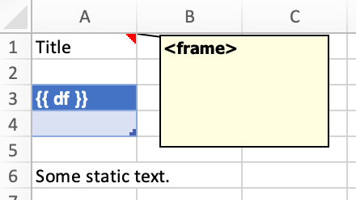

.. _reports_quickstart:

xlwings Reports
===============

This feature requires xlwings :guilabel:`PRO`.

Quickstart
----------

xlwings Reports is part of xlwings PRO and a solution for template-based Excel and PDF reporting. It allows business users without Python knowledge to create & maintain Excel templates without having to go back to a Python developer for every change: xlwings Reports separates the Python code (that gets and prepares all the data) from the Excel template (that defines which data goes where and how it should be formatted). See also the `xlwings Reports homepage <https://www.xlwings.org/reporting>`_. You can render one sheet at the time via :meth:`mysheet.render_template <xlwings.Sheet.render_template>` or use the higher-level convenience function :meth:`xw.create_report <xlwings.pro.reports.create_report>` which first copies the template workbook and then loops through all sheets.

Render Sheets
*************

Let's first look at how to render a single sheet. This is a workbook stored as ``Book1.xlsx``:

.. figure:: images/sheet_rendering1.png
    :scale: 60%

Running the following code::

    import xlwings as xw
    wb = xw.Book('Book1.xlsx')
    sheet = wb.sheets['template'].copy(name='report')
    sheet.render_template(title='A Demo!', table=[[1, 2], [3, 4]])
    wb.to_pdf()  # requires xlwings >=0.21.1

Leaves you with this:

.. figure:: images/sheet_rendering2.png
    :scale: 60%

See also the :meth:`API reference <xlwings.Sheet.render_template>`.

.. versionadded:: 0.22.0

Render Workbooks
****************

If your template is a full workbook, you can use the ``create_report`` function. Start by creating the following Python script ``my_template.py``::

    from xlwings.pro.reports import create_report
    import pandas as pd

    df = pd.DataFrame(data=[[1,2],[3,4]])
    wb = create_report('my_template.xlsx', 'my_report.xlsx', title='MyTitle', df=df)
    wb.to_pdf()  # requires xlwings >=0.21.1

Then create the following Excel file called ``my_template.xlsx``:

.. figure:: images/mytemplate.png

Now run the Python script::

    python my_template.py

This will copy the template and create the following output by replacing the variables in double curly braces with
the value from the Python variable:

.. figure:: images/myreport.png

The last line (``wb.to_pdf()``) will print the workbook as PDF, for more details on the options, see :meth:`Book.to_pdf() <xlwings.Book.to_pdf>`.

Apart from Strings and Pandas DataFrames, you can also use numbers, lists, simple dicts, NumPy arrays,
Matplotlib figures and PIL Image objects that have a filename.

By default, xlwings Reports overwrites existing values in templates if there is not enough free space for your variable.
If you want your rows to dynamically shift according to the height of your array, use :ref:`Frames`.

See also the :meth:`API reference <xlwings.pro.reports.create_report>`.

.. _frames:

Frames
------

Frames are vertical containers in which content is being aligned according to their height. That is,
within Frames:

* Variables do not overwrite existing cell values as they do without Frames.
* Formatting is applied dynamically, depending on the number of rows your object uses in Excel

To use Frames, insert ``<frame>`` into **row 1** of your Excel template wherever you want a new dyanmic column
to start. Row 1 will be removed automatically when creating the report. Frames go from one
``<frame>`` to the next ``<frame>`` or the right border of the used range.

How Frames behave is best demonstrated with an example:
The following screenshot defines two frames. The first one goes from column A to column E and the second one
goes from column F to column I, since this is the last column that is used.

You can define and format table-like objects by formatting exactly

* one header and
* one data row

as shown in the screenshot:

.. figure:: images/frame_template.png

However, also make sure to check out how to use Excel Tables below, as they make the formatting easier.

Running the following code::

    from xlwings.pro.reports import create_report
    import pandas as pd

    df1 = pd.DataFrame([[1, 2, 3], [4, 5, 6], [7, 8, 9]])
    df2 = pd.DataFrame([[1, 2, 3], [4, 5, 6], [7, 8, 9], [10, 11, 12], [13, 14, 15]])

    data = dict(df1=df1, df2=df2)

    create_report('my_template.xlsx',
                  'my_report.xlsx',
                  **data)

will generate this report:

.. figure:: images/frame_report.png

.. _excel_tables_reports:

Excel Tables
------------

Using Excel tables is the recommended way to format tables as the styling can be applied dynamically across columns and rows. You can also use themes and apply alternating colors to rows/columns. On top of that, they are the easiest way to make the source of a chart dynamic. Go to ``Insert`` > ``Table`` and make sure that you activate ``My table has headers`` before clicking on ``OK``. Add the placeholder as usual on the top-left of your Excel table:

Running the following script::

    from xlwings.pro.reports import create_report
    import pandas as pd

    nrows, ncols = 3, 3
    df = pd.DataFrame(data=nrows * [ncols * ['test']],
                      columns=['col ' + str(i) for i in range(ncols)])

    create_report('template.xlsx', 'output.xlsx', df=df.set_index('col 0'))

Will produce the following report:

.. figure:: images/excel_table_report.png

.. note::
    * If you would like to exclude the DataFrame index, make sure to set the index to the first column e.g.: ``df.set_index('column_name')``.
    * At the moment, you can only assign pandas DataFrames to tables.
    * For Excel table support, you need at least version 0.21.0 and the index behavior was changed in 0.21.3

Excel Charts
------------

**Note**: To use charts with a dynamic source, you'll need at least xlwings version 0.22.1

To use Excel charts in your reports, follow this process:

1. Add some sample/dummy data to your Excel template:

    .. figure:: images/reports_chart1.png

2. If your data source is dynamic, turn it into an Excel Table (``Insert`` > ``Table``). Make sure you do this *before* adding the chart in the next step.

    .. figure:: images/reports_chart2.png

3. Add your chart and style it:

    .. figure:: images/reports_chart3.png

4. Reduce the Excel table to a 2 x 2 range and add the placeholder in the top-left corner (in our example ``chart_data``) . You can leave in some dummy data or clear the values of the Excel table:

    .. figure:: images/reports_chart4.png

5. Assuming your file is called ``mytemplate.xlsx`` and your sheet ``template`` like on the previous screenshot, you can run the following code::

    import xlwings as xw
    import pandas as pd

    df = pd.DataFrame(data={'Q1': [1000, 2000, 3000],
                            'Q2': [4000, 5000, 6000],
                            'Q3': [7000, 8000, 9000]},
                      index=['North', 'South', 'West'])

    wb = xw.Book("mytemplate.xlsx")
    sheet = wb.sheets['template'].copy(name='report')
    sheet.render_template(chart_data=df)

This will produce the following report, with the chart source correctly adjusted:

    .. figure:: images/reports_chart5.png

**Note**: If you don't want the source data on your report, you might want to place it on a separate sheet. It's easiest if you add and design the chart on the separate sheet, before cutting the chart and pasting it on your report template.

Shape Text
----------

.. versionadded:: 0.21.4

You can also use Shapes like Text Boxes or Rectangles with template text::

    from xlwings.pro.reports import create_report

    create_report('template.xlsx', 'output.xlsx', temperature=12.3)

This code turns this template:

into this report:

.. figure:: images/shape_text_report.png