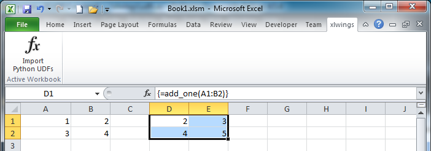

.. _udfs:

UDF Tutorial
============

.. note:: UDFs are currently only available on Windows.

This tutorial gets you quickly started on how to write User Defined Functions. For details of how to control the behaviour
of the arguments and return values, have a look at :ref:`converters`.

One-time Excel preparations
---------------------------

**Required**: Enable ``Trust access to the VBA project object model`` under
``File > Options > Trust Center > Trust Center Settings > Macro Settings``

**Recommended**: Install the add-in via command prompt: ``xlwings addin install`` (see :ref:`command_line`) to be
able to easily import the functions.

Workbook preparation
--------------------

The easiest way to start a new project is to run ``xlwings quickstart myproject`` on a command prompt (see :ref:`command_line`).
Alternative ways of getting the xlwings VBA module into your workbook are described under :ref:`vba`

A simple UDF
------------

The default settings (see :ref:`VBA settings <vba_settings>`) expect a Python source file in the way it is created
by ``quickstart``:

* in the same directory as the Excel file
* with the same name as the Excel file, but with a ``.py`` ending instead of ``.xlsm``.

Alternatively, you can point to a specific source file by setting the ``UDF_PATH`` in the VBA settings.

Let's assume you have a Workbook ``myproject.xlsm``, then you would write the following code in ``myproject.py``::

    import xlwings as xw

    @xw.func
    def double_sum(x, y):
        """Returns twice the sum of the two arguments"""
        return 2 * (x + y)

* Now click on ``Import Python UDFs`` in the xlwings tab to pick up the changes made to ``myproject.py``. If you don't
  want to install/use the add-in, you could also run the ``ImportPythonUDFs`` macro directly (one possibility to do that
  is to hit ``Alt + F8`` and select the macro from the pop-up menu).
* Enter the formula ``=double_sum(1, 2)`` into a cell and you will see the correct result:

  .. figure:: images/double_sum.png
    :scale: 80%

* This formula can be used in VBA, too.
* The docstring (in triple-quotes) will be shown as function description in Excel.

.. note::
  * You only need to re-import your functions if you change the function arguments or the function name.
  * Code changes in the actual functions are picked up automatically (i.e. at the next calculation of the formula,
    e.g. triggered by ``Ctrl-Alt-F9``), but changes in imported modules are not. This is the very behaviour of how Python
    imports work. The easiest way to come around this is by working with the debug server that can easily be restarted,
    see: :ref:`debugging`. If you aren't working with the debug server, the ``pythonw.exe`` process currently has to be killed
    via Windows Task Manager.
  * The ``@xw.func`` decorator is only used by xlwings when the function is being imported into Excel. It tells xlwings
    for which functions it should create a VBA wrapper function, otherwise it has no effect on how the functions behave
    in Python.

Array formulas: Get efficient
-----------------------------

Calling one big array formula in Excel is much more efficient than calling many single-cell formulas, so it's generally
a good idea to use them, especially if you hit performance problems.

You can pass an Excel Range as a function argument, as opposed to a single cell and it will show up in Python as
list of lists.

For example, you can write the following function to add 1 to every cell in a Range::

    @xw.func
    def add_one(data):
        return [[cell + 1 for cell in row] for row in data]

To use this formula in Excel,

* Click on ``Import Python UDFs`` again
* Fill in the values in the range ``A1:B2``
* Select the range ``D1:E2``
* Type in the formula ``=add_one(A1:B2)``
* Press ``Ctrl+Shift+Enter`` to create an array formula. If you did everything correctly, you'll see the formula
  surrounded by curly braces as in this screenshot:

Number of array dimensions: ndim
********************************

The above formula has the issue that it expects a "two dimensional" input, e.g. a nested list of the form
``[[1, 2], [3, 4]]``.
Therefore, if you would apply the formula to a single cell, you would get the following error:
``TypeError: 'float' object is not iterable``.

To force Excel to always give you a two-dimensional array, no matter whether the argument is a single cell, a
column/row or a two-dimensional Range, you can extend the above formula like this::

    @xw.func
    @xw.arg('data', ndim=2)
    def add_one(data):
        return [[cell + 1 for cell in row] for row in data]

Array formulas with NumPy and Pandas
------------------------------------

Often, you'll want to use NumPy arrays or Pandas DataFrames in your UDF, as this unlocks the full power of Python's
ecosystem for scientific computing.

To define a formula for matrix multiplication using numpy arrays, you would define the following function::

    import xlwings as xw
    import numpy as np

    @xw.func
    @xw.arg('x', np.array, ndim=2)
    @xw.arg('y', np.array, ndim=2)
    def matrix_mult(x, y):
        return x @ y

.. note:: If you are not on Python >= 3.5 with NumPy >= 1.10, use ``x.dot(y)`` instead of ``x @ y``.

A great example of how you can put Pandas at work is the creation of an array-based ``CORREL`` formula. Excel's
version of ``CORREL`` only works on 2 datasets and is cumbersome to use if you want to quickly get the correlation
matrix of a few time-series, for example. Pandas makes the creation of an array-based ``CORREL2`` formula basically
a one-liner::

    import xlwings as xw
    import pandas as pd

    @xw.func
    @xw.arg('x', pd.DataFrame, index=False, header=False)
    @xw.ret(index=False, header=False)
    def CORREL2(x):
        """Like CORREL, but as array formula for more than 2 data sets"""
        return x.corr()

@xw.arg and @xw.ret decorators
------------------------------

These decorators are to UDFs what the ``options`` method is to ``Range`` objects: they allow you to apply converters and their
options to function arguments (``@xw.arg``) and to the return value (``@xw.ret``). For example, to convert the argument ``x`` into
a pandas DataFrame and suppress the index when returning it, you would do the following::

    @xw.func
    @xw.arg('x', pd.DataFrame)
    @xw.ret(index=False)
    def myfunction(x):
       # x is a DataFrame, do something with it
       return x

For further details see the :ref:`converters` documentation.

Dynamic Array Formulas
----------------------

As seen above, to use Excel's array formulas, you need to specify their dimensions up front by selecting the
result array first, then entering the formula and finally hitting ``Ctrl-Shift-Enter``. While this makes sense from
a data integrity point of view, in practice, it often turns out to be a cumbersome limitation, especially when working
with dynamic arrays such as time series data. Since v0.10, xlwings offers dynamic UDF expansion:

This is a simple example that demonstrates the syntax and effect of UDF expansion:

.. code-block:: python

    import numpy as np

    @xw.func
    @xw.ret(expand='table')
    def dynamic_array(r, c):
        return np.random.randn(int(r), int(c))

.. figure:: images/dynamic_array1.png
  :scale: 40%

.. figure:: images/dynamic_array2.png
  :scale: 40%

**Note**: Expanding array formulas will overwrite cells without prompting and leave an empty border around them, i.e.
they will clear the row to the bottom and the column to the right of the array.

Docstrings
----------

The following sample shows how to include docstrings both for the function and for the arguments x and y that then
show up in the function wizard in Excel:

.. code-block:: python

    import xlwings as xw

    @xw.func
    @xw.arg('x', doc='This is x.')
    @xw.arg('y', doc='This is y.')
    def double_sum(x, y):
        """Returns twice the sum of the two arguments"""
        return 2 * (x + y)

The "vba" keyword
-----------------

It's often helpful to get the address of the calling cell. Right now, one of the easiest ways to
accomplish this is to use the ``vba`` keyword. ``vba``, in fact, allows you to access any available VBA expression
e.g. ``Application``. Note, however, that currently you're acting directly on the pywin32 COM object::

    @xw.func
    @xw.arg('xl_app', vba='Application')
    def get_caller_address(xl_app)
        return xl_app.Caller.Address

.. _decorator_macros:

Macros
------

On Windows, as alternative to calling macros via :ref:`RunPython <run_python>`, you can also use the ``@xw.sub``
decorator::

    import xlwings as xw

    @xw.sub
    def my_macro():
        """Writes the name of the Workbook into Range("A1") of Sheet 1"""
        wb = xw.Book.caller()
        wb.sheets[0].range('A1').value = wb.name

After clicking on ``Import Python UDFs``, you can then use this macro by executing it via ``Alt + F8`` or by
binding it e.g. to a button. To to the latter, make sure you have the ``Developer`` tab selected under ``File >
Options > Customize Ribbon``. Then, under the ``Developer`` tab, you can insert a button via ``Insert > Form Controls``.
After drawing the button, you will be prompted to assign a macro to it and you can select ``my_macro``.
