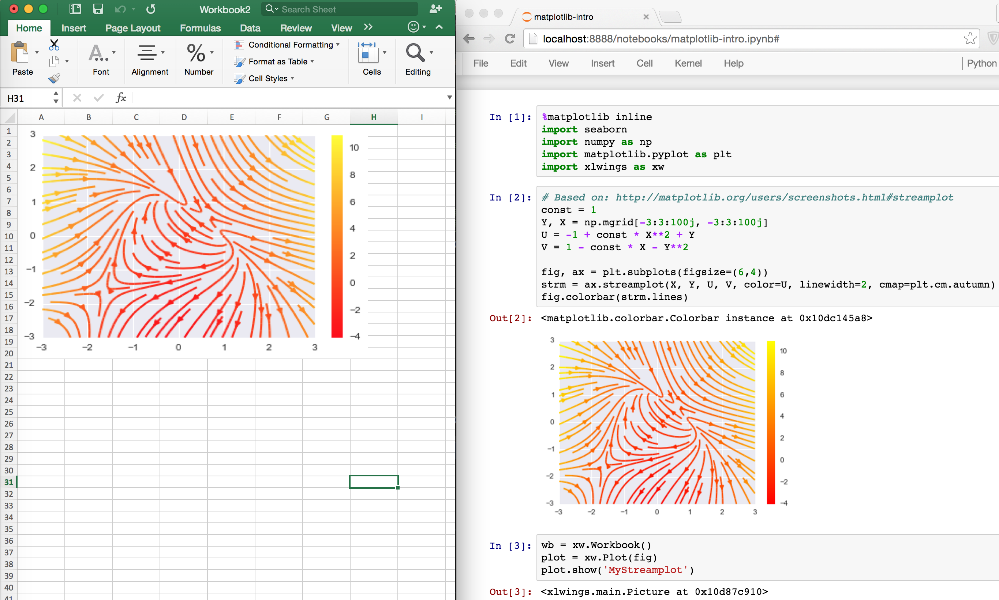

What's New
==========

v0.7.2 (May 18, 2016)
---------------------

Bug Fixes
*********
* [Win] UDFs returning Pandas DataFrames/Series containing ``nan`` were failing (:issue:`446`).
* [Win] ``RunFrozenPython`` was not finding the executable (:issue:`452`).
* The xlwings VBA module was not finding the Python interpreter if ``PYTHON_WIN`` or ``PYTHON_MAC`` contained spaces (:issue:`461`).

v0.7.1 (April 3, 2016)
----------------------

Enhancements
************
* [Win]: User Defined Functions (UDFs) support now optional/default arguments (:issue:`363`)
* [Win]: User Defined Functions (UDFs) support now multiple source files, see also under API changes below. For example
  (VBA settings): ``UDF_MODULES="common;myproject"``
* VBA Subs & Functions are now callable from Python:

    As an example, this VBA function:

    .. code-block:: vb

        Function MySum(x, y)
            MySum = x + y
        End Function

    can be accessed like this:

    >>> import xlwings as xw
    >>> wb = xw.Workbook.active()
    >>> my_sum = wb.macro('MySum')
    >>> my_sum(1, 2)
    3.0
* New ``xw.view`` method: This opens a new workbook and displays an object on its first sheet. E.g.:

    >>> import xlwings as xw
    >>> import pandas as pd
    >>> import numpy as np
    >>> df = pd.DataFrame(np.random.rand(10, 4), columns=['a', 'b', 'c', 'd'])
    >>> xw.view(df)

* New docs about :ref:`matplotlib` and :ref:`custom_converter`
* New method: :meth:`xlwings.Range.formula_array` (:issue:`411`)

API changes
***********

* VBA settings: ``PYTHON_WIN`` and ``PYTHON_MAC`` must now include the interpreter if you are not using the default
  (``PYTHON_WIN = ""``) (:issue:`289`). E.g.::

    PYTHON_WIN: "C:\Python35\pythonw.exe"
    PYTHON_MAC: "/usr/local/bin/python3.5"

* [Win]: VBA settings: ``UDF_PATH`` has been replaced with ``UDF_MODULES``. The default behaviour doesn't change though
  (i.e. if ``UDF_MODULES = ""``, then a Python source file with the same name as the Excel file, but with ``.py`` ending
  will be imported from the same directory as the Excel file).

  **New**:

  .. code-block:: vb

    UDF_MODULES: "mymodule"
    PYTHONPATH: "C:\path\to"

  **Old**:

  .. code-block:: vb

    UDF_PATH: "C:\path\to\mymodule.py"

Bug Fixes
*********
* Numpy scalars issues were resolved (:issue:`415`)
* [Win]: xlwings was failing with freezers like cx_Freeze (:issue:`413`)
* [Win]: UDFs were failing if they were returning ``None`` or ``np.nan`` (:issue:`390`)
* Multiindex Pandas Series have been fixed (:issue:`383`)
* [Mac]: ``xlwings runpython install`` was failing (:issue:`424`)

v0.7.0 (March 4, 2016)
----------------------

This version marks an important first step on our path towards a stable release. It introduces **converters**, a new and powerful
concept that brings a consistent experience for how Excel Ranges and their values are treated both when **reading** and **writing** but
also across **xlwings.Range** objects and **User Defined Functions** (UDFs).

As a result, a few highlights of this release include:

* Pandas DataFrames and Series are now supported for reading and writing, both via Range object and UDFs
* New Range converter options: ``transpose``, ``dates``, ``numbers``, ``empty``, ``expand``
* New dictionary converter
* New UDF debug server
* No more pyc files when using ``RunPython``

Converters are accessed via the new ``options`` method when dealing with ``xlwings.Range`` objects or via the ``@xw.arg``
and ``@xw.ret`` decorators when using UDFs. As an introductory sample, let's look at how to read and write Pandas DataFrames:

.. figure:: images/df_converter.png
  :scale: 55%

**Range object**::

    >>> import xlwings as xw
    >>> import pandas as pd
    >>> wb = xw.Workbook()
    >>> df = xw.Range('A1:D5').options(pd.DataFrame, header=2).value
    >>> df
        a     b
        c  d  e
    ix
    10  1  2  3
    20  4  5  6
    30  7  8  9

    # Writing back using the defaults:
    >>> Range('A1').value = df

    # Writing back and changing some of the options, e.g. getting rid of the index:
    >>> Range('B7').options(index=False).value = df

**UDFs**:

This is the same sample as above (starting in ``Range('A13')`` on screenshot). If you wanted to return a DataFrame with
the defaults, the ``@xw.ret`` decorator can be left away. ::

    @xw.func
    @xw.arg('x', pd.DataFrame, header=2)
    @xw.ret(index=False)
    def myfunction(x):
       # x is a DataFrame, do something with it
       return x

Enhancements
************

* Dictionary (``dict``) converter:

  .. figure:: images/dict_converter.png
    :scale: 80%

  ::

    >>> Range('A1:B2').options(dict).value
    {'a': 1.0, 'b': 2.0}
    >>> Range('A4:B5').options(dict, transpose=True).value
    {'a': 1.0, 'b': 2.0}

* ``transpose`` option: This works in both directions and finally allows us to e.g. write a list in column
  orientation to Excel (:issue:`11`)::

    Range('A1').options(transpose=True).value = [1, 2, 3]

* ``dates`` option: This allows us to read Excel date-formatted cells in specific formats:

    >>> import datetime as dt
    >>> Range('A1').value
    datetime.datetime(2015, 1, 13, 0, 0)
    >>> Range('A1').options(dates=dt.date).value
    datetime.date(2015, 1, 13)

* ``empty`` option: This allows us to override the default behavior for empty cells:

   >>> Range('A1:B1').value
   [None, None]
   >>> Range('A1:B1').options(empty='NA')
   ['NA', 'NA']

* ``numbers`` option: This transforms all numbers into the indicated type.

    >>> xw.Range('A1').value = 1
    >>> type(xw.Range('A1').value)  # Excel stores all numbers interally as floats
    float
    >>> type(xw.Range('A1').options(numbers=int).value)
    int

* ``expand`` option: This works the same as the Range properties ``table``, ``vertical`` and ``horizontal`` but is
  only evaluated when getting the values of a Range::

    >>> import xlwings as xw
    >>> wb = xw.Workbook()
    >>> xw.Range('A1').value = [[1,2], [3,4]]
    >>> rng1 = xw.Range('A1').table
    >>> rng2 = xw.Range('A1').options(expand='table')
    >>> rng1.value
    [[1.0, 2.0], [3.0, 4.0]]
    >>> rng2.value
    [[1.0, 2.0], [3.0, 4.0]]
    >>> xw.Range('A3').value = [5, 6]
    >>> rng1.value
    [[1.0, 2.0], [3.0, 4.0]]
    >>> rng2.value
    [[1.0, 2.0], [3.0, 4.0], [5.0, 6.0]]

All these options work the same with decorators for UDFs, e.g. for transpose::

  @xw.arg('x', transpose=True)
  @xw.ret(transpose=True)
  def myfunction(x):
      # x will be returned unchanged as transposed both when reading and writing
      return x

**Note**: These options (``dates``, ``empty``, ``numbers``) currently apply to the whole Range and can't be selectively
applied to e.g. only certain columns.

* UDF debug server

  The new UDF debug server allows you to easily debug UDFs: just set ``UDF_DEBUG_SERVER = True`` in the VBA Settings,
  at the top of the xlwings VBA module (make sure to update it to the latest version!). Then add the following lines
  to your Python source file and run it::

    if __name__ == '__main__':
        xw.serve()

  When you recalculate the Sheet, the code will stop at breakpoints or print any statements that you may have. For
  details, see: :ref:`debugging`.

* pyc files: The creation of pyc files has been disabled when using ``RunPython``, leaving your directory in an
  uncluttered state when having the Python source file next to the Excel workbook (:issue:`326`).

API changes
***********

* UDF decorator changes (it is assumed that xlwings is imported as ``xw`` and numpy as ``np``):

  ==============================  =========================
  **New**                         **Old**
  ==============================  =========================
  ``@xw.func``                    ``@xw.xlfunc``
  ``@xw.arg``                     ``@xw.xlarg``
  ``@xw.ret``                     ``@xw.xlret``
  ``@xw.sub``                     ``@xw.xlsub``
  ==============================  =========================

  Pay attention to the following subtle change:

  ==============================  =========================
  **New**                         **Old**
  ==============================  =========================
  ``@xw.arg("x", np.array)``      ``@xw.xlarg("x", "nparray")``
  ==============================  =========================

* Samples of how the new options method replaces the old Range keyword arguments:

  =============================================================   ===========================
  **New**                                                         **Old**
  =============================================================   ===========================
  ``Range('A1:A2').options(ndim=2)``                              ``Range('A1:A2', atleast_2d=True)``
  ``Range('A1:B2').options(np.array)``                            ``Range('A1:B2', asarray=True)``
  ``Range('A1').options(index=False, header=False).value = df``   ``Range('A1', index=False, header=False).value = df``
  =============================================================   ===========================

* Upon writing, Pandas Series are now shown by default with their name and index name, if they exist. This can be
  changed using the same options as for DataFrames (:issue:`276`)::

    import pandas as pd

    # unchanged behaviour
    Range('A1').value = pd.Series([1,2,3])

    # Changed behaviour: This will print a header row in Excel
    s = pd.Series([1,2,3], name='myseries', index=pd.Index([0,1,2], name='myindex'))
    Range('A1').value = s

    # Control this behaviour like so (as with DataFrames):
    Range('A1').options(header=False, index=True).value = s

* NumPy scalar values

  Previously, NumPy scalar values were returned as ``np.atleast_1d``. To keep the same behaviour, this now has to be
  set explicitly using ``ndim=1``. Otherwise they're returned as numpy scalar values.

  ===============================================                  =========================
  **New**                                                          **Old**
  ===============================================                  =========================
  ``Range('A1').options(np.array, ndim=1).value``                  ``Range('A1', asarray=True).value``
  ===============================================                  =========================

Bug Fixes
*********

A few bugfixes were made: :issue:`352`, :issue:`359`.

v0.6.4 (January 6, 2016)
------------------------

API changes
***********
None

Enhancements
************

* Quickstart: It's now easier than ever to start a new xlwings project, simply use the commmand line client (:issue:`306`):

  ``xlwings quickstart myproject`` will produce a folder with the following files, ready to be used (see :ref:`command_line`)::

    myproject
      |--myproject.xlsm
      |--myproject.py

* New documentation about how to use xlwings with other languages like R and Julia, see :ref:`r_and_julia`.

Bug Fixes
*********

* [Win]: Importing UDFs with the add-in was throwing an error if the filename was including characters like spaces or dashes (:issue:`331`).
  To fix this, close Excel completely and run ``xlwings addin update``.

* [Win]: ``Workbook.caller()`` is now also accessible within functions that are decorated with ``@xlfunc``. Previously,
  it was only available with functions that used the ``@xlsub`` decorator (:issue:`316`).

* Writing a Pandas DataFrame failed in case the index was named the same as a column (:issue:`334`).

v0.6.3 (December 18, 2015)
--------------------------

Bug Fixes
*********

* [Mac]: This fixes a bug introduced in v0.6.2: When using ``RunPython`` from VBA, errors were not shown in a pop-up window (:issue:`330`).

v0.6.2 (December 15, 2015)
--------------------------

API changes
***********

* LOG_FILE: So far, the log file has been placed next to the Excel file per default (VBA settings). This has been changed as it was
  causing issues for files on SharePoint/OneDrive and Mac Excel 2016: The place where ``LOG_FILE = ""`` refers to depends on the OS and the
  Excel version, see :ref:`log`.

Enhancements
************
* [Mac]: This version adds support for the VBA module on Mac Excel 2016 (i.e. the ``RunPython`` command) and is now feature equivalent
  with Mac Excel 2011 (:issue:`206`).

Bug Fixes
*********
* [Win]: On certain systems, the xlwings dlls weren't found (:issue:`323`).

v0.6.1 (December 4, 2015)
-------------------------

Bug Fixes
*********

* [Python 3]: The command line client has been fixed (:issue:`319`).
* [Mac]: It now works correctly with ``psutil>=3.0.0`` (:issue:`315`).

v0.6.0 (November 30, 2015)
--------------------------

API changes
***********
None

Enhancements
************

* **User Defined Functions (UDFs) - currently Windows only**

  The `ExcelPython <https://github.com/ericremoreynolds/excelpython/>`_ project has been fully merged into xlwings. This means
  that on Windows, UDF's are now supported via decorator syntax. A simple example::

    from xlwings import xlfunc

    @xlfunc
    def double_sum(x, y):
        """Returns twice the sum of the two arguments"""
        return 2 * (x + y)

  For **array formulas** with or without **NumPy**, see the docs: :ref:`udfs`

* **Command Line Client**

  The new xlwings command line client makes it easy to work with the xlwings **template** and the developer **add-in**
  (the add-in is currently Windows-only). E.g. to create a new Excel spreadsheet from the template, run::

      xlwings template open

  For all commands, see the docs: :ref:`command_line`

* **Other enhancements**:

  - New method: :meth:`xlwings.Sheet.delete`
  - New method: :meth:`xlwings.Range.top`
  - New method: :meth:`xlwings.Range.left`

v0.5.0 (November 10, 2015)
--------------------------

API changes
***********
None

Enhancements
************
This version adds support for Matplotlib! Matplotlib figures can be shown in Excel as pictures in just 2 lines of code:

1) Get a matplotlib ``figure`` object:

* via PyPlot interface::

    import matplotlib.pyplot as plt
    fig = plt.figure()
    plt.plot([1, 2, 3, 4, 5])

* via object oriented interface::

    from matplotlib.figure import Figure
    fig = Figure(figsize=(8, 6))
    ax = fig.add_subplot(111)
    ax.plot([1, 2, 3, 4, 5])

* via Pandas::

    import pandas as pd
    import numpy as np

    df = pd.DataFrame(np.random.rand(10, 4), columns=['a', 'b', 'c', 'd'])
    ax = df.plot(kind='bar')
    fig = ax.get_figure()

2) Show it in Excel as picture::

    plot = Plot(fig)
    plot.show('Plot1')

See the full API: :meth:`xlwings.Plot`. There's also a new example available both on
`GitHub <https://github.com/ZoomerAnalytics/xlwings/tree/master/examples/matplotlib/>`_ and as download on the
`homepage <http://xlwings.org/examples//>`_.

**Other enhancements**:

* New :meth:`xlwings.Shape` class
* New :meth:`xlwings.Picture` class
* The ``PYTHONPATH`` in the VBA settings now accepts multiple directories, separated by ``;`` (:issue:`258`)
* An explicit exception is raised when ``Range`` is called with 0-based indices (:issue:`106`)

Bug Fixes
*********
* ``Sheet.add`` was not always acting on the correct workbook (:issue:`287`)
* Iteration over a ``Range`` only worked the first time (:issue:`272`)
* [Win]: Sometimes, an error was raised when Excel was not running (:issue:`269`)
* [Win]: Non-default Python interpreters (as specified in the VBA settings under ``PYTHON_WIN``) were not found
  if the path contained a space (:issue:`257`)

v0.4.1 (September 27, 2015)
---------------------------

API changes
***********
None

Enhancements
************

This release makes it easier than ever to connect to Excel from Python! In addition to the existing ways, you can now
connect to the active Workbook (on Windows across all instances) and if the Workbook is already open, it's good enough
to refer to it by name (instead of having to use the full path). Accordingly, this is how you make a connection to...
(:issue:`30` and :issue:`226`):

* a new workbook: ``wb = Workbook()``
* the active workbook [New!]: ``wb = Workbook.active()``
* an unsaved workbook: ``wb = Workbook('Book1')``
* a saved (open) workbook by name (incl. xlsx etc.) [New!]: ``wb = Workbook('MyWorkbook.xlsx')``
* a saved (open or closed) workbook by path: ``wb = Workbook(r'C:\\path\\to\\file.xlsx')``

Also, there are some new docs:

* :ref:`connect_to_workbook`
* :ref:`missing_features`

Bug Fixes
*********

* The Excel template was updated to the latest VBA code (:issue:`234`).
* Connections to files that are saved on OneDrive/SharePoint are now working correctly (:issue:`215`).
* Various issues with timezone-aware objects were fixed (:issue:`195`).
* [Mac]: A certain range of integers were not written to Excel (:issue:`227`).

v0.4.0 (September 13, 2015)
---------------------------

API changes
***********
None

Enhancements
************
The most important update with this release was made on Windows: The methodology used to make a connection
to Workbooks has been completely replaced. This finally allows xlwings to reliably connect to multiple instances of
Excel even if the Workbooks are opened from untrusted locations (network drives or files downloaded from the internet).
This gets rid of the dreaded ``Filename is already open...`` error message that was sometimes shown in this
context. It also allows the VBA hooks (``RunPython``) to work correctly if the very same file is opened in various instances of
Excel.

Note that you will need to update the VBA module and that apart from ``pywin32`` there is now a new dependency for the
Windows version: ``comtypes``. It should be installed automatically though when installing/upgrading xlwings with
``pip``.

Other updates:

* Added support to manipulate named Ranges (:issue:`92`):

    >>> wb = Workbook()
    >>> Range('A1').name = 'Name1'
    >>> Range('A1').name
    >>> 'Name1'
    >>> del wb.names['Name1']

* New ``Range`` properties (:issue:`81`):
    * :meth:`xlwings.Range.column_width`
    * :meth:`xlwings.Range.row_height`
    * :meth:`xlwings.Range.width`
    * :meth:`xlwings.Range.height`

* ``Range`` now also accepts ``Sheet`` objects, the following 3 ways are hence all valid (:issue:`92`)::

    r = Range(1, 'A1')
    r = Range('Sheet1', 'A1')
    sheet1 = Sheet(1)
    r = Range(sheet1, 'A1')

* [Win]: Error pop-ups show now the full error message that can also be copied with ``Ctrl-C`` (:issue:`221`).

Bug Fixes
*********
* The VBA module was not accepting lower case drive letters (:issue:`205`).
* Fixed an error when adding a new Sheet that was already existing (:issue:`211`).

v0.3.6 (July 14, 2015)
----------------------

API changes
***********

``Application`` as attribute of a ``Workbook`` has been removed (``wb`` is a ``Workbook`` object):

==============================  =========================
**Correct Syntax (as before)**  **Removed**
==============================  =========================
``Application(wkb=wb)``         ``wb.application``
==============================  =========================

Enhancements
************

**Excel 2016 for Mac Support** (:issue:`170`)

Excel 2016 for Mac is finally supported (Python side). The VBA hooks (``RunPython``) are currently not yet supported.
In more details:

* This release allows Excel 2011 and Excel 2016 to be installed in parallel.
* ``Workbook()`` will open the default Excel installation (usually Excel 2016).
* The new keyword argument ``app_target`` allows to connect to a different Excel installation, e.g.::

    Workbook(app_target='/Applications/Microsoft Office 2011/Microsoft Excel')

  Note that ``app_target`` is only available on Mac. On Windows, if you want to change the version of Excel that
  xlwings talks to, go to ``Control Panel > Programs and Features`` and ``Repair`` the Office version that you want
  as default.

* The ``RunPython`` calls in VBA are not yet available through Excel 2016 but Excel 2011 doesn't get confused anymore if
  Excel 2016 is installed on the same system - make sure to update your VBA module!

**Other enhancements**

* New method: :meth:`xlwings.Application.calculate` (:issue:`207`)

Bug Fixes
*********

* [Win]: When using the ``OPTIMIZED_CONNECTION`` on Windows, Excel left an orphaned process running after
  closing (:issue:`193`).

Various improvements regarding unicode file path handling, including:

* [Mac]: Excel 2011 for Mac now supports unicode characters in the filename when called via VBA's ``RunPython``
  (but not in the path - this is a limitation of Excel 2011 that will be resolved in Excel 2016) (:issue:`154`).
* [Win]: Excel on Windows now handles unicode file paths correctly with untrusted documents.
  (:issue:`154`).

v0.3.5 (April 26, 2015)
-----------------------

API changes
***********

``Sheet.autofit()`` and ``Range.autofit()``: The integer argument for the axis has been removed (:issue:`186`).
Use string arguments ``rows`` or ``r`` for autofitting rows and ``columns`` or ``c`` for autofitting columns
(as before).

Enhancements
************
New methods:

* :meth:`xlwings.Range.row` (:issue:`143`)
* :meth:`xlwings.Range.column` (:issue:`143`)
* :meth:`xlwings.Range.last_cell` (:issue:`142`)

Example::

    >>> rng = Range('A1').table
    >>> rng.row, rng.column
    (1, 1)
    >>> rng.last_cell.row, rng.last_cell.column
    (4, 5)

Bug Fixes
*********
* The ``unicode`` bug on Windows/Python3 has been fixed (:issue:`161`)

v0.3.4 (March 9, 2015)
----------------------

Bug Fixes
*********
* The installation error on Windows has been fixed (:issue:`160`)

v0.3.3 (March 8, 2015)
----------------------

API changes
***********

None

Enhancements
************

* New class ``Application`` with ``quit`` method and properties ``screen_updating`` und ``calculation`` (:issue:`101`,
  :issue:`158`, :issue:`159`). It can be
  conveniently accessed from within a Workbook (on Windows, ``Application`` is instance dependent). A few examples:

  >>> from xlwings import Workbook, Calculation
  >>> wb = Workbook()
  >>> wb.application.screen_updating = False
  >>> wb.application.calculation = Calculation.xlCalculationManual
  >>> wb.application.quit()

* New headless mode: The Excel application can be hidden either during ``Workbook`` instantiation or through the
  ``application`` object:

  >>> wb = Workbook(app_visible=False)
  >>> wb.application.visible
  False
  >>> wb.application.visible = True

* Newly included Excel template which includes the xlwings VBA module and boilerplate code. This is currently
  accessible from an interactive interpreter session only:

  >>> from xlwings import Workbook
  >>> Workbook.open_template()

Bug Fixes
*********

* [Win]: ``datetime.date`` objects were causing an error (:issue:`44`).

* Depending on how it was instantiated, Workbook was sometimes missing the ``fullname`` attribute (:issue:`76`).

* ``Range.hyperlink`` was failing if the hyperlink had been set as formula (:issue:`132`).

* A bug introduced in v0.3.0 caused frozen versions (eg. with ``cx_Freeze``) to fail (:issue:`133`).

* [Mac]: Sometimes, xlwings was causing an error when quitting the Python interpreter (:issue:`136`).

v0.3.2 (January 17, 2015)
-------------------------

API changes
***********

None

Enhancements
************

None

Bug Fixes
*********

* The :meth:`xlwings.Workbook.save` method has been fixed to show the expected behavior (:issue:`138`): Previously,
  calling `save()` without a `path` argument would always create a new file in the current working directory. This is
  now only happening if the file hasn't been previously saved.

v0.3.1 (January 16, 2015)
-------------------------

API changes
***********

None

Enhancements
************

* New method :meth:`xlwings.Workbook.save` (:issue:`110`).

* New method :meth:`xlwings.Workbook.set_mock_caller` (:issue:`129`). This makes calling files from both
  Excel and Python much easier::

    import os
    from xlwings import Workbook, Range

    def my_macro():
        wb = Workbook.caller()
        Range('A1').value = 1

    if __name__ == '__main__':
        # To run from Python, not needed when called from Excel.
        # Expects the Excel file next to this source file, adjust accordingly.
        path = os.path.abspath(os.path.join(os.path.dirname(__file__), 'myfile.xlsm'))
        Workbook.set_mock_caller(path)
        my_macro()

* The ``simulation`` example on the homepage works now also on Mac.

Bug Fixes
*********

* [Win]: A long-standing bug that caused the Excel file to close and reopen under certain circumstances has been
  fixed (:issue:`10`): Depending on your security settings (Trust Center) and in connection with files downloaded from
  the internet or possibly in connection with some add-ins, Excel was either closing the file and reopening it or giving
  a "file already open" warning. This has now been fixed which means that the examples downloaded from the homepage should
  work right away after downloading and unzipping.

v0.3.0 (November 26, 2014)
--------------------------

API changes
***********

* To reference the calling Workbook when running code from VBA, you now have to use ``Workbook.caller()``. This means
  that ``wb = Workbook()`` is now consistently creating a new Workbook, whether the code is called interactively or
  from VBA.

  ==============================  =========================
  **New**                         **Old**
  ==============================  =========================
  ``Workbook.caller()``           ``Workbook()``
  ==============================  =========================

Enhancements
************
This version adds two exciting but still **experimental** features from
`ExcelPython <http://ericremoreynolds.github.io/excelpython//>`_ (**Windows only!**):

* Optimized connection: Set the ``OPTIMIZED_CONNECTION = True`` in the VBA settings. This will use a COM server that
  will keep the connection to Python alive between different calls and is therefore much more efficient. However,
  changes in the Python code are not being picked up until the ``pythonw.exe`` process is restarted by killing it
  manually in the Windows Task Manager. The suggested workflow is hence to set ``OPTIMIZED_CONNECTION = False`` for
  development and only set it to ``True`` for production - keep in mind though that this feature is still experimental!

* User Defined Functions (UDFs): Using ExcelPython's wrapper syntax in VBA, you can expose Python functions as UDFs, see
  :ref:`udfs` for details.

**Note:** ExcelPython's developer add-in that autogenerates the VBA wrapper code by simply using Python decorators
isn't available through xlwings yet.

Further enhancements include:

* New method :meth:`xlwings.Range.resize` (:issue:`90`).
* New method :meth:`xlwings.Range.offset` (:issue:`89`).
* New property :attr:`xlwings.Range.shape` (:issue:`109`).
* New property :attr:`xlwings.Range.size` (:issue:`109`).
* New property :attr:`xlwings.Range.hyperlink` and new method :meth:`xlwings.Range.add_hyperlink` (:issue:`104`).
* New property :attr:`xlwings.Range.color` (:issue:`97`).
* The ``len`` built-in function can now be used on ``Range`` (:issue:`109`):

    >>> len(Range('A1:B5'))
    5

* The ``Range`` object is now iterable (:issue:`108`)::

    for cell in Range('A1:B2'):
        if cell.value < 2:
            cell.color = (255, 0, 0)

* [Mac]: The VBA module finds now automatically the default Python installation as per ``PATH`` variable on
  ``.bash_profile`` when ``PYTHON_MAC = ""`` (the default in the VBA settings) (:issue:`95`).
* The VBA error pop-up can now be muted by setting ``SHOW_LOG = False`` in the VBA settings. To be used with
  care, but it can be useful on Mac, as the pop-up window is currently showing printed log messages even if no error
  occurred(:issue:`94`).

Bug Fixes
*********

* [Mac]: Environment variables from ``.bash_profile`` are now available when called from VBA, e.g. by using:
  ``os.environ['USERNAME']`` (:issue:`95`)

v0.2.3 (October 17, 2014)
-------------------------

API changes
***********

None

Enhancements
************

* New method ``Sheet.add()`` (:issue:`71`)::

    >>> Sheet.add()  # Place at end with default name
    >>> Sheet.add('NewSheet', before='Sheet1')  # Include name and position
    >>> new_sheet = Sheet.add(after=3)
    >>> new_sheet.index
    4

* New method ``Sheet.count()``::

    >>> Sheet.count()
    3

* ``autofit()`` works now also on ``Sheet`` objects, not only on ``Range`` objects (:issue:`66`)::

    >>> Sheet(1).autofit()  # autofit columns and rows
    >>> Sheet('Sheet1').autofit('c')  # autofit columns

* New property ``number_format`` for ``Range`` objects (:issue:`60`)::

    >>> Range('A1').number_format
    'General'
    >>> Range('A1:C3').number_format = '0.00%'
    >>> Range('A1:C3').number_format
    '0.00%'

  Works also with the ``Range`` properties ``table``, ``vertical``, ``horizontal``::

    >>> Range('A1').value = [1,2,3,4,5]
    >>> Range('A1').table.number_format = '0.00%'

* New method ``get_address`` for ``Range`` objects (:issue:`7`)::

    >>> Range((1,1)).get_address()
    '$A$1'
    >>> Range((1,1)).get_address(False, False)
    'A1'
    >>> Range('Sheet1', (1,1), (3,3)).get_address(True, False, include_sheetname=True)
    'Sheet1!A$1:C$3'
    >>> Range('Sheet1', (1,1), (3,3)).get_address(True, False, external=True)
    '[Workbook1]Sheet1!A$1:C$3'

* New method ``Sheet.all()`` returning a list with all Sheet objects::

    >>> Sheet.all()
    [<Sheet 'Sheet1' of Workbook 'Book1'>, <Sheet 'Sheet2' of Workbook 'Book1'>]
    >>> [i.name.lower() for i in Sheet.all()]
    ['sheet1', 'sheet2']
    >>> [i.autofit() for i in Sheet.all()]

Bug Fixes
*********

* xlwings works now also with NumPy < 1.7.0. Before, doing something like ``Range('A1').value = 'Foo'`` was causing
  a ``NotImplementedError: Not implemented for this type`` error when NumPy < 1.7.0 was installed (:issue:`73`).

* [Win]: The VBA module caused an error on the 64bit version of Excel (:issue:`72`).

* [Mac]: The error pop-up wasn't shown on Python 3 (:issue:`85`).

* [Mac]: Autofitting bigger Ranges, e.g. ``Range('A:D').autofit()`` was causing a time out (:issue:`74`).

* [Mac]: Sometimes, calling xlwings from Python was causing Excel to show old errors as pop-up alert (:issue:`70`).

v0.2.2 (September 23, 2014)
---------------------------

API changes
***********

* The ``Workbook`` qualification changed: It now has to be specified as keyword argument. Assume we have instantiated
  two Workbooks like so: ``wb1 = Workbook()`` and ``wb2 = Workbook()``. ``Sheet``, ``Range`` and ``Chart`` classes will
  default to ``wb2`` as it was instantiated last. To target ``wb1``, use the new ``wkb`` keyword argument:

  ==============================  =========================
  **New**                         **Old**
  ==============================  =========================
  ``Range('A1', wkb=wb1).value``  ``wb1.range('A1').value``
  ``Chart('Chart1', wkb=wb1)``    ``wb1.chart('Chart1')``
  ==============================  =========================

  Alternatively, simply set the current Workbook before using the ``Sheet``, ``Range`` or ``Chart`` classes::

    wb1.set_current()
    Range('A1').value

* Through the introduction of the ``Sheet`` class (see Enhancements), a few methods moved from the ``Workbook``
  to the ``Sheet`` class. Assume the current Workbook is: ``wb = Workbook()``:

  ====================================  ====================================
  **New**                               **Old**
  ====================================  ====================================
  ``Sheet('Sheet1').activate()``        ``wb.activate('Sheet1')``
  ``Sheet('Sheet1').clear()``           ``wb.clear('Sheet1')``
  ``Sheet('Sheet1').clear_contents()``  ``wb.clear_contents('Sheet1')``
  ``Sheet.active().clear_contents()``   ``wb.clear_contents()``
  ====================================  ====================================

* The syntax to add a new Chart has been slightly changed (it is a class method now):

  ===============================  ====================================
  **New**                          **Old**
  ===============================  ====================================
  ``Chart.add()``                  ``Chart().add()``
  ===============================  ====================================

Enhancements
************

* [Mac]: Python errors are now also shown in a Message Box. This makes the Mac version feature equivalent with the
  Windows version (:issue:`57`):

  .. figure:: images/mac_error.png
    :scale: 75%

* New ``Sheet`` class: The new class handles everything directly related to a Sheet. See the section about
  :ref:`api_sheet` for details (:issue:`62`). A few examples::

    >>> Sheet(1).name
    'Sheet1'
    >>> Sheet('Sheet1').clear_contents()
    >>> Sheet.active()
    <Sheet 'Sheet1' of Workbook 'Book1'>

* The ``Range`` class has a new method ``autofit()`` that autofits the width/height of either columns, rows or both
  (:issue:`33`).

  *Arguments*::

    axis : string or integer, default None
        - To autofit rows, use one of the following: 'rows' or 'r'
        - To autofit columns, use one of the following: 'columns' or 'c'
        - To autofit rows and columns, provide no arguments

  *Examples*::

    # Autofit column A
    Range('A:A').autofit()
    # Autofit row 1
    Range('1:1').autofit()
    # Autofit columns and rows, taking into account Range('A1:E4')
    Range('A1:E4').autofit()
    # AutoFit rows, taking into account Range('A1:E4')
    Range('A1:E4').autofit('rows')

* The ``Workbook`` class has the following additional methods: ``current()`` and ``set_current()``. They determine the
  default Workbook for ``Sheet``, ``Range`` or ``Chart``. On Windows, in case there are various Excel instances, when
  creating new or opening existing Workbooks,
  they are being created in the same instance as the current Workbook.

    >>> wb1 = Workbook()
    >>> wb2 = Workbook()
    >>> Workbook.current()
    <Workbook 'Book2'>
    >>> wb1.set_current()
    >>> Workbook.current()
    <Workbook 'Book1'>

* If a ``Sheet``, ``Range`` or ``Chart`` object is instantiated without an existing ``Workbook`` object, a user-friendly
  error message is raised (:issue:`58`).

* New docs about :ref:`debugging` and :ref:`datastructures`.

Bug Fixes
*********

* The ``atleast_2d`` keyword had no effect on Ranges consisting of a single cell and was raising an error when used in
  combination with the ``asarray`` keyword. Both have been fixed (:issue:`53`)::

    >>> Range('A1').value = 1
    >>> Range('A1', atleast_2d=True).value
    [[1.0]]
    >>> Range('A1', atleast_2d=True, asarray=True).value
    array([[1.]])

* [Mac]: After creating two new unsaved Workbooks with ``Workbook()``, any ``Sheet``, ``Range`` or ``Chart``
  object would always just access the latest one, even if the Workbook had been specified (:issue:`63`).

* [Mac]: When xlwings was imported without ever instantiating a ``Workbook`` object, Excel would start upon
  quitting the Python interpreter (:issue:`51`).

* [Mac]: When installing xlwings, it now requires ``psutil`` to be at least version ``2.0.0`` (:issue:`48`).

v0.2.1 (August 7, 2014)
-----------------------

API changes
***********

None

Enhancements
************

* All VBA user settings have been reorganized into a section at the top of the VBA xlwings module::

    PYTHON_WIN = ""
    PYTHON_MAC = GetMacDir("Home") & "/anaconda/bin"
    PYTHON_FROZEN = ThisWorkbook.Path & "\build\exe.win32-2.7"
    PYTHONPATH = ThisWorkbook.Path
    LOG_FILE = ThisWorkbook.Path & "\xlwings_log.txt"

* Calling Python from within Excel VBA is now also supported on Mac, i.e. Python functions can be called like
  this: ``RunPython("import bar; bar.foo()")``. Running frozen executables (``RunFrozenPython``) isn't available
  yet on Mac though.

Note that there is a slight difference in the way that this functionality behaves on Windows and Mac:

* **Windows**: After calling the Macro (e.g. by pressing a button), Excel waits until Python is done. In case there's an
  error in the Python code, a pop-up message is being shown with the traceback.

* **Mac**: After calling the Macro, the call returns instantly but Excel's Status Bar turns into "Running..." during the
  duration of the Python call. Python errors are currently not shown as a pop-up, but need to be checked in the
  log file. I.e. if the Status Bar returns to its default ("Ready") but nothing has happened, check out the log file
  for the Python traceback.

Bug Fixes
*********

None

Special thanks go to Georgi Petrov for helping with this release.

v0.2.0 (July 29, 2014)
----------------------

API changes
***********

None

Enhancements
************

* Cross-platform: xlwings is now additionally supporting Microsoft Excel for Mac. The only functionality that is not
  yet available is the possibility to call the Python code from within Excel via VBA macros.
* The ``clear`` and ``clear_contents`` methods of the ``Workbook`` object now default to the active
  sheet (:issue:`5`)::

    wb = Workbook()
    wb.clear_contents()  # Clears contents of the entire active sheet

Bug Fixes
*********

* DataFrames with MultiHeaders were sometimes getting truncated (:issue:`41`).

v0.1.1 (June 27, 2014)
----------------------

API Changes
***********

* If ``asarray=True``, NumPy arrays are now always at least 1d arrays, even in the case of a single cell (:issue:`14`)::

    >>> Range('A1', asarray=True).value
    array([34.])

* Similar to NumPy's logic, 1d Ranges in Excel, i.e. rows or columns, are now being read in as flat lists or 1d arrays.
  If you want the same behavior as before, you can use the ``atleast_2d`` keyword (:issue:`13`).

  .. note:: The ``table`` property is also delivering a 1d array/list, if the table Range is really a column or row.

  .. figure:: images/1d_ranges.png

  ::

    >>> Range('A1').vertical.value
    [1.0, 2.0, 3.0, 4.0]
    >>> Range('A1', atleast_2d=True).vertical.value
    [[1.0], [2.0], [3.0], [4.0]]
    >>> Range('C1').horizontal.value
    [1.0, 2.0, 3.0, 4.0]
    >>> Range('C1', atleast_2d=True).horizontal.value
    [[1.0, 2.0, 3.0, 4.0]]
    >>> Range('A1', asarray=True).table.value
    array([ 1.,  2.,  3.,  4.])
    >>> Range('A1', asarray=True, atleast_2d=True).table.value
    array([[ 1.],
           [ 2.],
           [ 3.],
           [ 4.]])

* The single file approach has been dropped. xlwings is now a traditional Python package.

Enhancements
************

* xlwings is now officially suppported on Python 2.6-2.7 and 3.1-3.4
* Support for Pandas ``Series`` has been added (:issue:`24`)::

    >>> import numpy as np
    >>> import pandas as pd
    >>> from xlwings import Workbook, Range
    >>> wb = Workbook()
    >>> s = pd.Series([1.1, 3.3, 5., np.nan, 6., 8.])
    >>> s
    0    1.1
    1    3.3
    2    5.0
    3    NaN
    4    6.0
    5    8.0
    dtype: float64
    >>> Range('A1').value = s
    >>> Range('D1', index=False).value = s

  .. figure:: images/pandas_series.png

* Excel constants have been added under their original Excel name, but categorized under their enum (:issue:`18`),
  e.g.::

    # Extra long version
    import xlwings as xl
    xl.constants.ChartType.xlArea

    # Long version
    from xlwings import constants
    constants.ChartType.xlArea

    # Short version
    from xlwings import ChartType
    ChartType.xlArea

* Slightly enhanced Chart support to control the ``ChartType`` (:issue:`1`)::

    >>> from xlwings import Workbook, Range, Chart, ChartType
    >>> wb = Workbook()
    >>> Range('A1').value = [['one', 'two'],[10, 20]]
    >>> my_chart = Chart().add(chart_type=ChartType.xlLine,
                               name='My Chart',
                               source_data=Range('A1').table)

  alternatively, the properties can also be set like this::

    >>> my_chart = Chart().add()  # Existing Charts: my_chart = Chart('My Chart')
    >>> my_chart.name = 'My Chart'
    >>> my_chart.chart_type = ChartType.xlLine
    >>> my_chart.set_source_data(Range('A1').table)

  .. figure:: images/chart_type.png
    :scale: 70%

* ``pytz`` is no longer a dependency as ``datetime`` object are now being read in from Excel as time-zone naive (Excel
  doesn't know timezones). Before, ``datetime`` objects got the UTC timezone attached.

* The ``Workbook`` class has the following additional methods: ``close()``
* The ``Range`` class has the following additional methods: ``is_cell()``, ``is_column()``, ``is_row()``,
  ``is_table()``

Bug Fixes
*********

* Writing ``None`` or ``np.nan`` to Excel works now (:issue:`16` & :issue:`15`).
* The import error on Python 3 has been fixed (:issue:`26`).
* Python 3 now handles Pandas DataFrames with MultiIndex headers correctly (:issue:`39`).
* Sometimes, a Pandas DataFrame was not handling ``nan`` correctly in Excel or numbers were being truncated
  (:issue:`31`) & (:issue:`35`).
* Installation is now putting all files in the correct place (:issue:`20`).

v0.1.0 (March 19, 2014)
-----------------------

Initial release of xlwings.