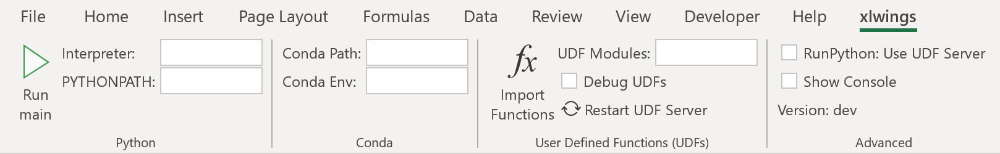

Changelog
=========

v0.30.13 (Dec 12, 2023)
-----------------------

* :bdg-info:`Enhancement` Wheels are now built for Python 3.12  (:issue:`2341`).
* :bdg-warning:`Bug Fix` :bdg-secondary:`PRO` The ``timeout`` argument in the ``RunRemotePython`` call has been fixed for high values (:issue:`2363`).
* :bdg-warning:`Bug Fix` Various bug fixes (:issue:`2335`, :issue:`2356`).
* :bdg-danger:`Breaking Change` :bdg-secondary:`PRO` Permissioning has been removed and replaced by the authentication in Office.js add-ins (:issue:`2336`).

v0.30.12 (Sep 18, 2023)
-----------------------

* :bdg-success:`Feature` New CLI command ``xlwings py edit``: this allows you to edit Microsoft's Python in Excel cells (``=PY``) in an external editor of your choice with auto-sync (:issue:`2331`).

v0.30.11 (Aug 26, 2023)
-----------------------

* :bdg-warning:`Bug Fix` Enabled a conflict-free co-existence with Microsoft's new Python in Excel feature as xlwings was internally also using ``=PY()``. This requires that you re-import your User-defined functions (UDFs) (:issue:`2319`).
* :bdg-danger:`Breaking Change` xlwings Server: The ``@pro`` decorators have been deprecated in favor of ``@server`` decorators, so e.g., functions are now decorated with ``@server.func`` instead of ``@pro.func``. The latter keeps working though for now (:issue:`2320`).

v0.30.10 (Jun 23, 2023)
-----------------------

* :bdg-danger:`Breaking Change` Dropped support for Python 3.7
* :bdg-info:`Enhancement` :bdg-secondary:`PRO` xlwings Server: added ``custom_function_call_path`` parameter in ``xw.pro.custom_functions_code()`` (:issue:`2289`).

v0.30.9 (Jun 12, 2023)
----------------------

* :bdg-info:`Enhancement` :bdg-secondary:`PRO` Custom functions: added support for ``help_url``, which allows you to link to more information via the function wizard/formula builder. See :ref:`pro/server/officejs_custom_functions:Help URL` (:issue:`2283`).
* :bdg-warning:`Bug Fix` :bdg-secondary:`PRO` Fixed a bug with sheet-scoped named ranges in case the scope and refers_to point to different sheets (:issue:`2280`).

v0.30.8 (May 27, 2023)
----------------------

* :bdg-info:`Enhancement` :bdg-secondary:`PRO` xlwings File Reader: when reading ``xls`` and ``xlsb`` formats, date cells are now properly converted into ``datetime`` objects (:issue:`2059`).

v0.30.7 (May 18, 2023)
----------------------

* :bdg-info:`Enhancement` :bdg-secondary:`PRO` xlwings Server: added named range support for Office Scripts, Office.js, and Google Apps Script clients in addition to the VBA client (:issue:`2257`).
* :bdg-info:`Enhancement` :bdg-secondary:`PRO` xlwings Server: the documentation has been improved to point out that the ``book`` object has to be closed at the end of a request in oder to prevent a memory leak. This can be done via ``mybook.close()`` or by using ``Book`` as a context manager (``with xw.Book(json=data) as book:```). Note that your framework may offer better means to automatically close the book at the end of a request via middleware or similar mechanism. As an example, for FastAPI, you can use dependency injection. See :ref:`pro/server/server:Introduction` (:issue:`2260`).

v0.30.6 (May 5, 2023)
---------------------

* :bdg-warning:`Bug Fix` :bdg-secondary:`PRO` xlwings Server (Office Scripts client): named ranges with sheet scope were ignored (:issue:`2245`).
* :bdg-warning:`Bug Fix` :bdg-secondary:`PRO` xlwings Server (Office.js client): excluded sheets were still loading sheet values (:issue:`2251`).

v0.30.5 (Apr 25, 2023)
----------------------

*  :bdg-info:`Enhancement` :bdg-secondary:`PRO` xlwings Server: this version adds picture support for Office Scripts and Office.js, meaning that pictures are now supported across all clients (:issue:`2235` and :issue:`2238`).
* :bdg-info:`Enhancement` :bdg-secondary:`PRO` xlwings Server: Excel tables can now be accessed via the ``mysheet['MyTable']`` syntax in addition to ``mysheet.tables`` (:issue:`2229`).
* :bdg-warning:`Bug Fix` :bdg-secondary:`PRO` Stability fixes with ``xw.apps.cleanup()`` (:issue:`2225` and :issue:`2239`).

v0.30.4 (Mar 31, 2023)
----------------------

* :bdg-warning:`Bug Fix` Fixed a bug that could cause a ``CoInitialize has not been called`` error on Windows when xlwings was used inside a web framework (:issue:`2213`).
* :bdg-warning:`Bug Fix` :bdg-secondary:`PRO` ``xlwings.min.js``: Fixed a regression introduced with 0.30.3 that caused a pop-up error to show when calling ``xlwings.runPython`` (:issue:`2214`).
* :bdg-warning:`Bug Fix` :bdg-secondary:`PRO` Fixed a regression introduced with 0.30.3 that was causing the ``xlwings license`` CLI command to fail on Linux (:issue:`2211`).

v0.30.3 (Mar 26, 2023)
----------------------

* :bdg-info:`Enhancement` :bdg-secondary:`PRO` xlwings Server now supports Excel tables (:issue:`2072`), ``range.insert()`` (:issue:`2073`), and ``range.copy()`` (:issue:`2204`).
* :bdg-info:`Enhancement` Improved error message when no engines is available either because of missing dependencies (OSS) or a missing license key (PRO) (:issue:`2072`).
* :bdg-danger:`Breaking Change` ``range.insert()`` now requires the ``shift`` argument. The previous default was to let Excel guess the shift direction (:issue:`2073`).

v0.30.2 (Mar 16, 2023)
----------------------

* :bdg-info:`Enhancement` On Windows, xlwings now actively cleans up Excel zombie processes when quitting or killing App objects and when exiting the Python process. You can also remove zombies manually by calling ``xw.apps.cleanup()`` (:issue:`2001`).
* :bdg-warning:`Bug Fix` :bdg-secondary:`PRO` xlwings Reports: fixed a regression introduced with 0.30.1 that was causing issues when using Excel tables in frames (:issue:`2192`).

v0.30.1 (Mar 6, 2023)
---------------------

* :bdg-info:`Enhancement` Added support for ``Range.autofill()`` (interactive engines on Windows and macOS) (:issue:`2180`).
* :bdg-warning:`Bug Fix` :bdg-secondary:`PRO` xlwings Reports: improved stability of dynamic range formatting by removing the use of the clipboard (:issue:`2175`).

v0.30.0 (Mar 2, 2023)
---------------------

* :bdg-info:`Feature` :bdg-secondary:`PRO` xlwings Server now supports custom functions (a.k.a. user-defined functions or UDFs) on Windows, macOS, and Web via the Office.js add-ins. See :ref:`pro/server/officejs_custom_functions:Office.js Custom Functions` (:issue:`2177`).
* :bdg-warning:`Bug Fix` :bdg-secondary:`PRO` xlwings Reports: fixed ``render_template()`` on Windows when the template had hidden sheets (:issue:`2166`).

v0.29.1 (Feb 5, 2023)
---------------------

* :bdg-info:`Enhancement` :bdg-secondary:`PRO` xlwings Server (VBA client): the default timeout for ``RunRemotePython`` has been increased from 5s to 30s (:issue:`2153`).
* :bdg-info:`Enhancement` :bdg-secondary:`PRO` xlwings Server (all clients): added support for ``app.macro()`` (:issue:`2157`).
* :bdg-info:`Enhancement` :bdg-secondary:`PRO` xlwings Server (all clients): added support for ``range.delete()`` (:issue:`2157`).

v0.29.0 (Jan 29, 2023)
----------------------

* :bdg-success:`Feature` :bdg-secondary:`PRO` xlwings Server now supports Office.js add-ins! Check out the comprehensive :ref:`documentation <officejs_addins>` (:issue:`2151`).

v0.28.9 (Jan 21, 2023)
----------------------

* :bdg-info:`Enhancement` :bdg-secondary:`PRO` xlwings Server: add full support for named ranges when called from VBA. JavaScript client implementations are still pending (:issue:`2145`).
* :bdg-warning:`Bug Fix` On macOS, opening a file was turning its name into lower case  (:issue:`2052`).
* :bdg-warning:`Bug Fix` The xlwings CLI was removing the xlwings addin when the ``remove`` command was called with the ``--dir`` flag. Also, the ``xlwings.exe`` builds are now 32-bit (:issue:`2142`).

v0.28.8 (Jan 13, 2023)
----------------------

* :bdg-warning:`Bug Fix` :bdg-secondary:`PRO` xlwings Server: make ``include``/``exclude`` parameters respect all objects in a sheet, not just values (:issue:`2139`).
* :bdg-warning:`Bug Fix` :bdg-secondary:`PRO` xlwings Server (VBA client): ignore shapes that aren't real pictures in the pictures collection (:issue:`2140`).

v0.28.7 (Dec 27, 2022)
----------------------

* :bdg-info:`Enhancement` New CLI commands ``xlwings copy vba`` and ``xlwings copy vba --addin``: They can help you to upgrade existing standalone projects and custom add-ins more easily (:issue:`2129`).
* :bdg-warning:`Bug Fix` :bdg-secondary:`PRO` xlwings Server: Google Sheets was failing when cells contained a Date, caused by a recent Chromium V8 bug (:issue:`2126`).
* :bdg-warning:`Bug Fix` :bdg-secondary:`PRO` xlwings Server: Writing ``datetime`` objects from Python to Google Sheets (with a time part not being zero) weren't formatting the cell properly as Date Time (:issue:`2126`).


v0.28.6 (Dec 15, 2022)
----------------------

* :bdg-success:`Feature` xlwings now allows to authenticate and authorize users via Azure AD in connection with the Ribbon add-in or VBA standalone module. This is useful in connection with a server component, such as xlwings Server, where the acquired access tokens can be validated, see :ref:`Server Auth <server_auth>` (:issue:`2122`).
* :bdg-info:`Enhancement` :bdg-secondary:`PRO` xlwings Server: added support for reading the Names collection via ``mybook.names`` and ``mysheet.names`` (:issue:`2123`).
* :bdg-success:`Feature` The xlwings CLI (command-line interface) is now also available as a standalone executable for a limited set of uses cases. It can be downloaded from the `GitHub Release page <https://github.com/xlwings/xlwings/releases>`_ and can be useful to run ``xlwings vba ...``, ``xlwings auth ...``, and ``xlwings addin ... -f`` without having to install a full Python installation (:issue:`2121`).
* :bdg-danger:`Breaking Change` :bdg-secondary:`PRO`: xlwings Server: ``auth`` replaces the ``apiKey`` argument in the ``runPython`` and ``RunRemotePython`` calls respectively. Technically it's only a deprecation, so ``apiKey`` still works for now (:issue:`2104`).
* :bdg-warning:`Bug Fix` :bdg-secondary:`PRO` xlwings Server: Fixed an error with setting custom headers in VBA (:issue:`2081`).


v0.28.4 and v0.28.5 (Oct 29, 2022)
----------------------------------

* :bdg-info:`Enhancement` Added possibility to install the add-in globally for all users via ``xlwings addin install -g`` (:issue:`2075`).
* :bdg-info:`Enhancement` Added ``App.path`` property (:issue:`2074`).
* :bdg-info:`Enhancement` Build wheels for Python 3.11 (:issue:`2071`).
* :bdg-warning:`Bug Fix` 0.28.5 fixes an issue with the global add-in install (:issue:`2076`).

v0.28.3 (Oct 21, 2022)
----------------------

* :bdg-warning:`Bug Fix` :bdg-secondary:`PRO` xlwings File Reader: To be in line with the rest of the API, integers are now delivered as floats (:issue:`2066`).
* :bdg-warning:`Bug Fix` :bdg-secondary:`PRO` xlwings File Reader: Fixed a bug that sometimes read in incorrect decimals with the legacy ``xls`` file formats (:issue:`2062`).
* :bdg-warning:`Bug Fix` :bdg-secondary:`PRO` Fixed a bug introduced with 0.28.1 when ``xlwings code embed`` was run with the ``--file`` flag and a relative path (:issue:`2061`).

v0.28.2 (Oct 17, 2022)
----------------------

* :bdg-danger:`Breaking Change` :bdg-secondary:`PRO` xlwings File Reader: The reader was including Chartsheets etc. in ``mybook.sheets``, which was inconsistent with the rest of the API. Accordingly, it now only shows Worksheets (:issue:`2058`).
* :bdg-warning:`Bug Fix` :bdg-secondary:`PRO` xlwings File Reader: With ``xlsb`` formats, slightly unusual defined names caused the reader to fail (:issue:`2057`).
* :bdg-info:`Enhancement` :bdg-secondary:`PRO` xlwings Reports: the imports have been flattened. What previously was available via ``xlwings.pro.reports`` is now also available via ``xlwings.reports`` (:issue:`2055`).
* :bdg-info:`Enhancement` :bdg-secondary:`PRO` xlwings Reports: the registration of formatters for use with templates has been simplified by allowing you to use the ``@formatter`` decorator instead of having to register the function via ``register_formatter(myfunc)`` (:issue:`2055`).

v0.28.1 (Oct 10, 2022)
----------------------

* :bdg-success:`Feature` You can now use formatters to format the data you write to Excel or Google Sheets in a very flexible manner (see also :ref:`converters:Default Converter`)::

    import pandas as pd
    import xlwings as xw

    sheet = xw.Book().sheets[0]

    def table(rng: xw.Range, df: pd.DataFrame):
        """This is the formatter function"""
        # Header
        rng[0, :].color = "#A9D08E"

        # Rows
        for ix, row in enumerate(rng.rows[1:]):
            if ix % 2 == 0:
                row.color = "#D0CECE"  # Even rows

        # Columns
        for ix, col in enumerate(df.columns):
            if "two" in col:
                rng[1:, ix].number_format = "0.0%"


    df = pd.DataFrame(data={"one": [1, 2, 3, 4], "two": [5, 6, 7, 8]})
    sheet["A1"].options(formatter=table, index=False).value = df

  .. image:: images/formatter.png

* :bdg-success:`Feature` :bdg-secondary:`PRO` Formatters are also available for xlwings Reports via filters: ``{{ df | formatter("myformatter") }}``, see :ref:`pro/reports/components_filters:DataFrames Filters`.
* :bdg-success:`Feature` You can now export a sheet to an HTML page via :meth:`mysheet.to_html() <xlwings.Sheet.to_html()>`
* :bdg-success:`Feature` New convenience property to get a list of the sheet names: :attr:`mybook.sheet_names <xlwings.Book.sheet_names>`
* :bdg-info:`Enhancement` :bdg-secondary:`PRO` The Excel File Reader now supports the Names collection. I.e., you can now run code like this::

    with xw.Book("myfile.xlsx", mode="r") as book:
        for name in book.names:
            print(name.refers_to_range.value)
* :bdg-info:`Enhancement` :bdg-secondary:`PRO` Code embedding via ``xlwings release`` or ``xlwings code embed`` now allows you to work with Python packages, i.e., nested directories.

v0.28.0 (Oct 4, 2022)
---------------------

* :bdg-success:`Feature` :bdg-secondary:`PRO` xlwings PRO adds an ultra fast file reader, allowing you to read Excel files much faster than via ``pandas.read_excel()``:

  .. code-block:: python

      with xw.Book("myfile.xlsx", mode="r") as book:
          sheet1 = book.sheets[0]
          df = sheet1["A1:B2"].options("df", index=False).value

  For all the details, see :ref:`Excel File Reader<file_reader>`.

* :bdg-info:`Enhancement` ``Book`` can now be used as context manager (i.e., with the ``with`` statement, see previous bullet point), which will close the book automatically when leaving the body of the ``with`` statement.
* :bdg-info:`Enhancement` The new option ``err_to_str`` allows you to deliver cell errors like ``#N/A`` as strings instead of ``None`` (default): ``xw.Book("mybook.xlsx").options(err_to_str=True).value``.
* :bdg-danger:`Breaking Change` :bdg-secondary:`PRO` xlwings Server used to deliver cell errors as strings, which wasn't consistent with the rest of xlwings. This has now been fixed by delivering them as ``None`` by default. To get the previous behavior, use the ``err_to_str`` option, see the previous bullet point.
* :bdg-info:`Enhancement` :bdg-secondary:`PRO` The *Remote Interpreter* has been rebranded to *xlwings Server*.

v0.27.15 (Sep 16, 2022)
-----------------------

* :bdg-info:`Enhancement` :bdg-secondary:`PRO` Reports: Added new ``vmerge`` filter to vertically merge cells with the same values, for details, see :ref:`pro/reports/components_filters:vmerge` (:issue:`2020`).

v0.27.14 (Aug 26, 2022)
-----------------------

* :bdg-info:`Enhancement` Allow to install/remove the addin via ``xlwings addin install`` while Excel is running (:issue:`1999`).

v0.27.13 (Aug 22, 2022)
-----------------------

* :bdg-success:`Feature` Add support for alerts: ``myapp.alert("Hello World")``, see :meth:`myapp.alert() <xlwings.App.alert>` for more details (:issue:`756`).
* :bdg-info:`Enhancement` Handle Timedelta dtypes in pandas DataFrames and Series (:issue:`1991`).
* :bdg-info:`Enhancement` :bdg-secondary:`PRO` Remove the cryptography dependency from xlwings PRO (:issue:`1992`).

v0.27.12 (Aug 8, 2022)
----------------------

* :bdg-info:`Enhancement` :bdg-secondary:`PRO`: xlwings Server: added support for named ranges via ``mysheet["myname"]`` or ``mysheet.range("myname")`` (:issue:`1975`).
* :bdg-info:`Enhancement` :bdg-secondary:`PRO`: xlwings Server: in addition to Google Sheets, ``pictures.add()`` is now also supported on Desktop Excel (Windows and macOS). This includes support for Matplotlib plots (:issue:`1974`).
* :bdg-info:`Enhancement` Faster UDFs (:issue:`1976`).
* :bdg-warning:`Bug Fix` Made ``myapp.range()`` behave the same as ``mysheet.range()`` (:issue:`1982`).
* :bdg-warning:`Bug Fix` :bdg-secondary:`PRO`: xlwings Server: cell errors were causing a bug with Desktop Excel (:issue:`1968`).
* :bdg-warning:`Bug Fix` :bdg-secondary:`PRO`: xlwings Server: sending large payloads with Desktop Excel on macOS is now possible (:issue:`1977`).

v0.27.11 (Jul 6, 2022)
----------------------

* :bdg-info:`Enhancement` Added support for pandas ``pd.NA`` (:issue:`1939`).
* :bdg-warning:`Bug Fix` Empty cells in UDFs are now properly returned as ``None`` / ``NaN`` instead of an empty string (:issue:`1947`).
* :bdg-warning:`Bug Fix` Resolved an issue with OneDrive/SharePoint files that are unsynced locally (:issue:`1946`).

v0.27.10 (Jun 8, 2022)
----------------------

* :bdg-warning:`Bug Fix` :bdg-secondary:`PRO` This release fixes a ``FileNotFound`` error that could sometimes happen with embedded code (:issue:`1931`).

v0.27.9 (Jun 4, 2022)
---------------------

* :bdg-warning:`Bug Fix` Fixes a bug on Windows that caused an Excel Zombie process with pywin32 > v301 (:issue:`1929`).

v0.27.8 (May 22, 2022)
----------------------

* :bdg-info:`Enhancement` Smarter shrinking of Excel tables when using ``mytable.update(df)`` as it doesn't delete rows below the table anymore (:issue:`1908`).
* :bdg-warning:`Bug Fix` Fixed a regression when ``RunPyhon`` was used with ``Use UDF Server = True`` (introduced in v0.26.2) (:issue:`1912`).
* :bdg-warning:`Bug Fix` :bdg-secondary:`PRO` The ``xlwings release`` command would sometimes incorrectly show a version mismatch error (:issue:`1918`).
* :bdg-warning:`Bug Fix` :bdg-secondary:`PRO` xlwings Reports now raises an explicit error when Jinja2 is missing (:issue:`1637`).

v0.27.7 (May 1, 2022)
---------------------

* :bdg-success:`Feature` :bdg-secondary:`PRO` Google Sheets now support pictures via ``mysheet.pictures.add()`` incl. Matplotlib/Plotly (note that Excel on the web and Desktop Excel via xlwings Server are not yet supported). Also note that Google Sheets allows a maximum of 1 million pixels as calculated by  (width in inches * dpi) * (height in inches * dpi), see also :ref:`matplotlib:Matplotlib & Plotly charts` (:issue:`1906`).
* :bdg-danger:`Breaking Change` Matplotlib plots are now written to Excel/Google Sheets with a default of 200 dpi instead of 300 dpi. You can change this (and all other options that Matplotlib's ``savefig()`` and Plotly's ``write_image()`` offer via ``sheet.pictures.add(image=myfigure, export_options={"bbox_inches": "tight", "dpi": 300})`` (:issue:`665`, :issue:`519`).


v0.27.6 (Apr 11, 2022)
----------------------

* :bdg-warning:`Bug Fix` macOS: Python modules on OneDrive Personal are now found again in the default setup even if they have been migrated to the new location (:issue:`1891`).
* :bdg-info:`Enhancement` :bdg-secondary:`PRO` xlwings Server now shows nicely formatted error messages across all platforms (:issue:`1889`).


v0.27.5 (Apr 1, 2022)
---------------------

* :bdg-info:`Enhancement` :bdg-secondary:`PRO` xlwings Server: added support for setting the number format of a range via ``myrange.number_format = "..."`` (:issue:`1887`).
* :bdg-warning:`Bug Fix` :bdg-secondary:`PRO` xlwings Server: Google Sheets/Excel on the web were formatting strings like ``"1"`` as date (:issue:`1885`).

v0.27.4 (Mar 29, 2022)
----------------------
* :bdg-info:`Enhancement` Further SharePoint enhancements on Windows, increasing the chance that ``mybook.fullname`` returns the proper local filepath (by taking into account the info in the registry) (:issue:`1829`).
* :bdg-info:`Enhancement` The ribbon, i.e., the config, now allows you to uncheck the box ``Add workbook to PYTHONPATH`` to not automatically add the directory of your workbook to the PYTHONPATH. The respective config is called ``ADD_WORKBOOK_TO_PYTHONPATH``. This can be helpful if you experience issues with OneDrive/SharePoint: uncheck this box and provide the path where your source file is manually via the PYTHONPATH setting (:issue:`1873`).
* :bdg-info:`Enhancement` :bdg-secondary:`PRO` Added support for ``myrange.add_hyperlink()`` with remote interpreter (:issue:`1882`).
* :bdg-info:`Enhancement` :bdg-secondary:`PRO` Added a new optional parameter ``include`` in connection with ``runPython`` (JS) and ``RunRemotePython`` (VBA), respectively. It's the counterpart to ``exclude`` and allows you to submit the names of the sheets that you want to send to the server. Like ``exclude``, ``include`` accepts a comma-delimited string, e.g., "Sheet1,Sheet2"  (:issue:`1882`).
* :bdg-info:`Enhancement` :bdg-secondary:`PRO` On Google Sheets, the xlwings JS module now automatically asks for the proper permission to allow authentication based on OAuth Token (:issue:`1876`).

v0.27.3 (Mar 18, 2022)
----------------------

* :bdg-warning:`Bug Fix` :bdg-secondary:`PRO` Fixes an issue with Date formatting on Google Sheets in case you're not using the U.S. locale (:issue:`1866`).
* :bdg-warning:`Bug Fix` :bdg-secondary:`PRO` Fixes the truncating of ranges with xlwings Server in case the range was partly outside the used range (:issue:`1822`).

v0.27.2 (Mar 11, 2022)
----------------------

* :bdg-warning:`Bug Fix` :bdg-secondary:`PRO` Fixes an issue with xlwings Server that occurred on 64-bit versions of Excel.

v0.27.0 and v0.27.1 (Mar 8, 2022)
---------------------------------

* :bdg-success:`Feature` :bdg-secondary:`PRO` This release adds support for xlwings Server to the Excel Desktop apps on both Windows and macOS. The new VBA function ``RunRemotePython`` is equivalent to ``runPython`` in the JavaScript modules of Google Sheets and Excel on the web, see :ref:`xlwings Server<remote_interpreter>` (:issue:`1841`).
* :bdg-info:`Enhancement` The xlwings package is now uploaded as wheel to PyPI in addition to the source format (:issue:`1855`).
* :bdg-info:`Enhancement` The xlwings package is now compatible with Poetry (:issue:`1265`).
* :bdg-info:`Enhancement` The add-in and the dll files are now code signed (:issue:`1848`).
* :bdg-danger:`Breaking Change` :bdg-secondary:`PRO` The JavaScript modules (Google Sheet/Excel on the web ) changed the parameters in ``runPython``, see :ref:`xlwings Server<remote_interpreter>` (:issue:`1852`).
* :bdg-danger:`Breaking Change` ``xlwings vba edit`` has been refactored and there is an additional command ``xlwings vba import`` to edit your VBA code outside of the VBA editor, e.g., in VS Code or any other editor, see :ref:`command_line` (:issue:`1843`).
* :bdg-danger:`Breaking Change` The ``--unprotected`` flag has been removed from the ``xlwings addin install`` command. You can still manually remove the password (``xlwings``) though (:issue:`1850`).
* :bdg-warning:`Bug Fix` :bdg-secondary:`PRO` The ``Markdown`` class has been fixed in case the first line was empty (:issue:`1856`).
* :bdg-warning:`Bug Fix` :bdg-secondary:`PRO` 0.27.1 fixes an issue with the version string in the new RunRemotePython VBA call (:issue:`1859`).

v0.26.3 (Feb 19, 2022)
----------------------

* :bdg-success:`Feature` If you still have to write VBA code, you can now use the new CLI command ``xlwings vba edit``: this will export all the VBA modules locally so that you can edit them with any editor like e.g., VS Code. Every local change is synced back whenever you save the local file, see :ref:`command_line` (:issue:`1839`).
* :bdg-info:`Enhancement` :bdg-secondary:`PRO` The permissioning feature now allows you to send an Authorization header via the new ``PERMISSION_CHECK_AUTHORIZATION`` setting (:issue:`1840`).

v0.26.2 (Feb 10, 2022)
----------------------

* :bdg-success:`Feature` Added support for ``myrange.clear_formats`` and ``mysheet.clear_formats`` (:issue:`1802`).
* :bdg-success:`Feature` Added support for ``mychart.to_pdf()`` and ``myrange.to_pdf()`` (:issue:`1708`).
* :bdg-success:`Feature` :bdg-secondary:`PRO` xlwings Server: added support for ``mybook.selection`` (:issue:`1819`).
* :bdg-info:`Enhancement` The ``quickstart`` command now makes sure that the project name is a valid Python module name (:issue:`1773`).
* :bdg-info:`Enhancement` The ``to_pdf`` method now accepts an additional parameter ``quality`` that defaults to ``"standard"`` but can be set to ``"minimum"`` for smaller PDFs (:issue:`1697`).
* :bdg-warning:`Bug Fix` Allow space in path to Python interpreter when using UDFs / UDF Server (:issue:`974`).
* :bdg-warning:`Bug Fix` A few issues were fixed in case your files are synced with OneDrive or SharePoint (:issue:`1813` and :issue:`1810`).
* :bdg-warning:`Bug Fix` :bdg-secondary:`PRO` Reports: fixed the ``aggsmall`` filter to work without the optional ``min_rows`` parameter (:issue:`1824`).

v0.26.0 and v0.26.1 (Feb 1, 2022)
---------------------------------

* :bdg-secondary:`PRO` :bdg-success:`Feature` Added experimental support for Google Sheets and Excel on the web via a remote Python interpreter. For all the details, see :ref:`xlwings Server <remote_interpreter>`.
* :bdg-secondary:`PRO` :bdg-warning:`Bug Fix` 0.26.1 fixes an issue with the ``xlwings copy gs`` command.
* xlwings PRO is now free for noncommercial usage under the `PolyForm Noncommercial License 1.0.0 <https://polyformproject.org/licenses/noncommercial/1.0.0>`_, see :ref:`xlwings PRO <pro>` for the details.

Older Releases
--------------

v0.25.3 (Dec 16, 2021)

* :bdg-secondary:`PRO` :bdg-warning:`Bug Fix` The xlwings Reports filters ``aggsmall`` and ``maxrows`` don't fail with empty DataFrames anymore (:issue:`1788`).

v0.25.2 (Dec 3, 2021)

* :bdg-secondary:`PRO` :bdg-info:`Enhancement` xlwings Reports now ignores sheets whose name start with ``##`` for both rendering and printing to PDF (:issue:`1779`).
* :bdg-secondary:`PRO` :bdg-info:`Enhancement` The ``aggsmall`` filter in xlwings Reports now accepts a new parameter ``min_rows`` (:issue:`1780`).

v0.25.1 (Nov 21, 2021)

* :bdg-info:`Enhancement` ``mybook.save()`` now supports the ``password`` parameter (:issue:`1568`).
* :bdg-secondary:`PRO` :bdg-warning:`Bug Fix` xlwings Reports would sometimes cause a ``Could not activate App instance`` error (:issue:`1764`).
* :bdg-secondary:`PRO` :bdg-info:`Enhancement` xlwings now warns about expiring developer license keys 30 days before they expire (:issue:`1758`).

v0.25.0 (Oct 27, 2021)

* :bdg-warning:`Bug Fix` Finally, xlwings adds proper support for OneDrive, OneDrive for Business, and SharePoint. This means that the ``quickstart`` setup (Excel file and Python file in the same folder with the same name) works even if the files are stored on OneDrive/SharePoint---as long as they are being synced locally. It also makes ``mybook.fullname`` return the local file path instead of a URL. Sometimes, this requires editing the configuration, see: :ref:`onedrive_sharepoint` for the details (:issue:`1630`).
* :bdg-success:`Feature` The ``update()`` method of Excel tables has been moved from PRO to open source. You can now easily update an existing table in Excel with the data from a new pandas DataFrame without messing up any formulas that reference that table: ``mytable.update(df)``, see: :meth:`Table.update() <xlwings.main.Table.update>` (:issue:`1751`).
* :bdg-secondary:`PRO` :bdg-danger:`Breaking Change`: Reports: ``create_report()`` is now deprecated in favor of ``render_template()`` that is available via ``app``, ``book`` (new), and ``sheet`` objects, see: :ref:`reports_quickstart` (:issue:`1738`).
* :bdg-warning:`Bug Fix` Running UDFs from other Office apps has been fixed (:issue:`1729`).
* :bdg-warning:`Bug Fix` Writing to a protected sheet or using an invalid sheet name etc. caused xlwings to hang instead of raising an Exception (:issue:`1725`).

v0.24.9 (Aug 26, 2021)

* :bdg-warning:`Bug Fix` Fixed a regression introduced with 0.24.8 that was causing an error with pandas DataFrames that have repeated column headers (:issue:`1711`).

v0.24.8 (Aug 25, 2021)

* :bdg-success:`Feature` New methods :meth:`mychart.to_png() <xlwings.Chart.to_png>`, :meth:`myrange.to_png() <xlwings.Range.to_png>` and :meth:`myrange.copy_picture() <xlwings.Range.copy_picture>` (:issue:`1707` and :issue:`582`).
* :bdg-info:`Enhancement` You can now use the alias ``'df'`` to convert to a pandas DataFrame: ``mysheet['A1:C3'].options('df').value`` is equivalent to ``import pandas as pd; mysheet['A1:C3'].options(pd.DataFrame).value`` (:issue:`1533`).
* :bdg-info:`Enhancement` Added ``--dir`` option to ``xlwings addin install`` to allow the installation of all files in a directory as add-ins (:issue:`1702`).
* :bdg-warning:`Bug Fix` Pandas DataFrames now properly work with ``PeriodIndex`` / ``PeriodDtype`` (:issue:`1084`).
* :bdg-secondary:`PRO` Reports: If there's just one Frame, keep height of rows (:issue:`1698`).

v0.24.7 (Aug 5, 2021)

* :bdg-secondary:`PRO` :bdg-danger:`Breaking Change`: Reports: Changed the order of the arguments of the arithmetic DataFrame filters: ``sum``, ``div``, ``mul`` and ``div`` to align them with the other filters. E.g., to multiply column 2 by 100, you now have to write your filter as ``{{ df | mul(100, 2) }}`` (:issue:`1696`).
* :bdg-secondary:`PRO` :bdg-warning:`Bug Fix` Reports: Fixed an issue with images when pillow wasn't installed (:issue:`1695`).

v0.24.6 (Jul 31, 2021)

* :bdg-info:`Enhancement` You can now also define the color of cells, shapes and font objects with a hex string instead of just an RGB tuple, e.g., ``mysheet["A1"].color = "#efefef"`` (:issue:`1535`).
* :bdg-info:`Enhancement` When you print a workbook or sheet to a pdf, you can now automatically open the PDF document via the new ``show`` argument: ``mybook.to_pdf(show=True)`` (:issue:`1683`).
* :bdg-warning:`Bug Fix`: This release includes another round of fixing the cleanup actions of the App() context manager (:issue:`1687`).
* :bdg-secondary:`PRO` :bdg-info:`Enhancement` Reports: New filter ``fontcolor``, allowing you to write text in black and turn it into e.g., white for the report. This gets around the issue that white text isn't visible in Excel on a white background: ``{{ myplaceholder | fontcolor("white") }}``. Alternatively, you can also use a hex color (:issue:`1692`).
* :bdg-secondary:`PRO` :bdg-warning:`Bug Fix` Positioning shapes wasn't always respecting the top/left filters (:issue:`1687`).
* :bdg-secondary:`PRO` :bdg-warning:`Bug Fix` Fixed a bug with non-string headers when calling ``table.update`` (:issue:`1687`).

v0.24.5 (Jul 27, 2021)

* :bdg-secondary:`PRO` :bdg-warning:`Bug Fix` Reports: Using the ``header`` filter in a Frame was causing rows to be inserted (:issue:`1681`).

v0.24.4 (Jul 26, 2021)

* :bdg-success:`Feature` ``myapp.properties`` is a new context manager that allows you to easily change the app’s properties temporarily. Once the code leaves the with block, the properties are changed back to their previous state (:issue:`254`). For example::

    import xlwings as xw
    app = App()

    with app.properties(display_alerts=False):
        # Alerts are disabled until you leave the with block again

* :bdg-info:`Enhancement` The app properties ``myapp.enable_events`` and ``myapp.interactive`` are now supported (:issue:`254`).
* :bdg-info:`Enhancement` ``mybook.to_pdf`` now ignores sheet names that start with a ``#``. This can be changed by setting the new parameter ``exclude_start_string`` (:issue:`1667`).
* :bdg-info:`Enhancement` New method ``mytable.resize()`` (:issue:`1662`).
* :bdg-warning:`Bug Fix` The new App context manager introduced with v0.24.3 was sometimes causing an error on Windows during the cleanup actions (:issue:`1668`).

:bdg-secondary:`PRO` **xlwings.pro.reports:**

* :bdg-danger:`Breaking Change`: DataFrame placeholders will now ignore the DataFrame's index. If you need the index, reset it via : ``df.reset_index()`` before passing the DataFrame to ``create_report`` or ``render_template``. This was required as the same column index used in filters would point to seemingly different columns in Excel depending on whether the index was included or not. This also means that the ``noindex`` and ``body`` filters are no obsolete and have been removed (:issue:`1676`).
* :bdg-info:`Enhancement` Dataframe filters now respect the order in which they are called and can be used multiple times (:issue:`1675`).
* :bdg-info:`Enhancement` New filters: ``format`` (to apply f-string like formatting), ``datetime`` (to format datetime objects), ``top`` and  ``left`` (to position graphics outside of the grid structure) ``header``, ``add``, ``sub``, ``mul``, ``div`` (to only return the header of a DataFrame or apply an arithmetic operation, respectively) (:issue:`1666`, :issue:`1660`, :issue:`1677`).
* :bdg-info:`Enhancement`: ``create_report`` can now be accessed as method of the app object like so: ``myapp.create_report`` (:issue:`1665`).
* :bdg-warning:`Bug Fix`: Excel tables that had the Header Row unchecked were sometimes causing row shifts in the template (:issue:`1663`).
* :bdg-warning:`Bug Fix`: Rendering a template was sometimes causing the following error ``PasteSpecial method of Range class failed`` (:issue:`1672`).

v0.24.3 (Jul 15, 2021)

* :bdg-info:`Enhancement` :meth:`xlwings.App` can now be used as context manager, making sure that there are no zombie processes left over on Windows, even if you use a hidden instance and your code fails. It is therefore recommended to use it whenever you can, like so::

    with xw.App(visible=True) as app:
        print(app.books)

* :bdg-info:`Enhancement` :meth:`mysheet.pictures.add <xlwings.main.Pictures.add>` now accepts a new ``anchor`` argument that you can use as an alternative to ``top``/``left`` to position the picture by providing an anchor range object, e.g.: ``mysheet.pictures.add(img, anchor=mysheet['A1'])`` (:issue:`1648`).
* :bdg-warning:`Bug Fix` macOS: Plots are now sent to Excel in PDF format when you set ``format='vector'`` which is supporting transparency unlike the previously used eps format (:issue:`1647`).
* :bdg-secondary:`PRO` :bdg-info:`Enhancement` :meth:`mybook.to_pdf <xlwings.Book.to_pdf>` now accepts a ``layout`` parameter so you can "print" your reports onto a PDF with your corporate layout including headers, footers and borderless graphics. See :ref:`reports_pdf_layout`.

v0.24.2 (Jul 6, 2021)

* :bdg-success:`Feature` Added very basic support for :meth:`mysheet.page_setup <xlwings.Sheet.page_setup>` and :meth:`myrange.note <xlwings.Range.note>` (:issue:`1551` and :issue:`896`).
* :bdg-info:`Enhancement` DataFrames are now displayed in Excel tables with empty column names if the DataFrame doesn't have a column or index name. This effect is e.g. visible when using ``xw.view()`` (:issue:`1643`).
* :bdg-info:`Enhancement` ``mysheet.pictures.add()`` now supports ``format='vector'`` which translates to ``'svg'`` on Windows and ``'eps'`` on macOS (:issue:`1640`).
* :bdg-secondary:`PRO` :bdg-info:`Enhancement`: The reports package now offers the additional DataFrame filters ``rowslice`` and ``colslice``, see :ref:`xlwings Reports<reports_quickstart>` (:issue:`1645`).
* :bdg-secondary:`PRO` :bdg-warning:`Bug Fix`: Bug fix with handling Excel tables without headers.

:bdg-danger:`Breaking Change`

* :bdg-secondary:`PRO` :bdg-info:`Enhancement`: ``<frame>`` markers now have to be defined as cell notes in the first row, see :ref:`frames`. This has the advantage that the Layout view corresponds to the print view (:issue:`1641`). Also, the print area is now preserved even if you use Frames.

v0.24.1 (Jun 27, 2021)

* :bdg-secondary:`PRO` :bdg-info:`Enhancement`: The reports package now offers the additional DataFrame filters ``head`` and ``tail``, see :ref:`xlwings Reports<reports_quickstart>` (:issue:`1633`).

v0.24.0 (Jun 25, 2021)

* :bdg-info:`Enhancement` ``pictures.add()`` now accepts every picture format (including vector-based formats) that your Excel version supports. For example, on Windows you can use the ``svg`` format (only supported with Excel that comes with Microsoft 365) and on macOS, you can use ``eps`` (:issue:`1624`).
* [Enhancements] Support for Plotly images was moved from PRO to the Open Source version, i.e. you can now provide a Plotly image directly to ``pictures.add()``.
* :bdg-info:`Enhancement` Matplotlib and Plotly plots can now be sent to Excel in a vector-based format by providing the ``format`` argument, e.g. ``svg`` on Windows or ``eps`` on macOS.
* :bdg-info:`Enhancement` Removed dependency on pillow/PIL to properly size images via ``pictures.add()``.
* :bdg-warning:`Bug Fix` Various fixes with scaling and positioning images via ``pictures.add()`` (:issue:`1491`).
* :bdg-success:`Feature` New methods :meth:`mypicture.lock_aspect_ratio <xlwings.Picture.lock_aspect_ratio>` and :meth:`myapp.cut_copy_mode <xlwings.App.cut_copy_mode>` (:issue:`1622` and :issue:`1625`).
* :bdg-secondary:`PRO` :bdg-success:`Feature`: Reports: DataFrames and Images are now offering various filters to influence the behavior of how DataFrames and Images are displayed, giving the template designer the ability to change a lot of things that previously had to be taken care of by the Python developer. For example, to hide a DataFrame's index, you can now do ``{{ df | noindex }}`` or to scale the image to double its size, you can do ``{{ img | scale(2) }}``. You'll find all available filters under :ref:`xlwings Reports<reports_quickstart>` (:issue:`1602`).

:bdg-danger:`Breaking Change`

* :bdg-info:`Enhancement`: When using ``pictures.add()``, pictures arrive now in Excel in the same size as if you would manually add them via the Excel UI and setting width/height now behaves consistently during initial adding and resizing. Consequently, you may have to fix your image sizes when you upgrade. (:issue:`1491`).
* :bdg-secondary:`PRO` The default MarkdownStyle removed the empty space after a h1 heading. You can always reintroduce it by applying a custom style (:issue:`1628`).

v0.23.4 (Jun 15, 2021)

* :bdg-warning:`Bug Fix` Windows: Fixed the ImportUDFs function in the VBA standalone module (:issue:`1601`).
* :bdg-warning:`Bug Fix` Fixed configuration hierarchy: if you have a setting with an empty value in the ``xlwings.conf`` sheet, it will not be overridden by the same key in the directory or user config file anymore. If you wanted it to be overridden, you'd have to get the key out of the "xlwings.conf" sheet (:issue:`1617`).
* :bdg-secondary:`PRO` :bdg-success:`Feature` Added the ability to block the execution of Python modules based on the file hash and/or machine name (:issue:`1586`).
* :bdg-secondary:`PRO` :bdg-success:`Feature` Added the ``xlwings release`` command for an easy release management in connection with the one-click installer, see :ref:`release`. (:issue:`1429`).

v0.23.3 (May 17, 2021)

* :bdg-warning:`Bug Fix` Windows: UDFs returning a ``pandas.NaT`` were causing a ``#VALUE!`` error (:issue:`1590`).

v0.23.2 (May 7, 2021)

* :bdg-success:`Feature` Added support for :attr:`myrange.wrap_text <xlwings.Range.wrap_text>` (:issue:`173`).
* :bdg-info:`Enhancement` :meth:`xlwings.view` and :meth:`xlwings.load` now use chunking by default (:issue:`1570`).
* :bdg-warning:`Bug Fix` Allow to save non-Excel file formats (:issue:`1569`)
* :bdg-warning:`Bug Fix` Calculate formulas by default in the Function Wizard (:issue:`1574`).
* :bdg-secondary:`PRO` :bdg-warning:`Bug Fix` Properly embed code with unicode characters (:issue:`1575`).

v0.23.1 (Apr 19, 2021)

* :bdg-success:`Feature` You can now save your workbook in any format you want, simply by specifying its extension:

  .. code-block:: python

      mybook.save('binaryfile.xlsb')
      mybook.save('macroenabled.xlsm')

* :bdg-success:`Feature` Added support for the ``chunksize`` option: when you read and write from or to big ranges, you may have to chunk them or you will hit a timeout or a memory error. The ideal ``chunksize`` will depend on your system and size of the array, so you will have to try out a few different chunksizes to find one that works well (:issue:`77`):

  .. code-block:: python

      import pandas as pd
      import numpy as np
      sheet = xw.Book().sheets[0]
      data = np.arange(75_000 * 20).reshape(75_000, 20)
      df = pd.DataFrame(data=data)
      sheet['A1'].options(chunksize=10_000).value = df

  And the same for reading:

  .. code-block:: python

      # As DataFrame
      df = sheet['A1'].expand().options(pd.DataFrame, chunksize=10_000).value
      # As list of list
      df = sheet['A1'].expand().options(chunksize=10_000).value

* :bdg-info:`Enhancement` ``xw.load()`` now expands to the ``current_region`` instead of relying on ``expand()`` (:issue:`1565`).
* :bdg-info:`Enhancement` The OneDrive setting has been split up into a Windows and macOS-specific paths: ``ONEDRIVE_WIN`` and ``ONEDRIVE_MAC`` (:issue:`1556`).
* :bdg-warning:`Bug Fix` macOS: There are no more timeouts when opening or saving large workbooks that take longer than 60 seconds (:issue:`618`).
* :bdg-warning:`Bug Fix` ``RunPython`` was failing when there was a ``&`` in the Excel file name (:issue:`1557`).

v0.23.0 (Mar 5, 2021)

* :bdg-secondary:`PRO` :bdg-success:`Feature`: This release adds support for Markdown-based formatting of text, both in cells as well as in shapes, see :ref:`markdown` for the details. This is also supported for template-based reports.

.. code-block:: python

    from xlwings.pro import Markdown, MarkdownStyle

    mytext = """\
    # Title

    Text **bold** and *italic*

    * A first bullet
    * A second bullet

    # Another Title

    This paragraph has a line break.
    Another line.
    """

    sheet = xw.Book("Book1.xlsx").sheets[0]
    sheet['A1'].value = Markdown(mytext)
    sheet.shapes[0].text = Markdown(mytext)

Running this code will give you this nicely formatted text, but you can also define your own style to match your corporate style guide as explained under :ref:`markdown`:

.. figure:: images/markdown1.png

* :bdg-success:`Feature` Added support for the ``Font`` object via ``range`` or ``shape`` objects, see :meth:`Font <xlwings.main.Font>` (:issue:`897` and :issue:`559`).
* :bdg-success:`Feature` Added support for the ``Characters`` object via ``range`` or ``shape`` objects, see :meth:`Characters <xlwings.main.Characters>`.

v0.22.3 (Mar 3, 2021)

* :bdg-info:`Enhancement` As a convenience method, you can now directly export sheets to PDF instead of having to go through the book: :meth:`mysheet.to_pdf() <xlwings.Sheet.to_pdf>` (:issue:`1517`).
* :bdg-secondary:`PRO` :bdg-warning:`Bug Fix` Running ``RunPython`` with embedded code was broken in 0.22.0 (:issue:`1530`).

v0.22.2 (Feb 8, 2021)

* :bdg-warning:`Bug Fix` Windows: If the path of the Excel file included a single quote, UDFs were failing (:issue:`1511`).
* :bdg-warning:`Bug Fix` macOS: Prevent Excel from showing up when using hidden Excel instances via ``xw.App(visible=False)`` (:issue:`1508`).


v0.22.1 (Feb 4, 2021)

* :bdg-secondary:`PRO` :bdg-warning:`Bug Fix`: :meth:`Table.update <xlwings.main.Table.update>` has been fixed so it also works when the table is the data source of a chart (:issue:`1507`).
* :bdg-secondary:`PRO` [Docs]: New documentation about how to work with Excel charts in templates; see :ref:`reports_quickstart`.


v0.22.0 (Jan 29, 2021)

* :bdg-success:`Feature` While it's always been possible to  *somehow* create your own xlwings-based add-ins, this release adds a toolchain to make it a lot easier to create your own white-labeled add-in, see :ref:`customaddin` (:issue:`1488`).
* :bdg-info:`Enhancement` ``xw.view`` now formats the pandas DataFrames as Excel table and with the new ``xw.load`` function, you can easily load a DataFrame from your active workbook into a Jupyter notebook. See :ref:`jupyternotebooks` for a full tutorial (:issue:`1487`).
* :bdg-success:`Feature` New method :meth:`mysheet.copy() <xlwings.Sheet.copy>` (:issue:`123`).
* :bdg-secondary:`PRO` :bdg-success:`Feature`: in addition to ``xw.create_report()``, you can now also work within a workbook by using the new :meth:`mysheet.render_template() <xlwings.Sheet.render_template>` method, see also :ref:`reports_quickstart` (:issue:`1478`).

v0.21.4 (Nov 23, 2020)

* :bdg-info:`Enhancement` New property :attr:`Shape.text <xlwings.Shape.text>` to read and write text to the text frame of shapes (:issue:`1456`).
* :bdg-secondary:`PRO` :bdg-success:`Feature`: xlwings Reports now supports template text in shapes, see :ref:`xlwings Reports<reports_quickstart>`.

v0.21.3 (Nov 22, 2020)

* :bdg-secondary:`PRO` :bdg-danger:`Breaking Change`: The :meth:`Table.update <xlwings.main.Table.update>` method has been changed to treat the DataFrame's index consistently whether or not it's being written to an Excel table: by default, the index is now transferred to Excel in both cases.

v0.21.2 (Nov 15, 2020)

* :bdg-warning:`Bug Fix` The default ``quickstart`` setup now also works when you store your workbooks on OneDrive (:issue:`1275`)
* :bdg-warning:`Bug Fix` Excel files that have single quotes in their paths are now working correctly (:issue:`1021`)

v0.21.1 (Nov 13, 2020)

* :bdg-info:`Enhancement` Added new method :meth:`Book.to_pdf() <xlwings.Book.to_pdf>` to easily export PDF reports. Needless to say, this integrates very nicely with :ref:`xlwings Reports<reports_quickstart>` (:issue:`1363`).
* :bdg-info:`Enhancement` Added support for :attr:`Sheet.visible <xlwings.Sheet.visible>` (:issue:`1459`).

v0.21.0 (Nov 9, 2020)

* :bdg-info:`Enhancement` Added support for Excel tables, see: :meth:`Table <xlwings.main.Table>` and :meth:`Tables <xlwings.main.Tables>` and :meth:`range.table <xlwings.Range.table>` (:issue:`47` and :issue:`1364`)
* :bdg-info:`Enhancement`: When using UDFs, you can now use ``'range'`` for the ``convert`` argument where you would use before ``xw.Range``. The latter will be removed in a future version (:issue:`1455`).
* :bdg-info:`Enhancement` Windows: The ``comtypes`` requirement has been dropped (:issue:`1443`).
* :bdg-secondary:`PRO` :bdg-success:`Feature`: :meth:`Table.update <xlwings.main.Table.update>` offers an easy way to keep your Excel tables in sync with your DataFrame source (:issue:`1454`).
* :bdg-secondary:`PRO` :bdg-info:`Enhancement`: The reports package now supports Excel tables in the templates. This is e.g. helpful to style the tables with striped rows, see :ref:`excel_tables_reports`  (:issue:`1364`).

v0.20.8 (Oct 18, 2020)

* :bdg-info:`Enhancement` Windows: With UDFs, you can now get easy access to the caller (an xlwings range object) by using ``caller`` as a function argument (:issue:`1434`). In that sense, ``caller`` is now a reserved argument by xlwings and if you have any existing arguments with this name, you'll need to rename them::

    @xw.func
    def get_caller_address(caller):
        # caller will not be exposed in Excel, so use it like so:
        # =get_caller_address()
        return caller.address

* :bdg-warning:`Bug Fix` Windows: The setting ``Show Console`` now also shows/hides the command prompt properly when using the UDF server with Conda. There is no more switching between ``python`` and ``pythonw`` required (:issue:`1435` and :issue:`1421`).
* :bdg-warning:`Bug Fix` Windows: Functions called via ``RunPython`` with ``Use UDF Server`` activated don't require the ``xw.sub`` decorator anymore (:issue:`1418`).

v0.20.7 (Sep 3, 2020)

* :bdg-warning:`Bug Fix` Windows: Fix a regression introduced with 0.20.0 that would cause an ``AttributeError: Range.CLSID`` with async and legacy dynamic array UDFs (:issue:`1404`).
* :bdg-info:`Enhancement`: Matplotlib figures are now converted to 300 dpi pictures for better quality when using them with ``pictures.add`` (:issue:`1402`).

v0.20.6 (Sep 1, 2020)

* :bdg-warning:`Bug Fix` macOS: ``App(visible=False)`` has been fixed (:issue:`652`).
* :bdg-warning:`Bug Fix` macOS: The regression with ``Book.fullname`` that was introduced with 0.20.1 has been fixed (:issue:`1390`).
* :bdg-warning:`Bug Fix` Windows: The retry mechanism has been improved (:issue:`1398`).

v0.20.5 (Aug 27, 2020)

* :bdg-warning:`Bug Fix` The conda version check was failing with spaces in the installation path (:issue:`1396`).
* :bdg-warning:`Bug Fix` Windows: when running ``app.quit()``, the application is now properly closed without leaving a zombie process behind (:issue:`1397`).

v0.20.4 (Aug 20, 2020)

* :bdg-info:`Enhancement` The add-in can now optionally be installed without the password protection: ``xlwings addin install --unprotected`` (:issue:`1392`).

v0.20.3 (Aug 15, 2020)

* :bdg-warning:`Bug Fix` The conda version check was erroneously triggered when importing UDFs on systems without conda. (:issue:`1389`).

v0.20.2 (Aug 13, 2020)

* :bdg-secondary:`PRO` :bdg-success:`Feature`: Code can now be embedded by calling the new ``xlwings code embed [--file]`` CLI command (:issue:`1380`).
* :bdg-warning:`Bug Fix` Made the import UDFs functionality more robust to prevent an Automation 440 error that some users would see (:issue:`1381`).
* :bdg-info:`Enhancement` The standalone Excel file now includes all VBA dependencies to make it work on Windows and macOS (:issue:`1349`).
* :bdg-info:`Enhancement` xlwings now blocks the call if the Conda Path/Env settings are used with legacy Conda installations (:issue:`1384`).

v0.20.1 (Aug 7, 2020)

* :bdg-warning:`Bug Fix` macOS: password-protected sheets caused an alert when calling ``xw.Book`` (:issue:`1377`).
* :bdg-warning:`Bug Fix` macOS: calling ``wb.save('newname.xlsx')`` wasn't updating the ``wb`` object properly and caused an alert (:issue:`1129` and :issue:`626` and :issue:`957`).

v0.20.0 (Jul 22, 2020)

**This version drops support for Python 3.5**

* :bdg-success:`Feature` New property :attr:`xlwings.App.status_bar` (:issue:`1362`).
* :bdg-info:`Enhancement` ``xlwings.view()`` now becomes the active window, making it easier to work with in interactive workflows (please speak up if you feel differently) (:issue:`1353`).
* :bdg-warning:`Bug Fix` The UDF server has received a serious upgrade by `njwhite <https://github.com/njwhite>`_, getting rid of the many issues that were around with using a combination of async functions and legacy dynamic arrays. You can now also call functions defined via ``async def``, although for the time being they are still called synchronously from Excel (:issue:`1010` and :issue:`1164`).

v0.19.5 (Jul 5, 2020)

* :bdg-info:`Enhancement` When you install the add-in via ``xlwings addin install``, it autoconfigures the add-in if it can't find an existing user config file (:issue:`1322`).
* :bdg-success:`Feature` New ``xlwings config create [--force]`` command that autogenerates the user config file with the Python settings from which you run the command. Can be used to reset the add-in settings with the ``--force`` option (:issue:`1322`).
* :bdg-success:`Feature`: There is a new option to show/hide the console window. Note that with ``Conda Path`` and ``Conda Env`` set, the console always pops up when using the UDF server. Currently only available on Windows (:issue:`1182`).
* :bdg-info:`Enhancement` The ``Interpreter`` setting has been deprecated in favor of platform-specific settings: ``Interpreter_Win`` and ``Interpreter_Mac``, respectively. This allows you to use the sheet config unchanged on both platforms (:issue:`1345`).
* :bdg-info:`Enhancement` On macOS, you can now use a few environment-like variables in your settings: ``$HOME``, ``$APPLICATIONS``, ``$DOCUMENTS``, ``$DESKTOP`` (:issue:`615`).
* :bdg-warning:`Bug Fix`: Async functions sometimes caused an error on older Excel versions without dynamic arrays (:issue:`1341`).

v0.19.4 (May 20, 2020)

* :bdg-success:`Feature` ``xlwings addin install`` is now available on macOS. On Windows, it has been fixed so it should now work reliably (:issue:`704`).
* :bdg-warning:`Bug Fix` Fixed a ``dll load failed`` issue with ``pywin32`` when installed via ``pip`` on Python 3.8 (:issue:`1315`).

v0.19.3 (May 19, 2020)

* :bdg-secondary:`PRO` :bdg-success:`Feature`: Added possibility to create deployment keys.

v0.19.2 (May 11, 2020)

* :bdg-success:`Feature` New methods :meth:`xlwings.Shape.scale_height` and :meth:`xlwings.Shape.scale_width` (:issue:`311`).
* :bdg-warning:`Bug Fix` Using ``Pictures.add`` is not distorting the proportions anymore (:issue:`311`).

* :bdg-secondary:`PRO` :bdg-success:`Feature`: Added support for :ref:`plotly` (:issue:`1309`).

.. figure:: images/plotly.png

v0.19.1 (May 4, 2020)

* :bdg-warning:`Bug Fix` Fixed an issue with the xlwings PRO license key when there was no ``xlwings.conf`` file (:issue:`1308`).

v0.19.0 (May 2, 2020)

* :bdg-warning:`Bug Fix` Native dynamic array formulas can now be used with async formulas (:issue:`1277`)
* :bdg-info:`Enhancement` Quickstart references the project's name when run from Python instead of the active book (:issue:`1307`)

:bdg-danger:`Breaking Change`:

* ``Conda Base`` has been renamed into ``Conda Path`` to reduce the confusion with the ``Conda Env`` called ``base``. Please adjust your settings accordingly! (:issue:`1194`)

v0.18.0 (Feb 15, 2020)

* :bdg-success:`Feature` Added support for merged cells: :attr:`xlwings.Range.merge_area`, :attr:`xlwings.Range.merge_cells`, :meth:`xlwings.Range.merge`
  :meth:`xlwings.Range.unmerge` (:issue:`21`).
* :bdg-warning:`Bug Fix` ``RunPython`` now works properly with files that have a URL as ``fullname``, i.e. OneDrive and SharePoint (:issue:`1253`).
* :bdg-warning:`Bug Fix` Fixed a bug with ``wb.names['...'].refers_to_range`` on macOS (:issue:`1256`).

v0.17.1 (Jan 31, 2020)

* :bdg-warning:`Bug Fix` Handle ``np.float64('nan')`` correctly (:issue:`1116`).

v0.17.0 (Jan 6, 2020)

This release drops support for Python 2.7 in xlwings CE. If you still rely on Python 2.7, you will need to stick to v0.16.6.

v0.16.6 (Jan 5, 2020)

* :bdg-info:`Enhancement` CLI changes with respect to ``xlwings license`` (:issue:`1227`). 

v0.16.5 (Dec 30, 2019)

* :bdg-info:`Enhancement` Improvements with regards to the ``Run main`` ribbon button (:issue:`1207` and :issue:`1222`).

v0.16.4 (Dec 17, 2019)

* :bdg-info:`Enhancement` Added support for :meth:`xlwings.Range.copy` (:issue:`1214`).
* :bdg-info:`Enhancement` Added support for :meth:`xlwings.Range.paste` (:issue:`1215`). 
* :bdg-info:`Enhancement` Added support for :meth:`xlwings.Range.insert` (:issue:`80`).
* :bdg-info:`Enhancement` Added support for :meth:`xlwings.Range.delete` (:issue:`862`).

v0.16.3 (Dec 12, 2019)

* :bdg-warning:`Bug Fix` Sometimes, xlwings would show an error of a previous run. Moreover, 0.16.2 introduced an issue that would
  not show errors at all on non-conda setups (:issue:`1158` and :issue:`1206`)
* :bdg-info:`Enhancement` The xlwings CLI now prints the version number (:issue:`1200`)

:bdg-danger:`Breaking Change`

* ``LOG FILE`` has been retired and removed from the configuration/add-in.

v0.16.2 (Dec 5, 2019)

* :bdg-warning:`Bug Fix` ``RunPython`` can now be called in parallel from different Excel instances (:issue:`1196`).

v0.16.1 (Dec 1, 2019)

* :bdg-info:`Enhancement` :meth:`xlwings.Book()` and ``myapp.books.open()`` now accept parameters like 
  ``update_links``, ``password`` etc. (:issue:`1189`).
* :bdg-warning:`Bug Fix` ``Conda Env`` now works correctly with ``base`` for UDFs, too (:issue:`1110`).
* :bdg-warning:`Bug Fix` ``Conda Base`` now allows spaces in the path (:issue:`1176`).
* :bdg-info:`Enhancement` The UDF server timeout has been increased to 2 minutes (:issue:`1168`).

v0.16.0 (Oct 13, 2019)

This release adds a small but very powerful feature: There's a new ``Run main`` button in the add-in.
With that, you can run your Python scripts from standard ``xlsx`` files - no need to save your workbook
as macro-enabled anymore! 

The only condition to make that work is that your Python script has the same name as your workbook and that it contains
a function called ``main``, which will be called when you click the ``Run`` button. All settings from your config file or
config sheet are still respected, so this will work even if you have the source file in a different directory
than your workbook (as long as that directory is added to the ``PYTHONPATH`` in your config).

The ``xlwings quickstart myproject`` has been updated accordingly. It still produces an ``xlsm`` file at the moment
but you can save it as ``xlsx`` file if you intend to run it via the new ``Run`` button.

    .. figure:: images/ribbon.png

v0.15.10 (Aug 31, 2019)

* :bdg-warning:`Bug Fix` Fixed a Python 2.7 incompatibility introduced with 0.15.9.

v0.15.9 (Aug 31, 2019)

* :bdg-info:`Enhancement` The ``sql`` extension now uses the native dynamic arrays if available (:issue:`1138`).
* :bdg-info:`Enhancement` xlwings now support ``Path`` objects from ``pathlib`` for all file paths (:issue:`1126`).
* :bdg-warning:`Bug Fix` Various bug fixes: (:issue:`1118`), (:issue:`1131`), (:issue:`1102`).

v0.15.8 (May 5, 2019)

* :bdg-warning:`Bug Fix` Fixed an issue introduced with the previous release that always showed the command prompt when running UDFs,
  not just when using conda envs (:issue:`1098`).

v0.15.7 (May 5, 2019)

* :bdg-warning:`Bug Fix` ``Conda Base`` and ``Conda Env`` weren't stored correctly in the config file from the ribbon (:issue:`1090`).
* :bdg-warning:`Bug Fix` UDFs now work correctly with ``Conda Base`` and ``Conda Env``. Note, however, that currently there is no
  way to hide the command prompt in that configuration (:issue:`1090`).
* :bdg-info:`Enhancement` ``Restart UDF Server`` now actually does what it says: it stops and restarts the server. Previously
  it was only stopping the server and only when the first call to Python was made, it was started again (:issue:`1096`).

v0.15.6 (Apr 29, 2019)

* :bdg-success:`Feature` New default converter for ``OrderedDict`` (:issue:`1068`).
* :bdg-info:`Enhancement` ``Import Functions`` now restarts the UDF server to guarantee a clean state after importing. (:issue:`1092`)
* :bdg-info:`Enhancement` The ribbon now shows tooltips on Windows (:issue:`1093`)
* :bdg-warning:`Bug Fix` RunPython now properly supports conda environments on Windows (they started to require proper activation
  with packages like numpy etc). Conda >=4.6. required. A fix for UDFs is still pending (:issue:`954`).

:bdg-danger:`Breaking Change`

* :bdg-warning:`Bug Fix` ``RunFronzenPython`` now accepts spaces in the path of the executable, but in turn requires to be called
  with command line arguments as a separate VBA argument.
  Example: ``RunFrozenPython "C:\path\to\frozen_executable.exe", "arg1 arg2"`` (:issue:`1063`).

v0.15.5 (Mar 25, 2019)

* :bdg-info:`Enhancement` ``wb.macro()`` now accepts xlwings objects as arguments such as ``range``, ``sheet`` etc. when the VBA macro expects the corresponding Excel object (e.g. ``Range``, ``Worksheet`` etc.) (:issue:`784` and :issue:`1084`)

:bdg-danger:`Breaking Change`

* Cells that contain a cell error such as ``#DIV/0!``, ``#N/A``, ``#NAME?``, ``#NULL!``, ``#NUM!``, ``#REF!``, ``#VALUE!`` return now 
  ``None`` as value in Python. Previously they were returned as constant on Windows (e.g. ``-2146826246``) or ``k.missing_value`` on Mac.

v0.15.4 (Mar 17, 2019)

* [Win] BugFix: The ribbon was not showing up in Excel 2007. (:issue:`1039`)
* Enhancement: Allow to install xlwings on Linux even though it's not a supported platform: ``export INSTALL_ON_LINUX=1; pip install xlwings`` (:issue:`1052`)

v0.15.3 (Feb 23, 2019)

Bug Fix release:

* [Mac] `RunPython` was broken by the previous release. If you install via ``conda``, make sure to run ``xlwings runpython install`` again! (:issue:`1035`)
* [Win] Sometimes, the ribbon was throwing errors (:issue:`1041`)

v0.15.2 (Feb 3, 2019)

Better support and docs for deployment, see :ref:`deployment:deployment`:

* You can now package your python modules into a zip file for easier distribution (:issue:`1016`).
* ``RunFrozenPython`` now allows to includes arguments, e.g. ``RunFrozenPython "C:\path\to\my.exe arg1 arg2"`` (:issue:`588`).

:bdg-danger:`Breaking Change`

* Accessing a not existing PID in the ``apps`` collection raises now a ``KeyError`` instead of an ``Exception`` (:issue:`1002`).

v0.15.1 (Nov 29, 2018)

Bug Fix release:

* [Win] Calling Subs or UDFs from VBA was causing an error (:issue:`998`).

v0.15.0 (Nov 20, 2018)

**Dynamic Array Refactor**

While we're all waiting for the new native dynamic arrays, it's still going to take another while until the
majority can use them (they are not yet part of Office 2019).

In the meantime, this refactor improves the current xlwings dynamic arrays in the following way:

* Use of native ("legacy") array formulas instead of having a normal formula in the top left cell and writing around it
* It's up to 2x faster
* There's no empty row/col required outside of the dynamic array anymore
* It continues to overwrite existing cells (no change there)
* There's a small breaking change in the unlikely case that you were assigning values with the expand option:
  ``myrange.options(expand='table').value = [['b'] * 3] * 3``. This was previously clearing contiguous cells to
  the right and bottom (or one of them depending on the option), now you have to do that explicitly.

**Bug Fixes**:

* Importing multiple UDF modules has been fixed (:issue:`991`).

v0.14.1 (Nov 9, 2018)

This is a bug fix release:

* [Win] Fixed an issue when the new ``async_mode`` was used together with numpy arrays (:issue:`984`)
* [Mac] Fixed an issue with multiple arguments in ``RunPython`` (:issue:`905`)
* [Mac] Fixed an issue with the config file (:issue:`982`)

v0.14.0 (Nov 5, 2018)

**Features**:

This release adds support for asynchronous functions (like all UDF related functionality, this is only available on Windows).
Making a function asynchronous is as easy as::

    import xlwings as xw
    import time

    @xw.func(async_mode='threading')
    def myfunction(a):
        time.sleep(5)  # long running tasks
        return a

See :ref:`async_functions` for the full docs.

**Bug Fixes**:

* See :issue:`970` and :issue:`973`.


v0.13.0 (Oct 22, 2018)

**Features**:

This release adds a REST API server to xlwings, allowing you to easily expose your workbook over the internet.

**Enhancements**:

* Dynamic arrays are now more robust. Before, they often didn't manage to write everything when there was a lot going on in the workbook (:issue:`880`)
* Jagged arrays (lists of lists where not all rows are of equal length) now raise an error (:issue:`942`)
* xlwings can now be used with threading, see the docs: :ref:`threading_and_multiprocessing:threading` (:issue:`759`).
* [Win] xlwings now enforces pywin32 224 when installing xlwings on Python 3.7 (:issue:`959`)
* New :any:`xlwings.Sheet.used_range` property (:issue:`112`)

**Bug Fixes**:

* The current directory is now inserted in front of everything else on the PYTHONPATH (:issue:`958`)
* The standalone files had an issue in the VBA module (:issue:`960`)

:bdg-danger:`Breaking Change`

* Members of the ``xw.apps`` collection are now accessed by key (=PID) instead of index, e.g.:
  ``xw.apps[12345]`` instead of ``xw.apps[0]``. The apps collection also has a new ``xw.apps.keys()`` method. (:issue:`951`)

v0.12.1 (Oct 7, 2018)

[Py27] Bug Fix for a Python 2.7 glitch. 

v0.12.0 (Oct 7, 2018)

**Features**:

This release adds support to call Python functions from VBA in all Office apps (e.g. Access, Outlook etc.), not just Excel. As
this uses UDFs, it is only available on Windows.
See the docs: :ref:`other_office_apps`. 


:bdg-danger:`Breaking Change`

Previously, Python functions were always returning 2d arrays when called from VBA, no matter whether it was actually a 2d array or not.
Now you get the proper dimensionality which makes it easier if the return value is e.g. a string or scalar as you don't have to
unpack it anymore.

Consider the following example using the VBA Editor's Immediate Window after importing UDFs from a project created
using by ``xlwings quickstart``:

**Old behaviour** ::

    ?TypeName(hello("xlwings"))
    Variant()
    ?hello("xlwings")(0,0)
    hello xlwings

**New behaviour** ::

    ?TypeName(hello("xlwings"))
    String
    ?hello("xlwings")
    hello xlwings

**Bug Fixes**:

* [Win] Support expansion of environment variables in config values (:issue:`615`)
* Other bug fixes: :issue:`889`, :issue:`939`, :issue:`940`, :issue:`943`.

v0.11.8 (May 13, 2018)

* [Win] pywin32 is now automatically installed when using pip (:issue:`827`)
* `xlwings.bas` has been readded to the python package. This facilitates e.g. the use of xlwings within other addins (:issue:`857`)

v0.11.7 (Feb 5, 2018)

* [Win] This release fixes a bug introduced with v0.11.6 that wouldn't allow to open workbooks by name (:issue:`804`)

v0.11.6 (Jan 27, 2018)

Bug Fixes:

* [Win] When constantly writing to a spreadsheet, xlwings now correctly resumes after clicking into cells, previously it was crashing. (:issue:`587`)
* Options are now correctly applied when writing to a sheet (:issue:`798`)

v0.11.5 (Jan 7, 2018)

This is mostly a bug fix release:

* Config files can now additionally be saved in the directory of the workbooks, overriding the global Ribbon config, see :ref:`config_file` (:issue:`772`)
* Reading Pandas DataFrames with a simple index was creating a MultiIndex with Pandas > 0.20 (:issue:`786`)
* [Win] The xlwings dlls are now properly versioned, allowing to use pre 0.11 releases in parallel with >0.11 releases (:issue:`743`)
* [Mac] Sheet.names.add() was always adding the names on workbook level (:issue:`771`)
* [Mac] UDF decorators now don't cause errors on Mac anymore (:issue:`780`)

v0.11.4 (Jul 23, 2017)

This release brings further improvements with regards to the add-in:

* The add-in now shows the version on the ribbon. This makes it easy to check if you are using the correct version (:issue:`724`):

    .. figure:: images/addin_version.png

* [Mac] On Mac Excel 2016, the ribbon now only shows the available functionality (:issue:`723`):

    .. figure:: images/mac_ribbon.png

* [Mac] Mac Excel 2011 is now supported again with the new add-in. However, since Excel 2011 doesn't support the ribbon, 
  the config file has been created/edited manually, see :ref:`config_file` (:issue:`714`).

Also, some new docs:

* [Win] How to use imported functions in VBA, see :ref:`call_udfs_from_vba`.
* For more up-to-date installations via conda, use the ``conda-forge`` channel, see :ref:`installation:installation`.
* A troubleshooting section: :ref:`troubleshooting`.

v0.11.3 (Jul 14, 2017)

* Bug Fix: When using the ``xlwings.conf`` sheet, there was a subscript out of range error (:issue:`708`)
* Enhancement: The add-in is now password protected (pw: ``xlwings``) to declutter the VBA editor (:issue:`710`)

You need to update your xlwings add-in to get the fixes!

v0.11.2 (Jul 6, 2017)

* Bug Fix: The sql extension was sometimes not correctly assigning the table aliases (:issue:`699`)
* Bug Fix: Permission errors during pip installation should be resolved now (:issue:`693`)

v0.11.1 (Jul 5, 2017)

* Bug Fix: The sql extension installs now correctly (:issue:`695`)

v0.11.0 (Jul 2, 2017)

Big news! This release adds a full blown **add-in**! We also throw in a great **In-Excel SQL Extension** and a few **bug fixes**:

Add-in



A few highlights:

* Settings don't have to be manipulated in VBA code anymore, but can be either set globally via Ribbon/config file or
  for the workbook via a special worksheet
* UDF server can be restarted directly from the add-in
* You can still use a VBA module instead of the add-in, but the recommended way is the add-in
* Get all the details here: :ref:`xlwings_addin`

In-Excel SQL Extension

The add-in can be extended with own code. We throw in an ``sql`` function, that allows you to perform SQL queries
on data in your spreadsheets. It's pretty awesome, get the details here: :ref:`extensions:extensions`.

Bug Fixes

* [Win]: Running ``Debug > Compile`` is not throwing errors anymore (:issue:`678`)
* Pandas deprecation warnings have been fixed (:issue:`675` and :issue:`664`)
* [Mac]: Errors are again shown correctly in a pop up (:issue:`660`)
* [Mac]: Like Windows, Mac now also only shows errors in a popup. Before it was including stdout, too (:issue:`666`) 

:bdg-danger:`Breaking Change`

* ``RunFrozenPython`` now requires the full path to the executable.
* The xlwings CLI ``xlwings template`` functionality has been removed. Use ``quickstart`` instead.


.. _migrate_to_0.11:

Migrate to v0.11 (Add-in)

This migration guide shows you how you can start using the new xlwings add-in as opposed to the old xlwings VBA module
(and the old add-in that consisted of just a single import button).

Upgrade the xlwings Python package

1. Check where xlwings is currently installed

    >>> import xlwings
    >>> xlwings.__path__

2. If you installed xlwings with pip, for once, you should first uninstall xlwings: ``pip uninstall xlwings``
3. Check the directory that you got under 1): if there are any files left over, delete the ``xlwings`` folder and the
   remaining files manually
4. Install the latest xlwings version: ``pip install xlwings``
5. Verify that you have >= 0.11 by doing

    >>> import xlwings
    >>> xlwings.__version__

Install the add-in

1. If you have the old xlwings addin installed, find the location and remove it or overwrite it with the new version (see next step).
   If you installed it via the xlwings command line client, you should be able to do: ``xlwings addin remove``.
2. Close Excel. Run ``xlwings addin install`` from a command prompt. Reopen Excel and check if the xlwings Ribbon
   appears. If not, copy ``xlwings.xlam`` (from your xlwings installation folder under ``addin\xlwings.xlam`` manually
   into the ``XLSTART`` folder.
   You can find the location of this folder under Options > Trust Center > Trust Center Settings... > Trusted Locations,
   under the description ``Excel default location: User StartUp``. Restart Excel and you should see the add-in.

Upgrade existing workbooks

1. Make a backup of your Excel file
2. Open the file and go to the VBA Editor (``Alt-F11``)
3. Remove the xlwings VBA module
4. Add a reference to the xlwings addin, see :ref:`addin_installation`
5. If you want to use workbook specific settings, add a sheet ``xlwings.conf``, see :ref:`addin_wb_settings`

**Note**: To import UDFs, you need to have the reference to the xlwings add-in set!

v0.10.4 (Feb 19, 2017)

* [Win] Bug Fix: v0.10.3 introduced a bug that imported UDFs by default with `volatile=True`, this has now been fixed.
  You will need to reimport your functions after upgrading the xlwings package.

v0.10.3 (Jan 28, 2017)

This release adds new features to User Defined Functions (UDFs):

* categories
* volatile option
* suppress calculation in function wizard

Syntax:

.. code-block:: python

    import xlwings as xw
    @xw.func(category="xlwings", volatile=False, call_in_wizard=True)
    def myfunction():
        return ...

For details, check out the (also new) and comprehensive API docs about the decorators: :ref:`udf_api`

v0.10.2 (Dec 31, 2016)

* [Win] Python 3.6 is now supported (:issue:`592`)

v0.10.1 (Dec 5, 2016)

* Writing a Pandas Series with a MultiIndex header was not writing out the header (:issue:`572`)
* [Win] Docstrings for UDF arguments are now working (:issue:`367`)
* [Mac] ``Range.clear_contents()`` has been fixed (it was doing ``clear()`` instead) (:issue:`576`)
* ``xw.Book(...)`` and ``xw.books.open(...)`` raise now the same error in case the file doesn't exist (:issue:`540`)

v0.10.0 (Sep 20, 2016)

Dynamic Array Formulas

This release adds an often requested & powerful new feature to User Defined Functions (UDFs): Dynamic expansion for
array formulas. While Excel offers array formulas, you need to specify their dimensions up front by selecting the
result array first, then entering the formula and finally hitting ``Ctrl-Shift-Enter``. While this makes sense from
a data integrity point of view, in practice, it often turns out to be a cumbersome limitation, especially when working
with dynamic arrays such as time series data.

This is a simple example that demonstrates the syntax and effect of UDF expansion:

.. code-block:: python

    import numpy as np

    @xw.func
    @xw.ret(expand='table')
    def dynamic_array(r, c):
        return np.random.randn(int(r), int(c))

.. figure:: images/dynamic_array1.png

.. figure:: images/dynamic_array2.png

**Note**: Expanding array formulas will overwrite cells without prompting and leave an empty border around them, i.e.
they will clear the row to the bottom and the column to the right of the array.

Bug Fixes

* The ``int`` converter works now always as you would expect (e.g.: ``xw.Range('A1').options(numbers=int).value``). Before,
  it could happen that the number was off by 1 due to floating point issues (:issue:`554`).

v0.9.3 (Aug 22, 2016)

* [Win] ``App.visible`` wasn't behaving correctly (:issue:`551`).
* [Mac] Added support for the new 64bit version of Excel 2016 on Mac (:issue:`549`).
* Unicode book names are again supported (:issue:`546`).
* :meth:`xlwings.Book.save()` now supports relative paths. Also, when saving an existing book under a new name
  without specifying the full path, it'll be saved in Python's current working directory instead of in Excel's default
  directory (:issue:`185`).

v0.9.2 (Aug 8, 2016)

Another round of bug fixes:

* [Mac]: Sometimes, a column was referenced instead of a named range (:issue:`545`)
* [Mac]: Python 2.7 was raising a ``LookupError: unknown encoding: mbcs`` (:issue:`544`)
* Fixed docs regarding set_mock_caller (:issue:`543`)

v0.9.1 (Aug 5, 2016)

This is a bug fix release: As to be expected after a rewrite, there were some rough edges that have now been taken care of:

* [Win] Opening a file via ``xw.Book()`` was causing an additional ``Book1`` to be opened in case Excel was not running yet (:issue:`531`)
* [Win] Some users were getting an ImportError (:issue:`533`)
* [PY 2.7] ``RunPython`` was broken with Python 2.7 (:issue:`537`)
* Some corrections in the docs (:issue:`538` and :issue:`536`)

.. _v0.9_release_notes:

v0.9.0 (Aug 2, 2016)

Exciting times! v0.9.0 is a complete rewrite of xlwings with loads of syntax changes (hence the version jump). But more
importantly, this release adds a ton of new features and bug fixes that would have otherwise been impossible. Some of the
highlights are listed below, but make sure to check out the full :ref:`migration guide <migrate_to_0.9>` for the syntax changes in details.
Note, however, that the syntax for user defined functions (UDFs) did not change.
At this point, the API is fairly stable and we're expecting only smaller changes on our way towards a stable v1.0 release.

* **Active** book instead of **current** book: ``xw.Range('A1')`` goes against the active sheet of the active book
  like you're used to from VBA. Instantiating an explicit connection to a Book is not necessary anymore:

    >>> import xlwings as xw
    >>> xw.Range('A1').value = 11
    >>> xw.Range('A1').value
    11.0

* Excel Instances: Full support of multiple Excel instances (even on Mac!)

    >>> app1 = xw.App()
    >>> app2 = xw.App()
    >>> xw.apps
    Apps([<Excel App 1668>, <Excel App 1644>])

* New powerful object model based on collections and close to Excel's original, allowing to fully qualify objects:
  ``xw.apps[0].books['MyBook.xlsx'].sheets[0].range('A1:B2').value``

  It supports both Python indexing (square brackets) and Excel indexing (round brackets):

  ``xw.books[0].sheets[0]`` is the same as ``xw.books(1).sheets(1)``

  It also supports indexing and slicing of range objects:

    >>> rng = xw.Range('A1:E10')
    >>> rng[1]
    <Range [Workbook1]Sheet1!$B$1>
    >>> rng[:2, :2]
    <Range [Workbook1]Sheet1!$A$1:$B$2>

  For more details, see :ref:`syntax_overview`.

* UDFs can now also be imported from packages, not just modules (:issue:`437`)

* Named Ranges: Introduction of full object model and proper support for sheet and workbook scope (:issue:`256`)

* Excel doesn't become the active window anymore so the focus stays on your Python environment (:issue:`414`)

* When writing to ranges while Excel is busy, xlwings is now retrying until Excel is idle again (:issue:`468`)

* :meth:`xlwings.view()` has been enhanced to accept an optional sheet object (:issue:`469`)

* Objects like books, sheets etc. can now be compared (e.g. ``wb1 == wb2``) and are properly hashable

* Note that support for Python 2.6 has been dropped

Some of the new methods/properties worth mentioning are:

* :any:`xlwings.App.display_alerts`
* :meth:`xlwings.App.macro` in addition to :meth:`xlwings.Book.macro`
* :meth:`xlwings.App.kill`
* :any:`xlwings.Sheet.cells`
* :any:`xlwings.Range.rows`
* :any:`xlwings.Range.columns`
* :meth:`xlwings.Range.end`
* :any:`xlwings.Range.raw_value`

Bug Fixes

* See `here <https://github.com/xlwings/xlwings/issues?q=is%3Aclosed+is%3Aissue+milestone%3Av0.9.0+label%3Abug>`_
  for details about which bugs have been fixed.

.. _migrate_to_0.9:

Migrate to v0.9

The purpose of this document is to enable you a smooth experience when upgrading to xlwings v0.9.0 and above by laying out
the concept and syntax changes in detail. If you want to get an overview of the new features and bug fixes, have a look at the
:ref:`release notes <v0.9_release_notes>`. Note that the syntax for User Defined Functions (UDFs) didn't change.

Full qualification: Using collections

The new object model allows to specify the Excel application instance if needed:

* **old**: ``xw.Range('Sheet1', 'A1', wkb=xw.Workbook('Book1'))``

* **new**: ``xw.apps[0].books['Book1'].sheets['Sheet1'].range('A1')``

See :ref:`syntax_overview` for the details of the new object model.

Connecting to Books

* **old**: ``xw.Workbook()``
* **new**: ``xw.Book()`` or via ``xw.books`` if you need to control the app instance.

See :ref:`connect_to_workbook` for the details.

Active Objects

::

    # Active app (i.e. Excel instance)
    >>> app = xw.apps.active

    # Active book
    >>> wb = xw.books.active  # in active app
    >>> wb = app.books.active  # in specific app

    # Active sheet
    >>> sht = xw.sheets.active  # in active book
    >>> sht = wb.sheets.active  # in specific book

    # Range on active sheet
    >>> xw.Range('A1')  # on active sheet of active book of active app

Round vs. Square Brackets

Round brackets follow Excel's behavior (i.e. 1-based indexing), while square brackets use Python's 0-based indexing/slicing.

As an example, the following all reference the same range::

    xw.apps[0].books[0].sheets[0].range('A1')
    xw.apps(1).books(1).sheets(1).range('A1')
    xw.apps[0].books['Book1'].sheets['Sheet1'].range('A1')
    xw.apps(1).books('Book1').sheets('Sheet1').range('A1')

Access the underlying Library/Engine

* **old**: ``xw.Range('A1').xl_range`` and ``xl_sheet`` etc.

* **new**: ``xw.Range('A1').api``, same for all other objects

This returns a ``pywin32`` COM object on Windows and an ``appscript`` object on Mac.

Cheat sheet

Note that ``sht`` stands for a sheet object, like e.g. (in 0.9.0 syntax): ``sht = xw.books['Book1'].sheets[0]``

+----------------------------+--------------------------------------------------+--------------------------------------------------------------------+
|                            | v0.9.0                                           | v0.7.2                                                             |
+============================+==================================================+====================================================================+
| Active Excel instance      | ``xw.apps.active``                               | unsupported                                                        |
+----------------------------+--------------------------------------------------+--------------------------------------------------------------------+
| New Excel instance         | ``app = xw.App()``                               | unsupported                                                        |
+----------------------------+--------------------------------------------------+--------------------------------------------------------------------+
| Get app from book          | ``app = wb.app``                                 | ``app = xw.Application(wb)``                                       |
+----------------------------+--------------------------------------------------+--------------------------------------------------------------------+
| Target installation (Mac)  | ``app = xw.App(spec=...)``                       | ``wb = xw.Workbook(app_target=...)``                               |
+----------------------------+--------------------------------------------------+--------------------------------------------------------------------+
| Hide Excel Instance        | ``app = xw.App(visible=False)``                  | ``wb = xw.Workbook(app_visible=False)``                            |
+----------------------------+--------------------------------------------------+--------------------------------------------------------------------+
| Selected Range             | ``app.selection``                                | ``wb.get_selection()``                                             |
+----------------------------+--------------------------------------------------+--------------------------------------------------------------------+
| Calculation mode           | ``app.calculation = 'manual'``                   | ``app.calculation = xw.constants.Calculation.xlCalculationManual`` |
+----------------------------+--------------------------------------------------+--------------------------------------------------------------------+
| All books in app           | ``app.books``                                    | unsupported                                                        |
+----------------------------+--------------------------------------------------+--------------------------------------------------------------------+
|                            |                                                  |                                                                    |
+----------------------------+--------------------------------------------------+--------------------------------------------------------------------+
| Fully qualified book       | ``app.books['Book1']``                           | unsupported                                                        |
+----------------------------+--------------------------------------------------+--------------------------------------------------------------------+
| Active book in active app  | ``xw.books.active``                              | ``xw.Workbook.active()``                                           |
+----------------------------+--------------------------------------------------+--------------------------------------------------------------------+
| New book in active app     | ``wb = xw.Book()``                               | ``wb = xw.Workbook()``                                             |
+----------------------------+--------------------------------------------------+--------------------------------------------------------------------+
| New book in specific app   | ``wb = app.books.add()``                         | unsupported                                                        |
+----------------------------+--------------------------------------------------+--------------------------------------------------------------------+
| All sheets in book         | ``wb.sheets``                                    | ``xw.Sheet.all(wb)``                                               |
+----------------------------+--------------------------------------------------+--------------------------------------------------------------------+
| Call a macro in an addin   | ``app.macro('MacroName')``                       | unsupported                                                        |
+----------------------------+--------------------------------------------------+--------------------------------------------------------------------+
|                            |                                                  |                                                                    |
+----------------------------+--------------------------------------------------+--------------------------------------------------------------------+
| First sheet of book wb     | ``wb.sheets[0]``                                 | ``xw.Sheet(1, wkb=wb)``                                            |
+----------------------------+--------------------------------------------------+--------------------------------------------------------------------+
| Active sheet               | ``wb.sheets.active``                             | ``xw.Sheet.active(wkb=wb)`` or ``wb.active_sheet``                 |
+----------------------------+--------------------------------------------------+--------------------------------------------------------------------+
| Add sheet                  | ``wb.sheets.add()``                              | ``xw.Sheet.add(wkb=wb)``                                           |
+----------------------------+--------------------------------------------------+--------------------------------------------------------------------+
| Sheet count                | ``wb.sheets.count`` or ``len(wb.sheets)``        | ``xw.Sheet.count(wb)``                                             |
+----------------------------+--------------------------------------------------+--------------------------------------------------------------------+
|                            |                                                  |                                                                    |
+----------------------------+--------------------------------------------------+--------------------------------------------------------------------+
| Add chart to sheet         | ``chart = wb.sheets[0].charts.add()``            | ``chart = xw.Chart.add(sheet=1, wkb=wb)``                          |
+----------------------------+--------------------------------------------------+--------------------------------------------------------------------+
| Existing chart             | ``wb.sheets['Sheet 1'].charts[0]``               | ``xw.Chart('Sheet 1', 1)``                                         |
+----------------------------+--------------------------------------------------+--------------------------------------------------------------------+
| Chart Type                 | ``chart.chart_type = '3d_area'``                 | ``chart.chart_type = xw.constants.ChartType.xl3DArea``             |
+----------------------------+--------------------------------------------------+--------------------------------------------------------------------+
|                            |                                                  |                                                                    |
+----------------------------+--------------------------------------------------+--------------------------------------------------------------------+
| Add picture to sheet       | ``wb.sheets[0].pictures.add('path/to/pic')``     | ``xw.Picture.add('path/to/pic', sheet=1, wkb=wb)``                 |
+----------------------------+--------------------------------------------------+--------------------------------------------------------------------+
| Existing picture           | ``wb.sheets['Sheet 1'].pictures[0]``             | ``xw.Picture('Sheet 1', 1)``                                       |
+----------------------------+--------------------------------------------------+--------------------------------------------------------------------+
| Matplotlib                 | ``sht.pictures.add(fig, name='x', update=True)`` | ``xw.Plot(fig).show('MyPlot', sheet=sht, wkb=wb)``                 |
+----------------------------+--------------------------------------------------+--------------------------------------------------------------------+
|                            |                                                  |                                                                    |
+----------------------------+--------------------------------------------------+--------------------------------------------------------------------+
| Table expansion            | ``sht.range('A1').expand('table')``              | ``xw.Range(sht, 'A1', wkb=wb).table``                              |
+----------------------------+--------------------------------------------------+--------------------------------------------------------------------+
| Vertical expansion         | ``sht.range('A1').expand('down')``               | ``xw.Range(sht, 'A1', wkb=wb).vertical``                           |
+----------------------------+--------------------------------------------------+--------------------------------------------------------------------+
| Horizontal expansion       | ``sht.range('A1').expand('right')``              | ``xw.Range(sht, 'A1', wkb=wb).horizontal``                         |
+----------------------------+--------------------------------------------------+--------------------------------------------------------------------+
|                            |                                                  |                                                                    |
+----------------------------+--------------------------------------------------+--------------------------------------------------------------------+
| Set name of range          | ``sht.range('A1').name = 'name'``                | ``xw.Range(sht, 'A1', wkb=wb).name = 'name'``                      |
+----------------------------+--------------------------------------------------+--------------------------------------------------------------------+
| Get name of range          | ``sht.range('A1').name.name``                    | ``xw.Range(sht, 'A1', wkb=wb).name``                               |
+----------------------------+--------------------------------------------------+--------------------------------------------------------------------+
|                            |                                                  |                                                                    |
+----------------------------+--------------------------------------------------+--------------------------------------------------------------------+
| mock caller                | ``xw.Book('file.xlsm').set_mock_caller()``       | ``xw.Workbook.set_mock_caller('file.xlsm')``                       |
+----------------------------+--------------------------------------------------+--------------------------------------------------------------------+

v0.7.2 (May 18, 2016)

Bug Fixes

* [Win] UDFs returning Pandas DataFrames/Series containing ``nan`` were failing (:issue:`446`).
* [Win] ``RunFrozenPython`` was not finding the executable (:issue:`452`).
* The xlwings VBA module was not finding the Python interpreter if ``PYTHON_WIN`` or ``PYTHON_MAC`` contained spaces (:issue:`461`).

v0.7.1 (April 3, 2016)

Enhancements

* [Win]: User Defined Functions (UDFs) support now optional/default arguments (:issue:`363`)
* [Win]: User Defined Functions (UDFs) support now multiple source files, see also under API changes below. For example
  (VBA settings): ``UDF_MODULES="common;myproject"``
* VBA Subs & Functions are now callable from Python:

    As an example, this VBA function:

    .. code-block:: basic

        Function MySum(x, y)
            MySum = x + y
        End Function

    can be accessed like this:

    >>> import xlwings as xw
    >>> wb = xw.Workbook.active()
    >>> my_sum = wb.macro('MySum')
    >>> my_sum(1, 2)
    3.0
* New ``xw.view`` method: This opens a new workbook and displays an object on its first sheet. E.g.:

    >>> import xlwings as xw
    >>> import pandas as pd
    >>> import numpy as np
    >>> df = pd.DataFrame(np.random.rand(10, 4), columns=['a', 'b', 'c', 'd'])
    >>> xw.view(df)

* New docs about :ref:`matplotlib` and :ref:`custom_converter`
* New method: :meth:`xlwings.Range.formula_array` (:issue:`411`)

API changes

* VBA settings: ``PYTHON_WIN`` and ``PYTHON_MAC`` must now include the interpreter if you are not using the default
  (``PYTHON_WIN = ""``) (:issue:`289`). E.g.::

    PYTHON_WIN: "C:\Python35\pythonw.exe"
    PYTHON_MAC: "/usr/local/bin/python3.5"

* [Win]: VBA settings: ``UDF_PATH`` has been replaced with ``UDF_MODULES``. The default behaviour doesn't change though
  (i.e. if ``UDF_MODULES = ""``, then a Python source file with the same name as the Excel file, but with ``.py`` ending
  will be imported from the same directory as the Excel file).

  **New**:

  .. code-block:: basic

    UDF_MODULES: "mymodule"
    PYTHONPATH: "C:\path\to"

  **Old**:

  .. code-block:: basic

    UDF_PATH: "C:\path\to\mymodule.py"


Bug Fixes

* Numpy scalars issues were resolved (:issue:`415`)
* [Win]: xlwings was failing with freezers like cx_Freeze (:issue:`413`)
* [Win]: UDFs were failing if they were returning ``None`` or ``np.nan`` (:issue:`390`)
* Multiindex Pandas Series have been fixed (:issue:`383`)
* [Mac]: ``xlwings runpython install`` was failing (:issue:`424`)

v0.7.0 (March 4, 2016)

This version marks an important first step on our path towards a stable release. It introduces **converters**, a new and powerful
concept that brings a consistent experience for how Excel Ranges and their values are treated both when **reading** and **writing** but
also across **xlwings.Range** objects and **User Defined Functions** (UDFs).

As a result, a few highlights of this release include:

* Pandas DataFrames and Series are now supported for reading and writing, both via Range object and UDFs
* New Range converter options: ``transpose``, ``dates``, ``numbers``, ``empty``, ``expand``
* New dictionary converter
* New UDF debug server
* No more pyc files when using ``RunPython``

Converters are accessed via the new ``options`` method when dealing with ``xlwings.Range`` objects or via the ``@xw.arg``
and ``@xw.ret`` decorators when using UDFs. As an introductory sample, let's look at how to read and write Pandas DataFrames:

.. figure:: images/df_converter.png

**Range object**::

    >>> import xlwings as xw
    >>> import pandas as pd
    >>> wb = xw.Workbook()
    >>> df = xw.Range('A1:D5').options(pd.DataFrame, header=2).value
    >>> df
        a     b
        c  d  e
    ix
    10  1  2  3
    20  4  5  6
    30  7  8  9

    # Writing back using the defaults:
    >>> Range('A1').value = df

    # Writing back and changing some of the options, e.g. getting rid of the index:
    >>> Range('B7').options(index=False).value = df

**UDFs**:

This is the same sample as above (starting in ``Range('A13')`` on screenshot). If you wanted to return a DataFrame with
the defaults, the ``@xw.ret`` decorator can be left away. ::

    @xw.func
    @xw.arg('x', pd.DataFrame, header=2)
    @xw.ret(index=False)
    def myfunction(x):
       # x is a DataFrame, do something with it
       return x


Enhancements

* Dictionary (``dict``) converter:

  .. figure:: images/dict_converter.png

  ::

    >>> Range('A1:B2').options(dict).value
    {'a': 1.0, 'b': 2.0}
    >>> Range('A4:B5').options(dict, transpose=True).value
    {'a': 1.0, 'b': 2.0}

* ``transpose`` option: This works in both directions and finally allows us to e.g. write a list in column
  orientation to Excel (:issue:`11`)::

    Range('A1').options(transpose=True).value = [1, 2, 3]

* ``dates`` option: This allows us to read Excel date-formatted cells in specific formats:

    >>> import datetime as dt
    >>> Range('A1').value
    datetime.datetime(2015, 1, 13, 0, 0)
    >>> Range('A1').options(dates=dt.date).value
    datetime.date(2015, 1, 13)

* ``empty`` option: This allows us to override the default behavior for empty cells:

   >>> Range('A1:B1').value
   [None, None]
   >>> Range('A1:B1').options(empty='NA')
   ['NA', 'NA']

* ``numbers`` option: This transforms all numbers into the indicated type.

    >>> xw.Range('A1').value = 1
    >>> type(xw.Range('A1').value)  # Excel stores all numbers interally as floats
    float
    >>> type(xw.Range('A1').options(numbers=int).value)
    int

* ``expand`` option: This works the same as the Range properties ``table``, ``vertical`` and ``horizontal`` but is
  only evaluated when getting the values of a Range::

    >>> import xlwings as xw
    >>> wb = xw.Workbook()
    >>> xw.Range('A1').value = [[1,2], [3,4]]
    >>> rng1 = xw.Range('A1').table
    >>> rng2 = xw.Range('A1').options(expand='table')
    >>> rng1.value
    [[1.0, 2.0], [3.0, 4.0]]
    >>> rng2.value
    [[1.0, 2.0], [3.0, 4.0]]
    >>> xw.Range('A3').value = [5, 6]
    >>> rng1.value
    [[1.0, 2.0], [3.0, 4.0]]
    >>> rng2.value
    [[1.0, 2.0], [3.0, 4.0], [5.0, 6.0]]

All these options work the same with decorators for UDFs, e.g. for transpose::

  @xw.arg('x', transpose=True)
  @xw.ret(transpose=True)
  def myfunction(x):
      # x will be returned unchanged as transposed both when reading and writing
      return x


**Note**: These options (``dates``, ``empty``, ``numbers``) currently apply to the whole Range and can't be selectively
applied to e.g. only certain columns.

* UDF debug server

  The new UDF debug server allows you to easily debug UDFs: just set ``UDF_DEBUG_SERVER = True`` in the VBA Settings,
  at the top of the xlwings VBA module (make sure to update it to the latest version!). Then add the following lines
  to your Python source file and run it::

    if __name__ == '__main__':
        xw.serve()

  When you recalculate the Sheet, the code will stop at breakpoints or print any statements that you may have. For
  details, see: :ref:`debugging:debugging`.

* pyc files: The creation of pyc files has been disabled when using ``RunPython``, leaving your directory in an
  uncluttered state when having the Python source file next to the Excel workbook (:issue:`326`).

API changes

* UDF decorator changes (it is assumed that xlwings is imported as ``xw`` and numpy as ``np``):

  ==============================  =========================
  **New**                         **Old**
  ==============================  =========================
  ``@xw.func``                    ``@xw.xlfunc``
  ``@xw.arg``                     ``@xw.xlarg``
  ``@xw.ret``                     ``@xw.xlret``
  ``@xw.sub``                     ``@xw.xlsub``
  ==============================  =========================

  Pay attention to the following subtle change:

  ==============================  =========================
  **New**                         **Old**
  ==============================  =========================
  ``@xw.arg("x", np.array)``      ``@xw.xlarg("x", "nparray")``
  ==============================  =========================

* Samples of how the new options method replaces the old Range keyword arguments:

  =============================================================   ===========================
  **New**                                                         **Old**
  =============================================================   ===========================
  ``Range('A1:A2').options(ndim=2)``                              ``Range('A1:A2', atleast_2d=True)``
  ``Range('A1:B2').options(np.array)``                            ``Range('A1:B2', asarray=True)``
  ``Range('A1').options(index=False, header=False).value = df``   ``Range('A1', index=False, header=False).value = df``
  =============================================================   ===========================

* Upon writing, Pandas Series are now shown by default with their name and index name, if they exist. This can be
  changed using the same options as for DataFrames (:issue:`276`)::

    import pandas as pd

    # unchanged behaviour
    Range('A1').value = pd.Series([1,2,3])

    # Changed behaviour: This will print a header row in Excel
    s = pd.Series([1,2,3], name='myseries', index=pd.Index([0,1,2], name='myindex'))
    Range('A1').value = s

    # Control this behaviour like so (as with DataFrames):
    Range('A1').options(header=False, index=True).value = s

* NumPy scalar values

  Previously, NumPy scalar values were returned as ``np.atleast_1d``. To keep the same behaviour, this now has to be
  set explicitly using ``ndim=1``. Otherwise they're returned as numpy scalar values.

  ===============================================                  =========================
  **New**                                                          **Old**
  ===============================================                  =========================
  ``Range('A1').options(np.array, ndim=1).value``                  ``Range('A1', asarray=True).value``
  ===============================================                  =========================

Bug Fixes

A few bugfixes were made: :issue:`352`, :issue:`359`.

v0.6.4 (January 6, 2016)

API changes

None

Enhancements

* Quickstart: It's now easier than ever to start a new xlwings project, simply use the command line client (:issue:`306`):

  ``xlwings quickstart myproject`` will produce a folder with the following files, ready to be used (see :ref:`command_line`)::

    myproject
      |--myproject.xlsm
      |--myproject.py


* New documentation about how to use xlwings with other languages like R and Julia.

Bug Fixes

* [Win]: Importing UDFs with the add-in was throwing an error if the filename was including characters like spaces or dashes (:issue:`331`).
  To fix this, close Excel completely and run ``xlwings addin update``.

* [Win]: ``Workbook.caller()`` is now also accessible within functions that are decorated with ``@xlfunc``. Previously,
  it was only available with functions that used the ``@xlsub`` decorator (:issue:`316`).

* Writing a Pandas DataFrame failed in case the index was named the same as a column (:issue:`334`).

v0.6.3 (December 18, 2015)

Bug Fixes

* [Mac]: This fixes a bug introduced in v0.6.2: When using ``RunPython`` from VBA, errors were not shown in a pop-up window (:issue:`330`).

v0.6.2 (December 15, 2015)

API changes

* LOG_FILE: So far, the log file has been placed next to the Excel file per default (VBA settings). This has been changed as it was
  causing issues for files on SharePoint/OneDrive and Mac Excel 2016: The place where ``LOG_FILE = ""`` refers to depends on the OS and the Excel version.

Enhancements

* [Mac]: This version adds support for the VBA module on Mac Excel 2016 (i.e. the ``RunPython`` command) and is now feature equivalent
  with Mac Excel 2011 (:issue:`206`).

Bug Fixes

* [Win]: On certain systems, the xlwings dlls weren't found (:issue:`323`).


v0.6.1 (December 4, 2015)

Bug Fixes

* [Python 3]: The command line client has been fixed (:issue:`319`).
* [Mac]: It now works correctly with ``psutil>=3.0.0`` (:issue:`315`).


v0.6.0 (November 30, 2015)

API changes

None

Enhancements

* **User Defined Functions (UDFs) - currently Windows only**

  The `ExcelPython <https://github.com/ericremoreynolds/excelpython/>`_ project has been fully merged into xlwings. This means
  that on Windows, UDF's are now supported via decorator syntax. A simple example::

    from xlwings import xlfunc

    @xlfunc
    def double_sum(x, y):
        """Returns twice the sum of the two arguments"""
        return 2 * (x + y)

  For **array formulas** with or without **NumPy**, see the docs: :ref:`udfs`

* **Command Line Client**

  The new xlwings command line client makes it easy to work with the xlwings **template** and the developer **add-in**
  (the add-in is currently Windows-only). E.g. to create a new Excel spreadsheet from the template, run::

      xlwings template open

  For all commands, see the docs: :ref:`command_line`

* **Other enhancements**:

  - New method: :meth:`xlwings.Sheet.delete`
  - New method: :meth:`xlwings.Range.top`
  - New method: :meth:`xlwings.Range.left`

v0.5.0 (November 10, 2015)

API changes

None

Enhancements

This version adds support for Matplotlib! Matplotlib figures can be shown in Excel as pictures in just 2 lines of code:

.. figure:: images/matplotlib.png

1) Get a matplotlib ``figure`` object:

* via PyPlot interface::

    import matplotlib.pyplot as plt
    fig = plt.figure()
    plt.plot([1, 2, 3, 4, 5])

* via object oriented interface::

    from matplotlib.figure import Figure
    fig = Figure(figsize=(8, 6))
    ax = fig.add_subplot(111)
    ax.plot([1, 2, 3, 4, 5])

* via Pandas::

    import pandas as pd
    import numpy as np

    df = pd.DataFrame(np.random.rand(10, 4), columns=['a', 'b', 'c', 'd'])
    ax = df.plot(kind='bar')
    fig = ax.get_figure()

2) Show it in Excel as picture::

    plot = Plot(fig)
    plot.show('Plot1')

See the full API: :meth:`xlwings.Plot`. There's also a new example available both on
`GitHub <https://github.com/xlwings/xlwings/tree/master/examples/matplotlib/>`_ and as download on the
`homepage <http://www.xlwings.org/examples>`_.

**Other enhancements**:

* New :meth:`xlwings.Shape` class
* New :meth:`xlwings.Picture` class
* The ``PYTHONPATH`` in the VBA settings now accepts multiple directories, separated by ``;`` (:issue:`258`)
* An explicit exception is raised when ``Range`` is called with 0-based indices (:issue:`106`)

Bug Fixes

* ``Sheet.add`` was not always acting on the correct workbook (:issue:`287`)
* Iteration over a ``Range`` only worked the first time (:issue:`272`)
* [Win]: Sometimes, an error was raised when Excel was not running (:issue:`269`)
* [Win]: Non-default Python interpreters (as specified in the VBA settings under ``PYTHON_WIN``) were not found
  if the path contained a space (:issue:`257`)


v0.4.1 (September 27, 2015)

API changes

None

Enhancements

This release makes it easier than ever to connect to Excel from Python! In addition to the existing ways, you can now
connect to the active Workbook (on Windows across all instances) and if the Workbook is already open, it's good enough
to refer to it by name (instead of having to use the full path). Accordingly, this is how you make a connection to...
(:issue:`30` and :issue:`226`):

* a new workbook: ``wb = Workbook()``
* the active workbook [New!]: ``wb = Workbook.active()``
* an unsaved workbook: ``wb = Workbook('Book1')``
* a saved (open) workbook by name (incl. xlsx etc.) [New!]: ``wb = Workbook('MyWorkbook.xlsx')``
* a saved (open or closed) workbook by path: ``wb = Workbook(r'C:\\path\\to\\file.xlsx')``

Also, there are some new docs:

* :ref:`connect_to_workbook`
* :ref:`missing_features`

Bug Fixes

* The Excel template was updated to the latest VBA code (:issue:`234`).
* Connections to files that are saved on OneDrive/SharePoint are now working correctly (:issue:`215`).
* Various issues with timezone-aware objects were fixed (:issue:`195`).
* [Mac]: A certain range of integers were not written to Excel (:issue:`227`).

v0.4.0 (September 13, 2015)

API changes

None

Enhancements

The most important update with this release was made on Windows: The methodology used to make a connection
to Workbooks has been completely replaced. This finally allows xlwings to reliably connect to multiple instances of
Excel even if the Workbooks are opened from untrusted locations (network drives or files downloaded from the internet).
This gets rid of the dreaded ``Filename is already open...`` error message that was sometimes shown in this
context. It also allows the VBA hooks (``RunPython``) to work correctly if the very same file is opened in various instances of
Excel.

Note that you will need to update the VBA module and that apart from ``pywin32`` there is now a new dependency for the
Windows version: ``comtypes``. It should be installed automatically though when installing/upgrading xlwings with
``pip``.


Other updates:

* Added support to manipulate named Ranges (:issue:`92`):

    >>> wb = Workbook()
    >>> Range('A1').name = 'Name1'
    >>> Range('A1').name
    >>> 'Name1'
    >>> del wb.names['Name1']

* New ``Range`` properties (:issue:`81`):
    * :meth:`xlwings.Range.column_width`
    * :meth:`xlwings.Range.row_height`
    * :meth:`xlwings.Range.width`
    * :meth:`xlwings.Range.height`

* ``Range`` now also accepts ``Sheet`` objects, the following 3 ways are hence all valid (:issue:`92`)::

    r = Range(1, 'A1')
    r = Range('Sheet1', 'A1')
    sheet1 = Sheet(1)
    r = Range(sheet1, 'A1')

* [Win]: Error pop-ups show now the full error message that can also be copied with ``Ctrl-C`` (:issue:`221`).

Bug Fixes

* The VBA module was not accepting lower case drive letters (:issue:`205`).
* Fixed an error when adding a new Sheet that was already existing (:issue:`211`).

v0.3.6 (July 14, 2015)

API changes

``Application`` as attribute of a ``Workbook`` has been removed (``wb`` is a ``Workbook`` object):

==============================  =========================
**Correct Syntax (as before)**  **Removed**
==============================  =========================
``Application(wkb=wb)``         ``wb.application``
==============================  =========================

Enhancements

**Excel 2016 for Mac Support** (:issue:`170`)

Excel 2016 for Mac is finally supported (Python side). The VBA hooks (``RunPython``) are currently not yet supported.
In more details:

* This release allows Excel 2011 and Excel 2016 to be installed in parallel.
* ``Workbook()`` will open the default Excel installation (usually Excel 2016).
* The new keyword argument ``app_target`` allows to connect to a different Excel installation, e.g.::

    Workbook(app_target='/Applications/Microsoft Office 2011/Microsoft Excel')

  Note that ``app_target`` is only available on Mac. On Windows, if you want to change the version of Excel that
  xlwings talks to, go to ``Control Panel > Programs and Features`` and ``Repair`` the Office version that you want
  as default.

* The ``RunPython`` calls in VBA are not yet available through Excel 2016 but Excel 2011 doesn't get confused anymore if
  Excel 2016 is installed on the same system - make sure to update your VBA module!

**Other enhancements**

* New method: :meth:`xlwings.Application.calculate` (:issue:`207`)

Bug Fixes

* [Win]: When using the ``OPTIMIZED_CONNECTION`` on Windows, Excel left an orphaned process running after
  closing (:issue:`193`).

Various improvements regarding unicode file path handling, including:

* [Mac]: Excel 2011 for Mac now supports unicode characters in the filename when called via VBA's ``RunPython``
  (but not in the path - this is a limitation of Excel 2011 that will be resolved in Excel 2016) (:issue:`154`).
* [Win]: Excel on Windows now handles unicode file paths correctly with untrusted documents.
  (:issue:`154`).

v0.3.5 (April 26, 2015)

API changes

``Sheet.autofit()`` and ``Range.autofit()``: The integer argument for the axis has been removed (:issue:`186`).
Use string arguments ``rows`` or ``r`` for autofitting rows and ``columns`` or ``c`` for autofitting columns
(as before).

Enhancements

New methods:

* :meth:`xlwings.Range.row` (:issue:`143`)
* :meth:`xlwings.Range.column` (:issue:`143`)
* :meth:`xlwings.Range.last_cell` (:issue:`142`)

Example::

    >>> rng = Range('A1').table
    >>> rng.row, rng.column
    (1, 1)
    >>> rng.last_cell.row, rng.last_cell.column
    (4, 5)

Bug Fixes

* The ``unicode`` bug on Windows/Python3 has been fixed (:issue:`161`)

v0.3.4 (March 9, 2015)

Bug Fixes

* The installation error on Windows has been fixed (:issue:`160`)

v0.3.3 (March 8, 2015)

API changes

None

Enhancements

* New class ``Application`` with ``quit`` method and properties ``screen_updating`` und ``calculation`` (:issue:`101`,
  :issue:`158`, :issue:`159`). It can be
  conveniently accessed from within a Workbook (on Windows, ``Application`` is instance dependent). A few examples:

  >>> from xlwings import Workbook, Calculation
  >>> wb = Workbook()
  >>> wb.application.screen_updating = False
  >>> wb.application.calculation = Calculation.xlCalculationManual
  >>> wb.application.quit()

* New headless mode: The Excel application can be hidden either during ``Workbook`` instantiation or through the
  ``application`` object:

  >>> wb = Workbook(app_visible=False)
  >>> wb.application.visible
  False
  >>> wb.application.visible = True

* Newly included Excel template which includes the xlwings VBA module and boilerplate code. This is currently
  accessible from an interactive interpreter session only:

  >>> from xlwings import Workbook
  >>> Workbook.open_template()

Bug Fixes

* [Win]: ``datetime.date`` objects were causing an error (:issue:`44`).

* Depending on how it was instantiated, Workbook was sometimes missing the ``fullname`` attribute (:issue:`76`).

* ``Range.hyperlink`` was failing if the hyperlink had been set as formula (:issue:`132`).

* A bug introduced in v0.3.0 caused frozen versions (eg. with ``cx_Freeze``) to fail (:issue:`133`).

* [Mac]: Sometimes, xlwings was causing an error when quitting the Python interpreter (:issue:`136`).

v0.3.2 (January 17, 2015)

API changes

None

Enhancements

None

Bug Fixes

* The :meth:`xlwings.Workbook.save` method has been fixed to show the expected behavior (:issue:`138`): Previously,
  calling `save()` without a `path` argument would always create a new file in the current working directory. This is
  now only happening if the file hasn't been previously saved.

v0.3.1 (January 16, 2015)

API changes

None

Enhancements

* New method :meth:`xlwings.Workbook.save` (:issue:`110`).

* New method :meth:`xlwings.Workbook.set_mock_caller` (:issue:`129`). This makes calling files from both
  Excel and Python much easier::

    import os
    from xlwings import Workbook, Range

    def my_macro():
        wb = Workbook.caller()
        Range('A1').value = 1

    if __name__ == '__main__':
        # To run from Python, not needed when called from Excel.
        # Expects the Excel file next to this source file, adjust accordingly.
        path = os.path.abspath(os.path.join(os.path.dirname(__file__), 'myfile.xlsm'))
        Workbook.set_mock_caller(path)
        my_macro()

* The ``simulation`` example on the homepage works now also on Mac.

Bug Fixes

* [Win]: A long-standing bug that caused the Excel file to close and reopen under certain circumstances has been
  fixed (:issue:`10`): Depending on your security settings (Trust Center) and in connection with files downloaded from
  the internet or possibly in connection with some add-ins, Excel was either closing the file and reopening it or giving
  a "file already open" warning. This has now been fixed which means that the examples downloaded from the homepage should
  work right away after downloading and unzipping.

v0.3.0 (November 26, 2014)

API changes

* To reference the calling Workbook when running code from VBA, you now have to use ``Workbook.caller()``. This means
  that ``wb = Workbook()`` is now consistently creating a new Workbook, whether the code is called interactively or
  from VBA.

  ==============================  =========================
  **New**                         **Old**
  ==============================  =========================
  ``Workbook.caller()``           ``Workbook()``
  ==============================  =========================

Enhancements

This version adds two exciting but still **experimental** features from
`ExcelPython` (**Windows only!**):

* Optimized connection: Set the ``OPTIMIZED_CONNECTION = True`` in the VBA settings. This will use a COM server that
  will keep the connection to Python alive between different calls and is therefore much more efficient. However,
  changes in the Python code are not being picked up until the ``pythonw.exe`` process is restarted by killing it
  manually in the Windows Task Manager. The suggested workflow is hence to set ``OPTIMIZED_CONNECTION = False`` for
  development and only set it to ``True`` for production - keep in mind though that this feature is still experimental!

* User Defined Functions (UDFs): Using ExcelPython's wrapper syntax in VBA, you can expose Python functions as UDFs, see
  :ref:`udfs` for details.

**Note:** ExcelPython's developer add-in that autogenerates the VBA wrapper code by simply using Python decorators
isn't available through xlwings yet.

Further enhancements include:

* New method :meth:`xlwings.Range.resize` (:issue:`90`).
* New method :meth:`xlwings.Range.offset` (:issue:`89`).
* New property :attr:`xlwings.Range.shape` (:issue:`109`).
* New property :attr:`xlwings.Range.size` (:issue:`109`).
* New property :attr:`xlwings.Range.hyperlink` and new method :meth:`xlwings.Range.add_hyperlink` (:issue:`104`).
* New property :attr:`xlwings.Range.color` (:issue:`97`).
* The ``len`` built-in function can now be used on ``Range`` (:issue:`109`):

    >>> len(Range('A1:B5'))
    5

* The ``Range`` object is now iterable (:issue:`108`)::

    for cell in Range('A1:B2'):
        if cell.value < 2:
            cell.color = (255, 0, 0)

* [Mac]: The VBA module finds now automatically the default Python installation as per ``PATH`` variable on
  ``.bash_profile`` when ``PYTHON_MAC = ""`` (the default in the VBA settings) (:issue:`95`).
* The VBA error pop-up can now be muted by setting ``SHOW_LOG = False`` in the VBA settings. To be used with
  care, but it can be useful on Mac, as the pop-up window is currently showing printed log messages even if no error
  occurred(:issue:`94`).

Bug Fixes

* [Mac]: Environment variables from ``.bash_profile`` are now available when called from VBA, e.g. by using:
  ``os.environ['USERNAME']`` (:issue:`95`)

v0.2.3 (October 17, 2014)

API changes

None

Enhancements

* New method ``Sheet.add()`` (:issue:`71`)::

    >>> Sheet.add()  # Place at end with default name
    >>> Sheet.add('NewSheet', before='Sheet1')  # Include name and position
    >>> new_sheet = Sheet.add(after=3)
    >>> new_sheet.index
    4

* New method ``Sheet.count()``::

    >>> Sheet.count()
    3

* ``autofit()`` works now also on ``Sheet`` objects, not only on ``Range`` objects (:issue:`66`)::

    >>> Sheet(1).autofit()  # autofit columns and rows
    >>> Sheet('Sheet1').autofit('c')  # autofit columns

* New property ``number_format`` for ``Range`` objects (:issue:`60`)::

    >>> Range('A1').number_format
    'General'
    >>> Range('A1:C3').number_format = '0.00%'
    >>> Range('A1:C3').number_format
    '0.00%'

  Works also with the ``Range`` properties ``table``, ``vertical``, ``horizontal``::

    >>> Range('A1').value = [1,2,3,4,5]
    >>> Range('A1').table.number_format = '0.00%'

* New method ``get_address`` for ``Range`` objects (:issue:`7`)::

    >>> Range((1,1)).get_address()
    '$A$1'
    >>> Range((1,1)).get_address(False, False)
    'A1'
    >>> Range('Sheet1', (1,1), (3,3)).get_address(True, False, include_sheetname=True)
    'Sheet1!A$1:C$3'
    >>> Range('Sheet1', (1,1), (3,3)).get_address(True, False, external=True)
    '[Workbook1]Sheet1!A$1:C$3'

* New method ``Sheet.all()`` returning a list with all Sheet objects::

    >>> Sheet.all()
    [<Sheet 'Sheet1' of Workbook 'Book1'>, <Sheet 'Sheet2' of Workbook 'Book1'>]
    >>> [i.name.lower() for i in Sheet.all()]
    ['sheet1', 'sheet2']
    >>> [i.autofit() for i in Sheet.all()]

Bug Fixes

* xlwings works now also with NumPy < 1.7.0. Before, doing something like ``Range('A1').value = 'Foo'`` was causing
  a ``NotImplementedError: Not implemented for this type`` error when NumPy < 1.7.0 was installed (:issue:`73`).

* [Win]: The VBA module caused an error on the 64bit version of Excel (:issue:`72`).

* [Mac]: The error pop-up wasn't shown on Python 3 (:issue:`85`).

* [Mac]: Autofitting bigger Ranges, e.g. ``Range('A:D').autofit()`` was causing a time out (:issue:`74`).

* [Mac]: Sometimes, calling xlwings from Python was causing Excel to show old errors as pop-up alert (:issue:`70`).


v0.2.2 (September 23, 2014)

API changes

* The ``Workbook`` qualification changed: It now has to be specified as keyword argument. Assume we have instantiated
  two Workbooks like so: ``wb1 = Workbook()`` and ``wb2 = Workbook()``. ``Sheet``, ``Range`` and ``Chart`` classes will
  default to ``wb2`` as it was instantiated last. To target ``wb1``, use the new ``wkb`` keyword argument:

  ==============================  =========================
  **New**                         **Old**
  ==============================  =========================
  ``Range('A1', wkb=wb1).value``  ``wb1.range('A1').value``
  ``Chart('Chart1', wkb=wb1)``    ``wb1.chart('Chart1')``
  ==============================  =========================

  Alternatively, simply set the current Workbook before using the ``Sheet``, ``Range`` or ``Chart`` classes::

    wb1.set_current()
    Range('A1').value

* Through the introduction of the ``Sheet`` class (see Enhancements), a few methods moved from the ``Workbook``
  to the ``Sheet`` class. Assume the current Workbook is: ``wb = Workbook()``:

  ====================================  ====================================
  **New**                               **Old**
  ====================================  ====================================
  ``Sheet('Sheet1').activate()``        ``wb.activate('Sheet1')``
  ``Sheet('Sheet1').clear()``           ``wb.clear('Sheet1')``
  ``Sheet('Sheet1').clear_contents()``  ``wb.clear_contents('Sheet1')``
  ``Sheet.active().clear_contents()``   ``wb.clear_contents()``
  ====================================  ====================================

* The syntax to add a new Chart has been slightly changed (it is a class method now):

  ===============================  ====================================
  **New**                          **Old**
  ===============================  ====================================
  ``Chart.add()``                  ``Chart().add()``
  ===============================  ====================================

Enhancements

* [Mac]: Python errors are now also shown in a Message Box. This makes the Mac version feature equivalent with the
  Windows version (:issue:`57`):

  .. figure:: images/mac_error.png

* New ``Sheet`` class: The new class handles everything directly related to a Sheet. See the Python API section about
  ``Sheet`` for details (:issue:`62`). A few examples::

    >>> Sheet(1).name
    'Sheet1'
    >>> Sheet('Sheet1').clear_contents()
    >>> Sheet.active()
    <Sheet 'Sheet1' of Workbook 'Book1'>

* The ``Range`` class has a new method ``autofit()`` that autofits the width/height of either columns, rows or both
  (:issue:`33`).

  *Arguments*::

    axis : string or integer, default None
        - To autofit rows, use one of the following: 'rows' or 'r'
        - To autofit columns, use one of the following: 'columns' or 'c'
        - To autofit rows and columns, provide no arguments

  *Examples*::

    # Autofit column A
    Range('A:A').autofit()
    # Autofit row 1
    Range('1:1').autofit()
    # Autofit columns and rows, taking into account Range('A1:E4')
    Range('A1:E4').autofit()
    # AutoFit rows, taking into account Range('A1:E4')
    Range('A1:E4').autofit('rows')

* The ``Workbook`` class has the following additional methods: ``current()`` and ``set_current()``. They determine the
  default Workbook for ``Sheet``, ``Range`` or ``Chart``. On Windows, in case there are various Excel instances, when
  creating new or opening existing Workbooks,
  they are being created in the same instance as the current Workbook.

    >>> wb1 = Workbook()
    >>> wb2 = Workbook()
    >>> Workbook.current()
    <Workbook 'Book2'>
    >>> wb1.set_current()
    >>> Workbook.current()
    <Workbook 'Book1'>

* If a ``Sheet``, ``Range`` or ``Chart`` object is instantiated without an existing ``Workbook`` object, a user-friendly
  error message is raised (:issue:`58`).

* New docs about :ref:`debugging:debugging` and :ref:`datastructures`.

Bug Fixes

* The ``atleast_2d`` keyword had no effect on Ranges consisting of a single cell and was raising an error when used in
  combination with the ``asarray`` keyword. Both have been fixed (:issue:`53`)::

    >>> Range('A1').value = 1
    >>> Range('A1', atleast_2d=True).value
    [[1.0]]
    >>> Range('A1', atleast_2d=True, asarray=True).value
    array([[1.]])

* [Mac]: After creating two new unsaved Workbooks with ``Workbook()``, any ``Sheet``, ``Range`` or ``Chart``
  object would always just access the latest one, even if the Workbook had been specified (:issue:`63`).

* [Mac]: When xlwings was imported without ever instantiating a ``Workbook`` object, Excel would start upon
  quitting the Python interpreter (:issue:`51`).

* [Mac]: When installing xlwings, it now requires ``psutil`` to be at least version ``2.0.0`` (:issue:`48`).

v0.2.1 (August 7, 2014)

API changes

None

Enhancements

* All VBA user settings have been reorganized into a section at the top of the VBA xlwings module::

    PYTHON_WIN = ""
    PYTHON_MAC = GetMacDir("Home") & "/anaconda/bin"
    PYTHON_FROZEN = ThisWorkbook.Path & "\build\exe.win32-2.7"
    PYTHONPATH = ThisWorkbook.Path
    LOG_FILE = ThisWorkbook.Path & "\xlwings_log.txt"

* Calling Python from within Excel VBA is now also supported on Mac, i.e. Python functions can be called like
  this: ``RunPython("import bar; bar.foo()")``. Running frozen executables (``RunFrozenPython``) isn't available
  yet on Mac though.

Note that there is a slight difference in the way that this functionality behaves on Windows and Mac:

* **Windows**: After calling the Macro (e.g. by pressing a button), Excel waits until Python is done. In case there's an
  error in the Python code, a pop-up message is being shown with the traceback.

* **Mac**: After calling the Macro, the call returns instantly but Excel's Status Bar turns into "Running..." during the
  duration of the Python call. Python errors are currently not shown as a pop-up, but need to be checked in the
  log file. I.e. if the Status Bar returns to its default ("Ready") but nothing has happened, check out the log file
  for the Python traceback.

Bug Fixes

None

Special thanks go to Georgi Petrov for helping with this release.

v0.2.0 (July 29, 2014)

API changes

None

Enhancements

* Cross-platform: xlwings is now additionally supporting Microsoft Excel for Mac. The only functionality that is not
  yet available is the possibility to call the Python code from within Excel via VBA macros.
* The ``clear`` and ``clear_contents`` methods of the ``Workbook`` object now default to the active
  sheet (:issue:`5`)::

    wb = Workbook()
    wb.clear_contents()  # Clears contents of the entire active sheet

Bug Fixes

* DataFrames with MultiHeaders were sometimes getting truncated (:issue:`41`).

v0.1.1 (June 27, 2014)

API Changes

* If ``asarray=True``, NumPy arrays are now always at least 1d arrays, even in the case of a single cell (:issue:`14`)::

    >>> Range('A1', asarray=True).value
    array([34.])

* Similar to NumPy's logic, 1d Ranges in Excel, i.e. rows or columns, are now being read in as flat lists or 1d arrays.
  If you want the same behavior as before, you can use the ``atleast_2d`` keyword (:issue:`13`).

  .. note:: The ``table`` property is also delivering a 1d array/list, if the table Range is really a column or row.

  .. figure:: images/1d_ranges.png

  ::

    >>> Range('A1').vertical.value
    [1.0, 2.0, 3.0, 4.0]
    >>> Range('A1', atleast_2d=True).vertical.value
    [[1.0], [2.0], [3.0], [4.0]]
    >>> Range('C1').horizontal.value
    [1.0, 2.0, 3.0, 4.0]
    >>> Range('C1', atleast_2d=True).horizontal.value
    [[1.0, 2.0, 3.0, 4.0]]
    >>> Range('A1', asarray=True).table.value
    array([ 1.,  2.,  3.,  4.])
    >>> Range('A1', asarray=True, atleast_2d=True).table.value
    array([[ 1.],
           [ 2.],
           [ 3.],
           [ 4.]])

* The single file approach has been dropped. xlwings is now a traditional Python package.

Enhancements

* xlwings is now officially suppported on Python 2.6-2.7 and 3.1-3.4
* Support for Pandas ``Series`` has been added (:issue:`24`)::

    >>> import numpy as np
    >>> import pandas as pd
    >>> from xlwings import Workbook, Range
    >>> wb = Workbook()
    >>> s = pd.Series([1.1, 3.3, 5., np.nan, 6., 8.])
    >>> s
    0    1.1
    1    3.3
    2    5.0
    3    NaN
    4    6.0
    5    8.0
    dtype: float64
    >>> Range('A1').value = s
    >>> Range('D1', index=False).value = s

  .. figure:: images/pandas_series.png

* Excel constants have been added under their original Excel name, but categorized under their enum (:issue:`18`),
  e.g.::

    # Extra long version
    import xlwings as xl
    xl.constants.ChartType.xlArea

    # Long version
    from xlwings import constants
    constants.ChartType.xlArea

    # Short version
    from xlwings import ChartType
    ChartType.xlArea

* Slightly enhanced Chart support to control the ``ChartType`` (:issue:`1`)::

    >>> from xlwings import Workbook, Range, Chart, ChartType
    >>> wb = Workbook()
    >>> Range('A1').value = [['one', 'two'],[10, 20]]
    >>> my_chart = Chart().add(chart_type=ChartType.xlLine,
                               name='My Chart',
                               source_data=Range('A1').table)

  alternatively, the properties can also be set like this::

    >>> my_chart = Chart().add()  # Existing Charts: my_chart = Chart('My Chart')
    >>> my_chart.name = 'My Chart'
    >>> my_chart.chart_type = ChartType.xlLine
    >>> my_chart.set_source_data(Range('A1').table)

  .. figure:: images/chart_type.png

* ``pytz`` is no longer a dependency as ``datetime`` object are now being read in from Excel as time-zone naive (Excel
  doesn't know timezones). Before, ``datetime`` objects got the UTC timezone attached.

* The ``Workbook`` class has the following additional methods: ``close()``
* The ``Range`` class has the following additional methods: ``is_cell()``, ``is_column()``, ``is_row()``,
  ``is_table()``

Bug Fixes

* Writing ``None`` or ``np.nan`` to Excel works now (:issue:`16` & :issue:`15`).
* The import error on Python 3 has been fixed (:issue:`26`).
* Python 3 now handles Pandas DataFrames with MultiIndex headers correctly (:issue:`39`).
* Sometimes, a Pandas DataFrame was not handling ``nan`` correctly in Excel or numbers were being truncated
  (:issue:`31`) & (:issue:`35`).
* Installation is now putting all files in the correct place (:issue:`20`).

v0.1.0 (March 19, 2014)

Initial release of xlwings.
